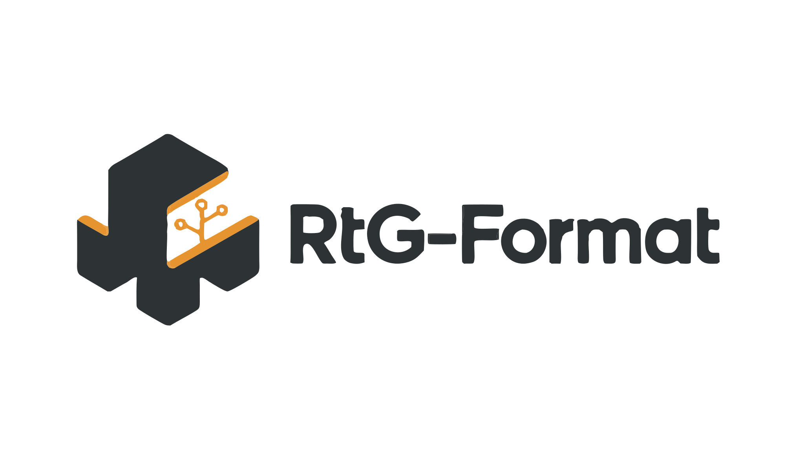
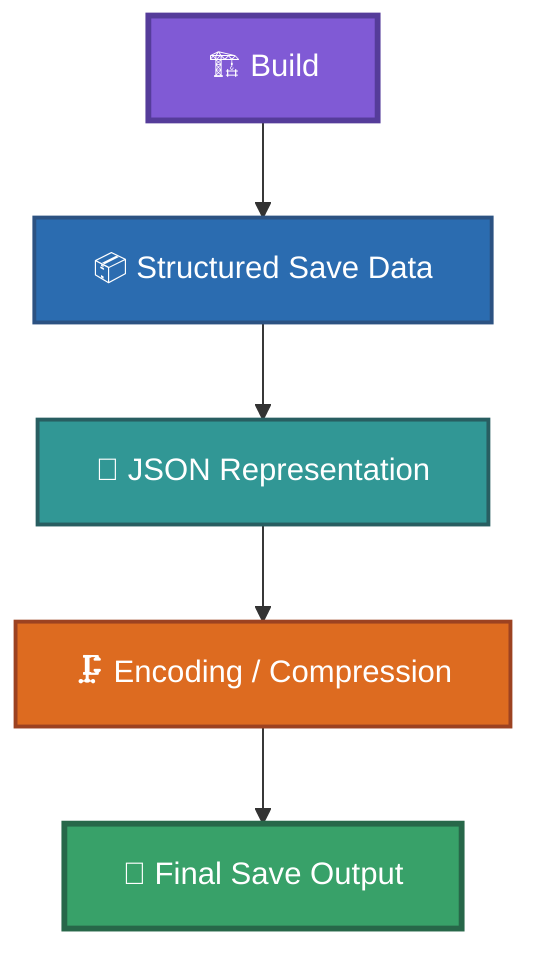
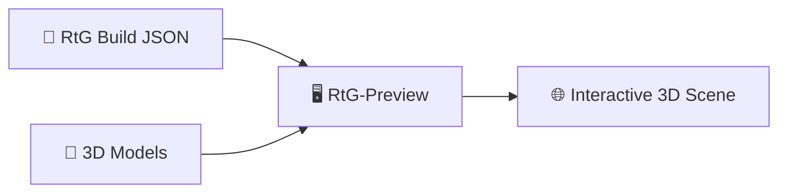

# RtG Save Format — Reverse-Engineered Documentation

Independent technical documentation of the save/build format used by **Road To Gramby's (RtG)** on Roblox.

<div class="banner-container">
  
</div>

## What is RtG-Format?

**RtG-Format** is an independent reverse-engineering project that documents how **Road To Gramby's (RtG)** represents, builds, serializes, and saves its constructions.
The project covers the format from the building system and its internal object relationships through the structured data representation and finally to the encoded/compressed save output used by the game.

### What can you find here?

The documentation covers:

```md
- Save/build data structure
- JSON representation
- Building-system behavior relevant to serialization
- Save final output
- Object and Part IDs
- Connection points
- Parent/connection references
- Object properties
- Identifiers and UUIDs
- `EphemeralAttachments`
- CFrame data
- Encoding and compression
- Known and unknown fields
- Research methodology and experimental results
```

## RtG-Preview

**RtG-Preview** is the browser-based 3D previewer included in this repository.
It allows RtG builds to be visualized as interactive 3D scenes directly in a web browser, without requiring a separate application.

The previewer uses the existing **RtG-Format build structure** and the repository's 3D models to create the scene. It does **not** introduce a separate build format.

⚠️ RtG-Preview is currently on hold while the RtG save/build format is being extensively documented. The previewer currently **targets an older version of the format** specification and may not reflect the latest research.

### What can RtG-Preview do?

```md
- Render RtG builds as interactive 3D scenes
- Load models from `assets/models/`
- Display multiple objects at once
- Interactive mouse and touch controls
- Keyboard camera movement
- Gamepad/controller support
- Build statistics
- Error and notification alerts
- Loading screen with progress
- RtG splash messages
- Adaptive scene grid
- 3D world axes and origin
- SVG interface controls
```

### Quick Preview

RtG-Preview can be loaded directly from a CDN such as jsDelivr.

A minimal example:

```html
<script src="https://cdn.jsdelivr.net/gh/JuanCrakYT/RtG-Format/RtG-Preview/preview.js"></script>
<script>
  RtGPreview.render([
    ["Part", [], {}],
    ["Anchor", [], {}],
    ["Tooth", [], {}]
  ]);
</script>
```

The renderer receives a normal RtG-Format build through:

```js
RtGPreview.render(build);
```

For more information, see [`RtG-Preview/README.md`](RtG-Preview/README.md).

### RtG-Preview Assets

The previewer uses assets stored in the main repository:

```tree
assets/
├── models/
├── sounds/
├── svg/
└── images/
    └── logo/
        └── official-banners/
```

3D models are stored as Wavefront OBJ files under [`assets/models/`](assets/models/).

For example:

```md
assets/models/Part.obj
assets/models/Anchor.obj
assets/models/Tooth.obj
assets/models/Fricklet.obj
```

Loading screens can use the official RtG banners stored under:

```md
assets/images/logo/official-banners/
```

RtG-Preview also uses [`RtG-Preview/splash.json`](RtG-Preview/splash.json) for its loading-screen splash messages.
For the complete previewer documentation, see [`RtG-Preview/README.md`](RtG-Preview/README.md).

## Quick Start

If you are new to the RtG save/build format, **start with [`SPECIFICATION.md`](SPECIFICATION.md)** for the current interpretation of the format.

For introductory documentation, see [`docs/README.md`](docs/README.md), which provides a recommended reading path through the documentation.
If you want to **visualize an RtG build**, see [`RtG-Preview/README.md`](RtG-Preview/README.md).

Other introductory resources:

* [`docs/save-anatomy.md`](docs/save-anatomy.md) — Anatomy of an RtG save
* [`docs/building-system.md`](docs/building-system.md) — Building-system concepts
* [`docs/faq.md`](docs/faq.md) — Frequently asked questions

## How the RtG Save System Works

In simple terms, the RtG save system can be understood as a pipeline:

1. A build is represented internally as a collection of objects and their relationships.
2. The building system converts those objects into structured save data.
3. The JSON representation contains the objects, connections, and properties.
4. The JSON representation is then encoded/compressed into the final save output used by the game.

Conceptually:



This repository documents each stage of that process, from the building system to the final save output.
The JSON documentation describes the structured representation of the save data before the final encoding/compression layer. The final save output is documented separately under [`compression/`](compression/).

RtG-Preview operates on the structured build representation and provides a visual representation of that data:



## Documentation

### Format

[`SPECIFICATION.md`](SPECIFICATION.md) is the main technical specification and the primary reference for the current understanding of the format.

Detailed documentation for specific parts of the format is available under [`format/`](format/). See [`format/README.md`](format/README.md) for the complete format documentation index.

### Blocks and Parts

See [`blocks/parts/parts-id.md`](blocks/parts/parts-id.md) for the documented object/Part IDs and their categories.

The historical reverse-engineering ID research is preserved separately in [`old-files/`](old-files/).

### Compression and Encoding

* [`compression/encoding.md`](compression/encoding.md) — Observed encoding and final save representation

### Examples

See [`examples/`](examples/) for real and reproducible save/build examples and experiments.

### Research

See [`research/`](research/) for methodology, discoveries, and unresolved questions.

### Tools

See [`tools/`](tools/) for utilities related to decoding, encoding, conversion, and inspection.

### RtG-Preview

See [`RtG-Preview/`](RtG-Preview/) for the browser-based 3D previewer.

* [`RtG-Preview/README.md`](RtG-Preview/README.md) — Previewer documentation
* [`RtG-Preview/preview.js`](RtG-Preview/preview.js) — Main renderer

## Status

**Specification:** Current consolidated specification — Work in progress

[`SPECIFICATION.md`](SPECIFICATION.md) is the main reference for the current understanding of the RtG save/build format. It combines the project's current interpretation of the format with additional data and discoveries confirmed during development.

The documentation under [`format/`](format/) provides more detailed information about specific parts of the format.
Historical reverse-engineering material is preserved in [`old-files/`](old-files/) for research provenance. It is not required for understanding the current format and is primarily intended for investigating how previous findings were obtained or why historical observations may differ from the current interpretation.

## Research Status

The documentation distinguishes between:

```md
- **Confirmed** — Supported by reproducible observations or direct evidence.
- **Partially confirmed** — Supported by observations but not completely verified.
- **Unconfirmed** — Reported or suspected but lacking sufficient evidence.
```

Historical observations are preserved rather than silently rewritten.

## Historical Documentation

[`old-files/`](old-files/) contains historical reverse-engineering material, including earlier specification versions, investigations, and observations.

This material is preserved for research provenance and may be consulted when investigating discrepancies with the current documentation. When such a discrepancy exists, the historical material in `old-files/` has priority as evidence for investigating the discrepancy.
For the current interpretation of the format, start with [`SPECIFICATION.md`](SPECIFICATION.md).

## Attribution

RtG-Format is the result of independent reverse-engineering and documentation of the Road To Gramby's build/save system by JuanCrakYT.
If this documentation, its discoveries, examples, or derived knowledge are used in another project, please credit:

* JuanCrakYT — RtG-Format
* https://github.com/JuanCrakYT/RtG-Format

This attribution is requested for research provenance and does not imply affiliation with Road To Gramby's.

## Credits

* **JuanCrakYT** — Reverse engineering, research, documentation, and maintenance.
* **Road To Gramby's Wiki** — Reference for game objects, terminology, categorization and images.
* **Road To Gramby's** — Original game and save/build system documented by this project.

This is an independent reverse-engineering project and is not affiliated with or endorsed by the creators of Road To Gramby's or the Road To Gramby's Wiki.

<div style="text-align: center;">


</div>

## Web Documentation

A web-based documentation interface is available through the project's GitHub Pages deployment.
See [`page/`](page/) for the source of the documentation website.

## Link Reference

**Road To Gramby's Wiki:**

https://road-to-grambys.fandom.com/wiki/Road_to_Gramby%27s_%F0%9F%91%B5_Wiki

**JuanCrakYT — RtG-Format:**

https://github.com/JuanCrakYT/RtG-Format

[JuanCrakYT.github.io/RtG-Format](https://juancrakyt.github.io/RtG-Format/)

## Repository

* [`CHANGELOG.md`](CHANGELOG.md) — History of documented project changes.
* [`CONTRIBUTING.md`](CONTRIBUTING.md) — Contribution and documentation guidelines.
* [`LICENSE`](LICENSE) — Project license.
* [`structure.md`](structure.md) — Project Tree // Recommended for file search

---

```html
<script>
  (() => {
    const images = [
      "assets/images/logo/official-banners/RtG-1.webp",
      "assets/images/logo/official-banners/RtG-2.webp",
      "assets/images/logo/official-banners/RtG-3.webp",
      "assets/images/logo/official-banners/RtG-4.webp",
      "assets/images/logo/official-banners/RtG-5.webp"
    ];
    const banner = document.getElementById("rtg-banner-scripted");
    if (!banner) return;
    // Preload images
    images.forEach((src) => {
      const image = new Image();
      image.src = src;
    });
    let index = 0;
    let direction = 1;
    setInterval(() => {
      index += direction;
      if (index === images.length - 1) {
        direction = -1;
      } else if (index === 0) {
        direction = 1;
      }
      banner.style.opacity = "0";
      setTimeout(() => {
        banner.src = images[index];
        banner.style.opacity = "1";
      }, 250);
    }, 1500);
  })();
</script>
```