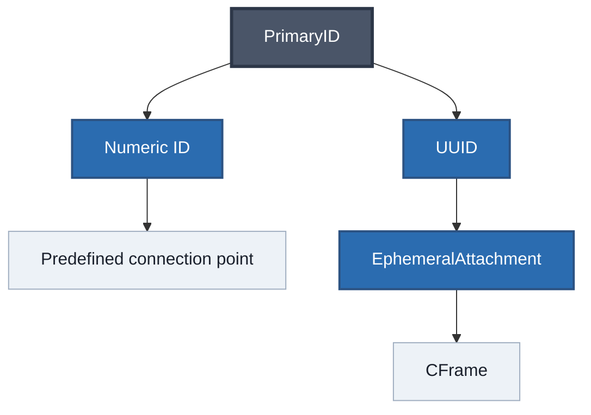
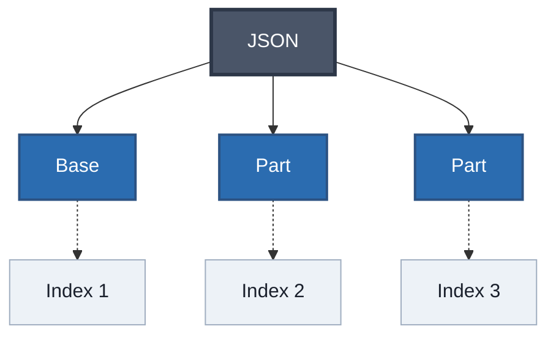
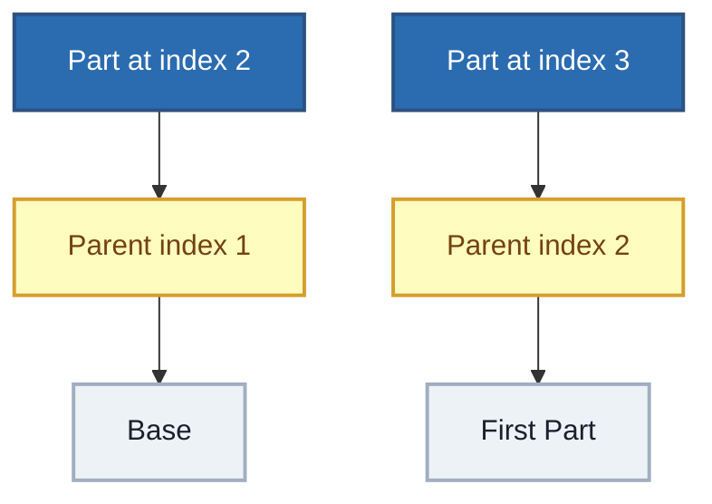
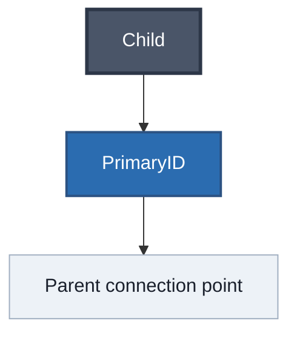
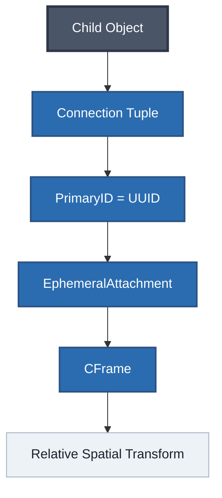
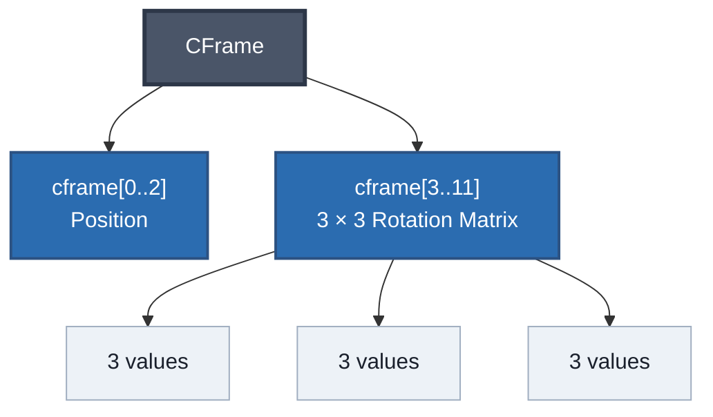
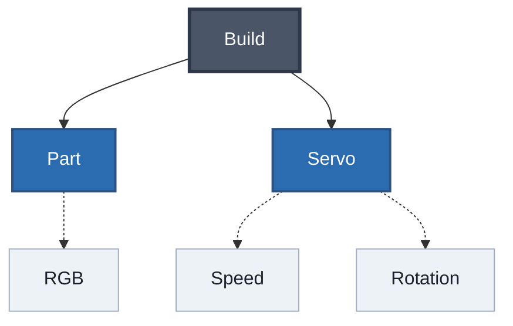
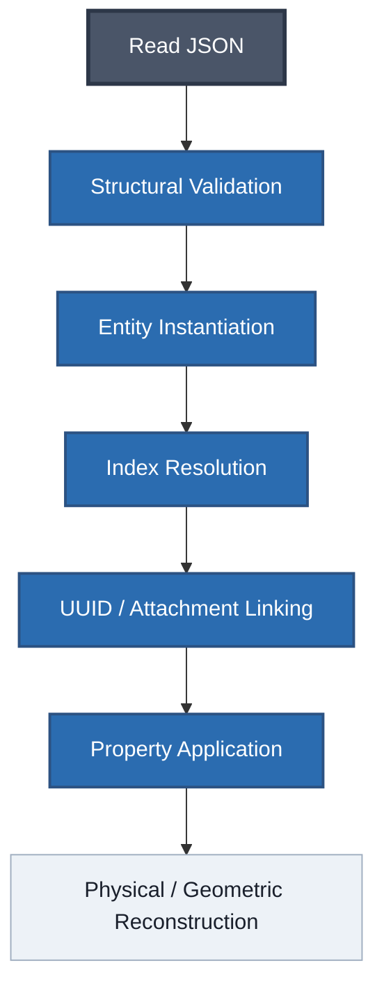
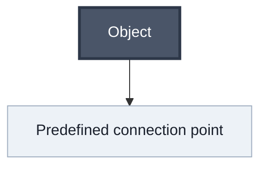
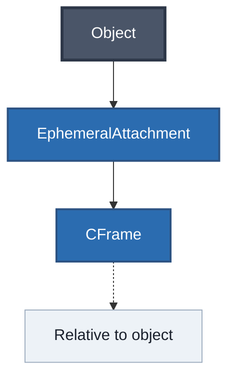

# RtG Save Format Specification

> **Status:** Experimental / Unofficial  
> **Author:** JuanCrakYT  
> **Game:** Road To Gramby's (Roblox)
>
> This document is the current consolidated specification of the observed RtG save format.
>
> Historical reverse-engineering material is preserved in [`old-files/`](old-files/) and has priority when investigating discrepancies.

---

## 1. Overview

RtG save data represents a build as a structured collection of objects and relationships.

The save format does not simply store the final global position of every object. Instead, the loader reconstructs the build from object types, connections, properties, references, attachments, and spatial transformations.

Conceptually:

```mermaid
flowchart TD
    OBJECTS["Objects"]

    OBJECTS --> CONNECTIONS["Connections"]
    OBJECTS --> PROPERTIES["Properties"]
    OBJECTS --> ATTACHMENTS["Attachments"]

    ATTACHMENTS --> CFRAME["CFrame"]

    classDef root fill:#4a5568,color:#fff,stroke:#2d3748,stroke-width:3px;
    classDef branch fill:#2b6cb0,color:#fff,stroke:#2c5282,stroke-width:2px;
    classDef detail fill:#edf2f7,color:#1a202c,stroke:#a0aec0;

    class OBJECTS root;
    class CONNECTIONS,PROPERTIES,ATTACHMENTS branch;
    class CFRAME detail;


The information documented here comes from empirical reverse engineering, controlled modifications of saves, and observation of the game's loading behavior.

---

## 2. Root Structure

An RtG build is stored as a top-level JSON array.
Each element represents one object in the build.

```json
[
    [
        Type,
        Connections,
        Properties
    ]
]
```

A complete example:

```json
[
    ["Base", [], {}],
    ["Part", [["1", "5", 1]], {"RGB": [255, 0, 0]}],
    ["Part", [["1", "5", 2]], {"RGB": [0, 255, 0]}]
]
```

The three fields of an object tuple occupy fixed positions:

```text
0 → Type
1 → Connections
2 → Properties
```

These tuple positions are zero-based.

---

## 3. Object Type

The first field identifies the type of object represented by the tuple.

Examples:

```text
Base
Part
Servo
Sprite
Connector
Wheel
Chassis
Rope
Wire
Splitter_1
Splitter_2
Splitter_3
Splitter_4
```

The historical object catalog is preserved in:

* [`old-files/obj_ids-spanish.md`](old-files/obj_ids-spanish.md)
* [`old-files/RtG_Save_Format_Specification-spanish.md`](old-files/RtG_Save_Format_Specification-spanish.md)

The organized current Part reference is available at:

* [`blocks/parts/parts-id.md`](blocks/parts/parts-id.md)

---

## 4. Connections

The second field of the object tuple contains an array of connections.

```json
[
    ["1", "5", 1]
]
```

Each connection contains exactly three values:

```json
[
    LocalType,
    PrimaryID,
    PrimaryIndex
]
```

These names are descriptive names used by this documentation.

### 4.1 `LocalType`

`LocalType` is a numeric identifier associated with the local object type of the connection.

Each observed object type has an associated `LocalType`.
Examples:

```js
Part        = 1
Servo       = 1
Connector   = 5
InputSensor = 2
Gate-AND    = 4
```

The game uses this value to identify/search for the corresponding object type when processing the connection.

The exact internal lookup mechanism and the internal meaning of the numeric values are not currently known.

Changing `LocalType` to an incompatible value has been observed to cause the loader to reject the build with `"Build inválida"`.

### 4.2 `PrimaryID`

`PrimaryID` is the name used by this documentation for the second connection field.

Its contents can take different forms depending on how the object is attached.

#### Numeric connection point

A normal connection can contain a numeric connection-point identifier:

```json
["1", "24", 15]
```

In this case, `"24"` refers to a predefined connection point on the parent object.

#### UUID attachment reference

A connection can instead contain a UUID:

```json
[
    "1",
    "{5a54f1d6-0357-4dae-9a1d-f7600d9c2094}",
    1
]
```

Here the UUID identifies an `EphemeralAttachment` stored by the parent object.

Unlike a predefined connection point, the attachment can represent an arbitrary spatial location on the parent object.

Therefore:


Like:


### 4.3 `PrimaryIndex`

`PrimaryIndex` identifies the parent object in the top-level array.

RtG uses **1-based logical object indices**.

Example:

```json
[
    ["Base", [], {}],
    ["Part", [["1", "5", 1]], {}],
    ["Part", [["1", "5", 2]], {}]
]
```

Logical indices:



Therefore:



---

## 5. Object Ordering

The order of objects in the top-level array is significant.

Because connections use logical indices to locate parent objects, arbitrarily reordering the array can invalidate references.

Observed consequences include:

* broken parent-child relationships;
* invalid references;
* `"Build inválida"`;
* failed loading.

The logical object indices are therefore part of the serialized structure and cannot be treated as arbitrary numbering.

---

## 6. Spatial Reconstruction

Standard objects do not store their final global `X`, `Y`, `Z` coordinates directly as part of the object tuple.

Their spatial configuration is reconstructed from their parent relationships and connection data.

For normal connections:



For attachment-based connections:


```mermaid
flowchart TD
flowchart TD
    A["Child"] --> B["PrimaryID = UUID"]
    B --> C["EphemeralAttachment"]
    C --> D["CFrame"]
    D --> E["Child position/orientation"]

    classDef root fill:#4a5568,color:#fff,stroke:#2d3748,stroke-width:3px;
    classDef branch fill:#2b6cb0,color:#fff,stroke:#2c5282,stroke-width:2px;
    classDef detail fill:#edf2f7,color:#1a202c,stroke:#a0aec0;

    class A root;
    class B,C,D branch;
    class E detail;
```
---

## 7. EphemeralAttachments

`EphemeralAttachments` are stored inside an object's `Properties` dictionary.

Historical experiments demonstrated that **all objects can act as attachment hosts**.

`Chassis` was used during the initial investigation, but a standard `Part` was later tested successfully as a host.

Example:

```json
{
    "EphemeralAttachments": {
        "{94304247-4637-4797-9c54-8edc6130488f}": {
            "partName": "Part",
            "cframe": [
                5.0, 5.0, 0.0,
                0.0, 0.0, 0.0,
                0.0, 1.0, 0.0,
                0.0, 0.0, 1.0
            ]
        }
    }
}
```

An attachment consists of:

```text
UUID
partName
cframe
```

The UUID acts as a lookup/reference key.

The UUID itself does not contain the spatial position.

---

## 8. UUID Linking

UUIDs allow a connection to reference an `EphemeralAttachment`.

Conceptually:



Example:

```json
[
    [
        "Base",
        [],
        {
            "EphemeralAttachments": {
                "{5a54f1d6-0357-4dae-9a1d-f7600d9c2094}": {
                    "partName": "Base",
                    "cframe": [
                        -0.279449462890625,
                        0.24999618530273438,
                        1.4672355651855469,
                        -1.1920928955078126e-7,
                        1.0000001192092896,
                        0,
                        1.0000001192092896,
                        -1.1920928955078126e-7,
                        0,
                        0,
                        0,
                        -1.000000238418579
                    ]
                }
            }
        }
    ],
    [
        "Sprite",
        [
            [
                "1",
                "{5a54f1d6-0357-4dae-9a1d-f7600d9c2094}",
                1
            ]
        ],
        {
            "ImageId": 6767676767
        }
    ]
]
```

The game resolves the UUID to the corresponding attachment and obtains the spatial transformation from its `cframe`.

---

## 9. Synthetic UUIDs

UUIDs used by `EphemeralAttachments` do not have to be generated by Roblox itself.

Historical testing showed that externally generated UUIDs can be accepted as long as they use the expected GUID syntax.

Example:

```json
{99999999-9999-4999-8999-999999999999}
```

---

## 10. CFrame

The `cframe` field of an `EphemeralAttachment` contains 12 numeric values:

```json
[
    X, Y, Z,   // position
    R1, R2, R3,   // 3 × 3 rotation matrix
    R4, R5, R6,
    R7, R8, R9
]
```

The values represent:



The position is relative to the coordinate system of the object hosting the attachment.

Changing these values changes the spatial placement of an object attached through the UUID.

---

## 11. Properties

The third field of an object tuple is a JSON object containing its properties.

```json
{
    "RGB": [255, 0, 0]
}
```

The property dictionary is open.

Additional keys can be stored without necessarily causing a loading error.

Example:

```json
{
    "RGB": [255, 0, 0],
    "Speed": 100,
    "DatoInventado": 123
}
```

Historical experiments showed that unknown properties can be present without preventing the object from loading.

### 11.1 Property Categories

Properties can be considered in three observed categories:

```md
* Stored
* Interpreted
* Ignored
```

**Stored**

The key exists in the JSON.

**Interpreted**

The object's logic reads and uses the property.

Examples:



**Ignored**

The key is present but is not used by the object's logic.

---

## 12. Missing Properties

Historical testing indicates that some missing properties may be created automatically when required, using an empty or default value.

The exact defaults depend on the object and are not fully catalogued.

---

## 13. Observed Properties

The historical investigation recorded the following properties:

```text
RGB
EphemeralAttachments
Mode
Rotation
LimitAngle
Speed
Backwards
Rest
LimitEnabled
Visible
Length
Activated
Forwards
Text
Quantity
Bullets
Shooting
IgnoreAttached
MaxDistance
CanTargetAttached
ImageId
Delay
DelayDeactivation
MinLength
MaxLength
MaxForce
ActivationSpeed
ActivationHeight
Volume
Channel
CustomTrack
On
Phrase
```

This is an observed catalog, not a claim that these are the only properties used by RtG.

---

## 14. Loader Behavior

The historical investigation reconstructed a probable multi-stage loading process.

This is a **probable model**, not a confirmed representation of the game's internal source code.



Observed conceptual stages:

1. Structural validation.
2. Entity instantiation.
3. Parent/index resolution.
4. UUID and attachment linking.
5. Property application.
6. Physical and geometric reconstruction.

---

## 15. Validation and Failure Behavior

Historical experiments demonstrated that structural data is treated more strictly than arbitrary properties.

Observed behaviors include:

| Modification             | Observed result                                |
| ------------------------ | ---------------------------------------------- |
| Incompatible `LocalType` | `"Build inválida"`                             |
| Invalid parent index     | Broken reference / load failure                |
| Missing UUID attachment  | Link failure / load failure                    |
| Reordered objects        | Broken references                              |
| Unknown property         | Generally tolerated                            |
| Invalid `ImageId`        | `Sprite` can remain instantiated but invisible |

The exact internal error handling is not documented.

---

## 16. Coordinate and Attachment Behavior

The attachment system allows connections that are not limited to predefined connection points.

A normal connection:

An attachment-based connection:

This makes it possible to place an attachment at an arbitrary location/orientation on an object and use its UUID from another object's connection tuple.

---

## 17. Confirmed Discoveries

> **Author:** JuanCrakYT

1. ✅ **Root Structure:** The save file is a JSON array where every object is represented by a 3-element tuple: `[Type, Connections, Properties]`.
2. ✅ **PrimaryID:** The second value in a connection tuple can contain a numeric predefined connection-point identifier or a UUID referencing an `EphemeralAttachment` on the parent object.
3. ✅ **Open Properties Dictionary:** `Properties` accepts additional keys without necessarily causing a loading error.
4. ✅ **Parent Index:** The third connection value identifies the parent object using a **1-based logical index** in the top-level array.
5. ✅ **LocalType Identification:** `LocalType` identifies the local object type involved in the connection. The game uses this value to identify/search for the corresponding object type. The exact internal lookup mechanism is unknown.
6. ✅ **LocalType Validation:** Incompatible `LocalType` values can cause the loader to reject the build.
7. ✅ **Array Order Sensitivity:** Changing the order of objects can invalidate hierarchical references.
8. ✅ **No Standard Absolute Coordinates:** Standard objects are not represented by ordinary absolute global coordinates in the object tuple.
9. ✅ **Universal Attachment Host:** All objects can act as hosts for `EphemeralAttachments`.
10. ✅ **UUID Linking:** UUIDs are used as references to `EphemeralAttachments`.
11. ✅ **Synthetic UUID Compatibility:** Externally generated UUIDs can be accepted when they use valid GUID syntax.
12. ✅ **Required References:** Invalid or missing structural references are not automatically repaired.
13. ✅ **Invalid Sprite Image:** An invalid `ImageId` can result in a `Sprite` that exists in the build but is invisible.

---

## 18. Hypotheses and Reconstructed Behavior

### 18.1 Loader Pipeline

The six-stage loader sequence is a reconstructed model based on observed behavior.

It is not confirmed as the exact internal implementation of the game.

### 18.2 Sprite CFrame Behavior

Historical testing suggests that `Sprite` may interpret the rotation matrix differently from ordinary 3D objects, producing planar 2D transformations.

This remains a hypothesis until further evidence confirms the exact behavior.

---

## 19. Historical First Save (Skippeable)

The first save analyzed during the reverse-engineering process was a minimal `SprayPaint` build:

```json
[
    ["SprayPaint", [], {
        "RGB": [211, 27, 19]
    }]
]
```

This file was historically significant because it started the investigation.
It was not technically special.

---

## 20. Evidence and Confidence

The project uses the following evidence levels:

### CONFIRMED

Directly observed and reproducible behavior.

### OBSERVED

Behavior observed during experiments but not necessarily generalized.

### PROBABLE

A model reconstructed from multiple observations.

### HYPOTHESIS

A proposed explanation that has not yet been sufficiently demonstrated.

### UNKNOWN

The available evidence does not currently determine the behavior.
Historical evidence is preserved in [`old-files/`](old-files/) and has priority when investigating discrepancies.

---

## 21. Related Documentation

* [`docs/getting-started.md`](docs/getting-started.md) — Recommended documentation path.
* [`format/json-structure.md`](format/json-structure.md) — Detailed JSON structure.
* [`format/indexing.md`](format/indexing.md) — Object indices and references.
* [`format/identifiers.md`](format/identifiers.md) — Object identifiers, connection-point IDs and UUIDs.
* [`format/properties.md`](format/properties.md) — Properties and observed behavior.
* [`compression/`](compression/) — Encoding and compression research.
* [`research/discoveries.md`](research/discoveries.md) — Organized research discoveries.
* [`research/unknowns.md`](research/unknowns.md) — Remaining unknowns and hypotheses.
* [`examples/experiments/`](examples/experiments/) — Reproducible experiments.
* [`old-files/RtG_Save_Format_Specification-spanish.md`](old-files/RtG_Save_Format_Specification-spanish.md) — Historical specification.
* [`old-files/obj_ids-spanish.md`](old-files/obj_ids-spanish.md) — Historical object and connection-point research.