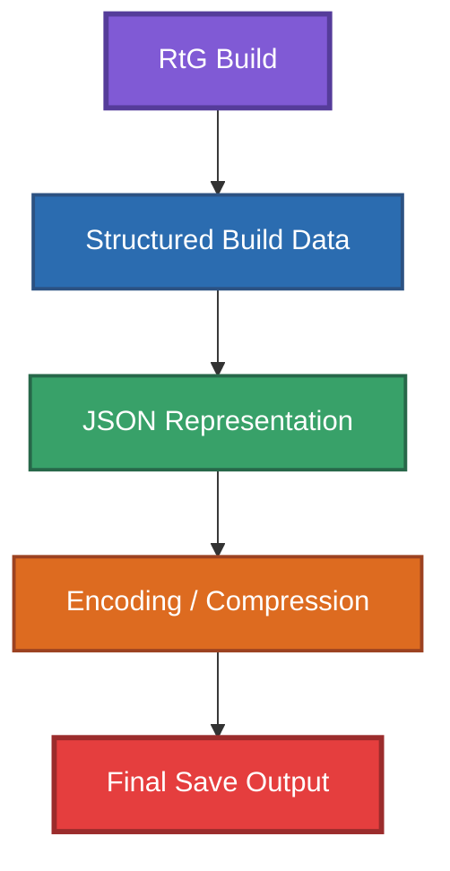

# Compression and Encoding

This folder documents the encoding and compression layers involved in the RtG save system.

The information in this folder is separate from the structural JSON format documented under `format/`. The `format/` directory describes the structure of the decoded build data, while this directory focuses on how that data is represented in the final save output.

## Documentation

### `overview.md`

General overview of the encoding and compression investigation.
This document describes the scope of this research and its current confidence level.

### `encoding.md`

Detailed documentation of the observed encoding process and final save representation.
This includes the historical reverse-engineering evidence for Base64 and the relationship between the build JSON and the final save output.

### `examples-template.md`

Template for documenting encoding and compression experiments.
Use this as a guide when creating reproducible experiment records.

## Research and Evidence

Compression and encoding behavior must be supported by reproducible evidence.
Do not document hypothetical encoding or compression algorithms as confirmed behavior.
Use the following confidence levels when describing observations:
```md
* **CONFIRMED** — Supported by direct evidence or reproducible observations.
* **PARTIALLY CONFIRMED** — Supported by evidence, but some details remain unverified.
* **UNCONFIRMED** — Observed or suspected, but not sufficiently verified.
* **HYPOTHESIS** — A proposed explanation that has not yet been demonstrated.
```
Detailed experiments and their evidence should be stored under `examples/experiments/`.

## Important Distinction

Base64 is an encoding method, not the RtG build format itself.
The build format is the structured data contained within the encoded save representation.

Conceptually:



The exact transformation between these stages should only be described as confirmed when supported by evidence.

## Related Documentation

* [`../format/json-structure.md`](../format/json-structure.md) — Structure of the decoded JSON build data.
* [`../format/indexing.md`](../format/indexing.md) — Indexing and references.
* [`../SPECIFICATION.md`](../SPECIFICATION.md) — Current consolidated specification.
* [`../examples/experiments/`](../examples/experiments/) — Reproducible experiments and their evidence.
* [`../old-files/`](../old-files/) — Historical reverse-engineering records.
