# Encoding and Save Output

## Status

**CONFIRMED — based on the historical reverse-engineering record in `old-files/RtG_Save_Format_Specification-spanish.md`.**

This document describes the encoding layer of the RtG build/save system as established by the historical investigation.

The current repository may contain other documents that describe encoding as experimental or unconfirmed. Those files were generated later and should not override the historical evidence used here.

---

## 1. Overview

Road To Gramby's does not expose its build data directly as readable JSON in the final save representation.

During the reverse-engineering process, the stored build data was observed as a **Base64-encoded representation of the build JSON**.

Conceptually, the data can be viewed as:

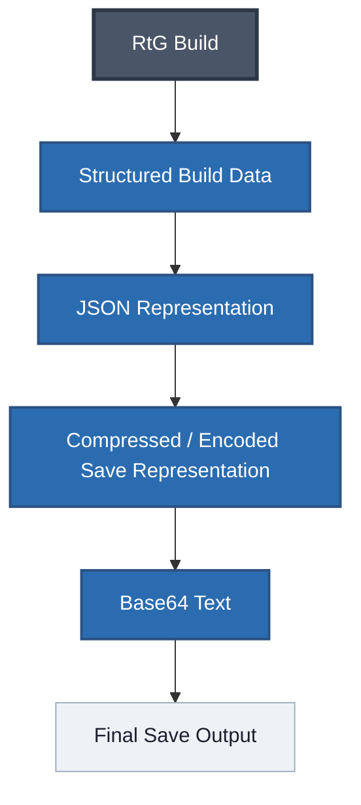

The historical specification explicitly states that the investigation was performed by analyzing and modifying **JSON data compressed in Base64**.

The important distinction is that **Base64 is an encoding layer, not the build format itself**.

The build format is the structured data contained after decoding the textual representation.

---

## 2. Base64

### 2.1 What was observed

A stored RtG build can appear as a string consisting of Base64 characters rather than immediately readable JSON.

One of the first strings analyzed during the research was:

```text
W1siU3ByYXlQYWludCIsW10seyJSR0IiOlsyMTEsMjcsMTldfV1d
```

This was the first file analyzed during the reverse-engineering process and is preserved in the historical specification as the starting point of the investigation.

Decoding this Base64 value produces:

```json
[["SprayPaint",[],{"RGB":[211,27,19]}]]
```

This is a valid RtG build representation containing one `SprayPaint` object.

The decoded data therefore immediately revealed that the apparently opaque save value was not arbitrary binary data: it contained the structured build representation used by RtG.

---

## 3. Decoding the First Known Save

The historical investigation can be reproduced conceptually with the following transformation:

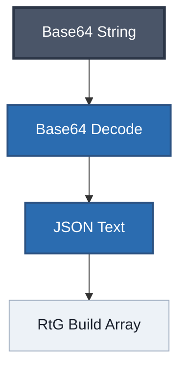

For the initial example:

```text
W1siU3ByYXlQYWludCIsW10seyJSR0IiOlsyMTEsMjcsMTldfV1d
```

the decoded result is:

```json
[
    [
        "SprayPaint",
        [],
        {
            "RGB": [211, 27, 19]
        }
    ]
]
```

The three components of the object are:

```json
[
    Type,
    Connections,
    Properties
]
```

In this example:

```js
Type        = "SprayPaint"
Connections = []
Properties  = {"RGB": [211, 27, 19]}
```

The historical specification identifies this three-element structure as the root representation of the RtG build system.

---

## 4. Base64 Is Not the Object Format

It is important not to confuse the encoding layer with the actual save schema.
**Base64** only changes how the data is represented as text.

For example:

The **Base64**:
```text
W1siU3ByYXlQYWludCIsW10seyJSR0IiOlsyMTEsMjcsMTldfV1d
```

becomes on a **JSON**:
```json
[
    [
        "SprayPaint",
        [],
        {
            "RGB": [211, 27, 19]
        }
    ]
]
```

The meaningful RtG information is contained in the decoded JSON:

* object type;
* connections;
* connection point references;
* parent references;
* properties;
* UUID references;
* `EphemeralAttachments`;
* CFrame data.

Base64 does not define any of these structures.

---

## 5. JSON Structure After Decoding

The decoded representation is a top-level JSON array.
The historical specification identifies the top-level array as **1-based with respect to RtG's object references**.

A simplified representation is:

```json
[
    ["Base", [], {}],
    ["Part", [["1", "5", 1]], {"RGB": [255, 0, 0]}],
    ["Part", [["1", "5", 2]], {"RGB": [0, 255, 0]}]
]
```

Each object uses:

```json
[
    <Type>,
    <Connections>,
    <Properties>
]
```

The ``Connections`` tuple is:

```json
[
    <LocalType>,
    <PrimaryID>,
    <PrimaryIndex>
]
```

where `PrimaryIndex` identifies the parent object using RtG's 1-based object indexing.

Therefore, decoding Base64 is only the first step in understanding a save.

---

## 6. Relationship Between Encoding and Serialization

The complete system should be considered as two separate concepts.

### Serialization

Serialization defines **what the build means**.

It determines how RtG represents:

```md
**Objects**
**Connections**
**Properties**
**References**
**Attachments**
**Transforms**
```

### Encoding

Encoding defines **how that serialized representation is transported or stored as text**.
In the observed save representation:

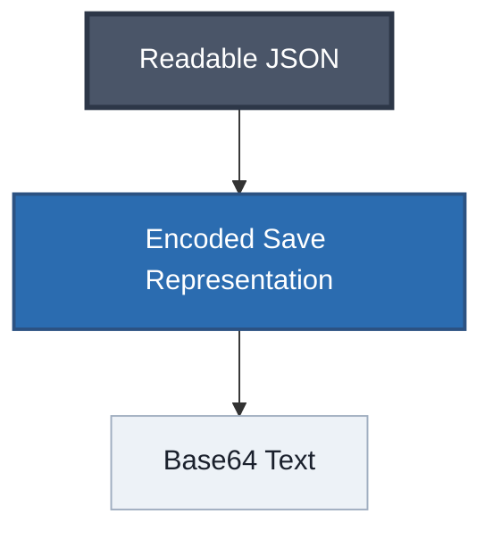

This distinction is important when writing tools.
A save decoder should therefore conceptually perform:

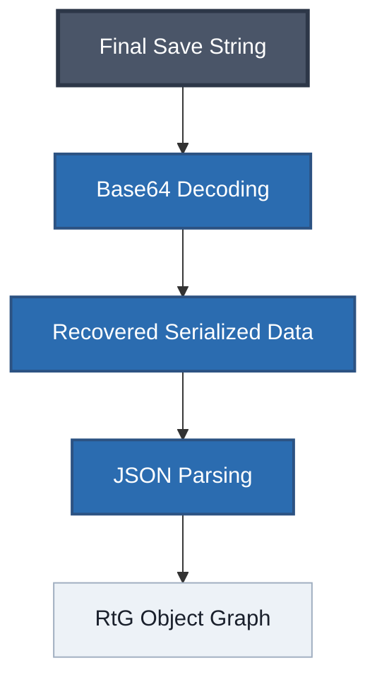

---

## 7. Compression

The historical documentation describes the build data as **JSON compressed in Base64**.

However, the historical record preserved here does **not establish a specific compression algorithm with enough detail to document it as a separate confirmed stage**.

Therefore this document intentionally does not claim that RtG uses:

* gzip;
* zlib;
* DEFLATE;
* LZ4;
* LZMA;
* Zstandard;
* Brotli;
* or any other specific compression implementation.

The existence of the Base64 textual representation is documented.

The exact internal compression algorithm, if any additional compression layer is present in a particular save pathway, must be documented separately only when supported by evidence.

### Important distinction

These statements are not equivalent:
```md
**JSON** is represented using **Base64**.
```
and:
```md
**JSON** is compressed using algorithm X and then **Base64-encoded**.
```

The first is supported by the historical investigation.
The second requires additional evidence identifying algorithm X.

---

## 8. Why Base64 Is Useful in the RtG Save Pipeline

Base64 converts arbitrary byte data into a text representation using a restricted character set.

This makes it suitable for systems where the final save value is expected to be textual.

The important consequence for RtG reverse engineering is that the final value can look like an opaque random string while still containing a directly recoverable serialized build.

A researcher who encounters a value such as:

```text
W1siU3ByYXlQYWludCIsW10seyJSR0IiOlsyMTEsMjcsMTldfV1d
```

can recognize the characteristic Base64 alphabet and attempt decoding.
In the historical investigation, that simple transformation exposed:

```json
[["SprayPaint",[],{"RGB":[211,27,19]}]]
```

which became the entry point for the rest of the format analysis.

---

## 9. Encoding Does Not Change RtG References

Base64 encoding does not alter the semantic values contained in the decoded build.

For example, a decoded connection:

```json
["1", "5", 2]
```

still represents the same RtG connection after encoding and decoding.
Likewise:

```json
"{5a54f1d6-0357-4dae-9a1d-f7600d9c2094}"
```

remains the same UUID reference.

And an attachment:

```json
{
    "partName": "Base",
    "cframe": [
        -0.279449462890625,
        0.24999618530273438,
        1.4672355651855469,
        -1.1920928955078126e-7,
        1.0000001192092896,
        0,
        1.0000001192092896,
        -1.1920928955078126e-7,
        0,
        0,
        0,
        -1.000000238418579
    ]
}
```

remains structurally unchanged once decoded.

The UUID and CFrame system is part of the serialized build representation, not part of Base64 itself.

---

## 10. Final Save Output

The final save representation should therefore be understood as a transport/storage layer surrounding the actual RtG build data.

Conceptually:

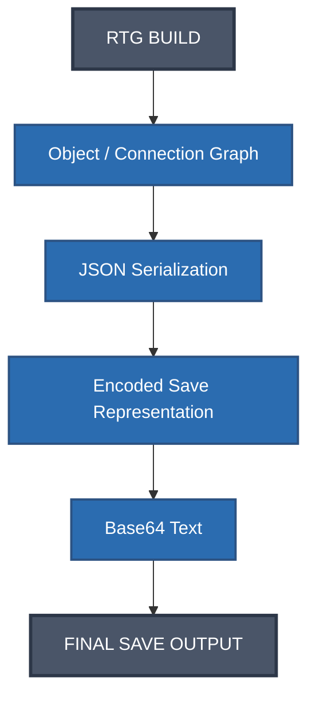

The exact implementation details between the JSON representation and the final textual value should not be inferred beyond the observed evidence.

---

## 11. Historical First Example

The historical research identifies the following value as the first file analyzed during the reverse-engineering process:

```text
W1siU3ByYXlQYWludCIsW10seyJSR0IiOlsyMTEsMjcsMTldfV1d
```

After Base64 decoding:

```json
[
    [
        "SprayPaint",
        [],
        {
            "RGB": [211, 27, 19]
        }
    ]
]
```

The historical specification explicitly notes that this simple `SprayPaint` build was **not technically special**.
Its importance is historical: it was the starting point from which the rest of the save-format investigation developed.

---

## 12. Interaction With `EphemeralAttachments`

The encoding layer also preserves the data used by RtG's attachment system.

The historical documentation establishes that an object can contain:

```json
{
    "EphemeralAttachments": {
        "{UUID}": {
            "partName": "Base",
            "cframe": [...]
        }
    }
}
```

A separate object can then reference that UUID:

```json
[
    "Sprite",
    [
        [
            "1",
            "{UUID}",
            1
        ]
    ],
    {
        "ImageId": 6767676767
    }
]
```

The loader resolves:

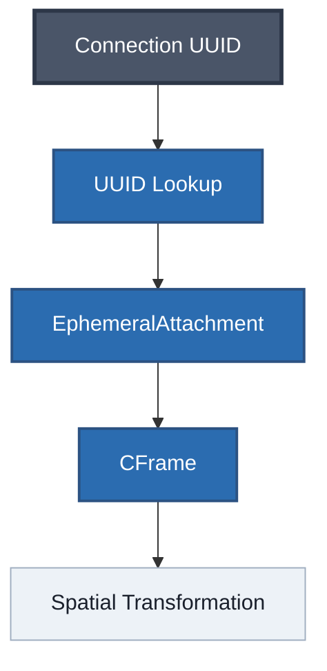

The encoding layer does not alter this relationship. It only represents the serialized structure as the final textual save data.

---

## 13. Practical Decoder Model

A decoder for the observed format should conceptually separate the operations:

```python
save_text = ...              # final RtG save value

decoded = base64_decode(save_text)

json_text = ...               # recovered serialized representation

build = json_parse(json_text)
```

The exact implementation after Base64 decoding depends on the precise save pathway being analyzed.

A robust tool should therefore avoid silently assuming an undocumented compression algorithm.

Instead, it should detect or validate the decoded payload before attempting additional processing.

---

## 14. Validation

A decoded value should be considered structurally valid only after checking that it produces the expected RtG representation.

At minimum, the recovered data should be compatible with the structure:

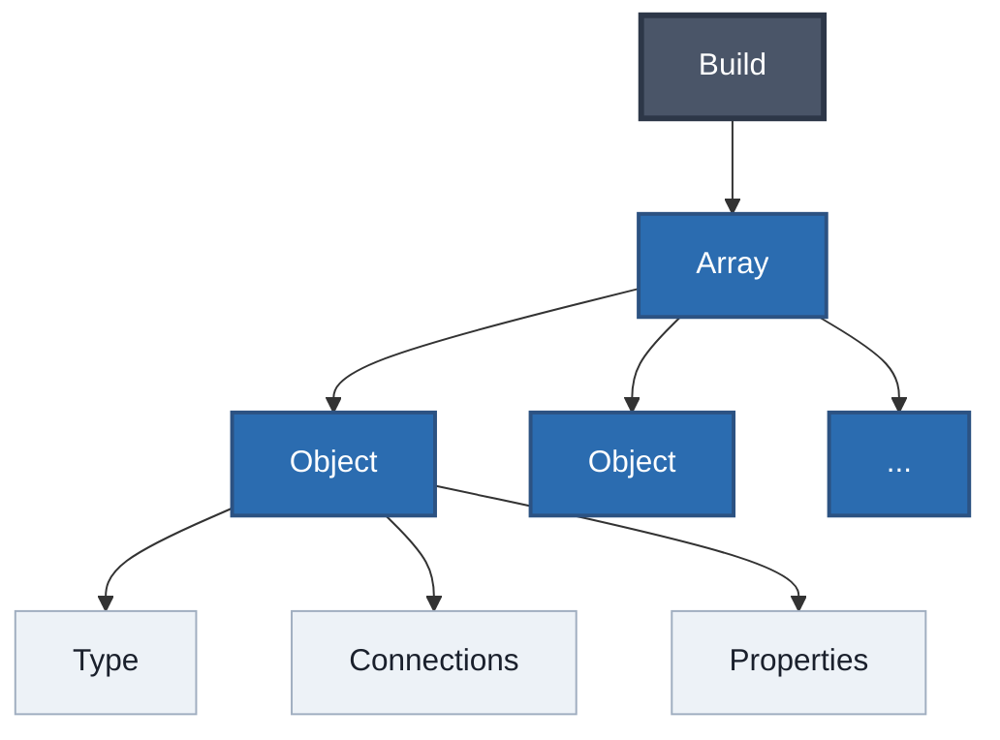

Connection tuples should have:

```json
[
    <LocalType>,
    <PrimaryID>,
    <PrimaryIndex>
]
```

and object references use RtG's 1-based indexing.

---

## 15. Decoding vs. Decompressing

These operations must not be treated as interchangeable.

### Decoding

Converts a representation such as Base64 text back into its underlying byte/text representation.

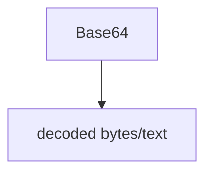

### Decompression

If a compressed binary representation is present, decompression reconstructs the original serialized data.

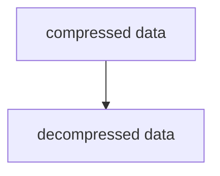

### JSON Parsing

Once the serialized JSON text has been recovered:

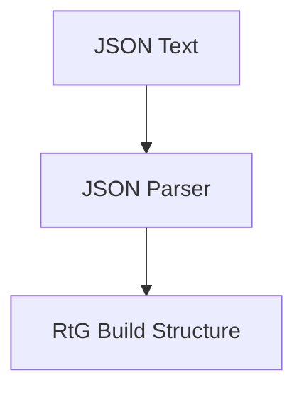

The historical investigation confirms the importance of the Base64 representation, but does not provide enough evidence in the preserved material to claim a specific compression algorithm here.

---

## 16. Evidence Classification

### Confirmed

The historical reverse-engineering record supports the following:

* RtG build data can be represented as JSON.
* The final observed save representation uses Base64.
* Decoding the initial analyzed Base64 value produces valid RtG JSON.
* The decoded representation contains the RtG object structure.
* Object connections and properties are part of that decoded representation.
* The decoded data uses RtG's 1-based parent-object references.

### Not established by this document

The following should not be asserted here without additional evidence:

* The exact compression algorithm used before Base64.
* Whether every possible save pathway uses exactly the same encoding pipeline.
* Whether Base64 is always the final outermost representation for every historical/current save mechanism.
* Any particular binary container format preceding Base64.

---

## 17. Summary

The observed encoding layer can be summarized as:

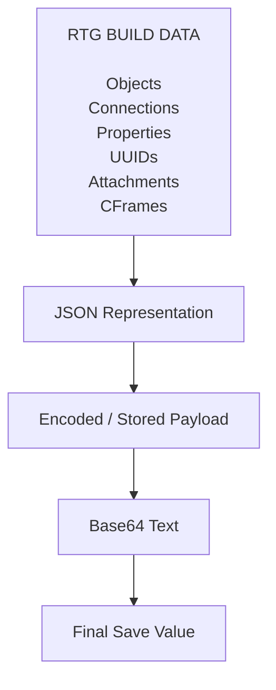

The most important practical observation from the original research is simple:

> A value that initially appears to be an opaque Base64 string can be decoded into the structured JSON representation used by RtG's save/build system.

From that decoded representation, the rest of the format can be analyzed as a structured object graph containing object types, connections, parent references, properties, UUIDs, attachments, and spatial transformations.

---

## Historical Source

Primary source for this document:

`old-files/RtG_Save_Format_Specification-spanish.md`

The historical specification records the empirical analysis of JSON build data encoded in Base64 and documents the resulting save structure and behavior.
