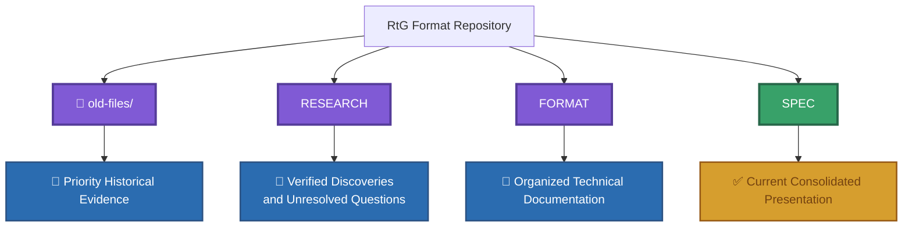

# FAQ

## What is this repository?

This repository documents reverse-engineering research into the Road To Gramby's (RtG) save/build format.
It separates confirmed observations, experiments, historical records, and unresolved questions.

## What is the current source of truth?

Use [`../SPECIFICATION.md`](../SPECIFICATION.md) together with the relevant documents under [`../format/`](../format/) for the current consolidated technical reference.

Historical files under [`../old-files/`](../old-files/) have priority as historical evidence when a discrepancy exists. They must be checked before changing or rejecting the current documentation.

In other words:

The current documentation organizes and explains the format, while `old-files/` preserves the historical evidence from which it was derived.

## Why are there historical files?

The files under `old-files/` preserve earlier research, observations, and versions of the specification.
They provide evidence for how the format was discovered and documented.

## Where are the Part IDs?

Start with [`../blocks/`](../blocks/).

The historical object ID research is preserved in [`../old-files/obj_ids-spanish.md`](../old-files/obj_ids-spanish.md).

The organized Part reference is [`../blocks/parts/parts-id.md`](../blocks/parts/parts-id.md).

## Where are the experiments?

Reproducible experiments are stored under [`../examples/experiments/`](../examples/experiments/).

Failed or inconclusive experiments should be preserved rather than deleted. See the rules in [`../examples/README.md`](../examples/README.md).

## Can I add an example JSON file?

Yes, but only if the example has real provenance and supporting evidence.
Do not create fabricated saves.

See [`../examples/json-examples/README.md`](../examples/json-examples/README.md).

## Can experiments be deleted?

No.

Experiments are research records and should be preserved, including failed or inconclusive results.
Failed experiments should be moved to [`../examples/trash/`](../examples/trash/) according to the rules for experiments.

## Where is encoding and compression documented?

See [`../compression/`](../compression/).

The main entry point is [`../compression/README.md`](../compression/README.md).

## Where are the tools?

See [`../tools/`](../tools/).
The current tool structure and development status are documented in [`../tools/README.md`](../tools/README.md).

## Is the project affiliated with Road To Gramby's?

No.

This is an independent reverse-engineering project and is not affiliated with or endorsed by the creators of Road To Gramby's or the Road To Gramby's Wiki.
