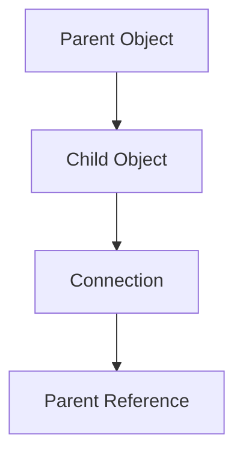
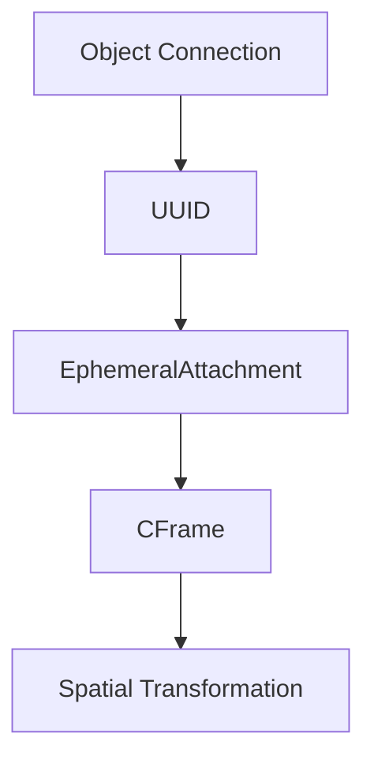

# Save Anatomy

An RtG save contains a serialized representation of a build.
At a high level, the decoded build is represented as a JSON array. Each element represents one object in the build.

## Basic Structure

```mermaid
flowchart TD
    A["Save (JSON Array)"] --> B["Element 0"]
    A --> C["Element 1"]
    A --> D["..."]

    B --> B1["Type"]
    B --> B2["Connections"]
    B --> B3["Properties"]

    C --> C1["Type"]
    C --> C2["Connections"]
    C --> C3["Properties"]
````

Each object follows the general structure:

```json
[
    Type,
    Connections,
    Properties
]
```

### Type

`Type` identifies the kind of RtG object represented by the element.

Examples include:

```text
Base
Part
Servo
Sprite
Connector
Wire
```

The currently documented object and Part IDs are organized under [`../blocks/`](../blocks/).

### Connections

`Connections` describes the relationships between the current object and other objects.

A connection uses the general structure:

```json
[
    LocalType,
    PrimaryID,
    PrimaryIndex
]
```

The exact meaning of these fields is documented in [`../format/indexing.md`](../format/indexing.md) and the relevant format documentation.

### Properties

`Properties` is an open JSON object containing data associated with the object.

Examples include:

```json
{
    "RGB": [255, 0, 0]
}
```

or:

```json
{
    "Speed": 72,
    "Rotation": 45
}
```

Property behavior is documented in [`../format/properties.md`](../format/properties.md).

## Object Relationships

Object references are used to reconstruct relationships between objects during loading.

Conceptually:



The loader uses these references to reconstruct the build structure.

## Attachments and UUIDs

Some spatial relationships use UUID-based references and `EphemeralAttachments`.

Conceptually:



For the detailed behavior, see [`../format/identifiers.md`](../format/identifiers.md) and [`../research/discoveries.md`](../research/discoveries.md).

## Encoding

The structured build data is separate from the final encoded save representation.

The encoding research is documented under [`../compression/`](../compression/).

## Where to Continue

* [`../SPECIFICATION.md`](../SPECIFICATION.md) — Current technical reference.
* [`../format/json-structure.md`](../format/json-structure.md) — Detailed JSON structure.
* [`../format/indexing.md`](../format/indexing.md) — Indexing and references.
* [`../format/properties.md`](../format/properties.md) — Properties.
* [`../format/identifiers.md`](../format/identifiers.md) — Identifiers and UUIDs.
* [`../blocks/`](../blocks/) — Object and Part IDs.
* [`../compression/`](../compression/) — Encoding and compression.


