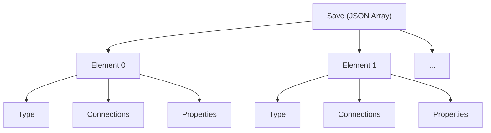

# Save anatomy (conceptual)

Concept

```mermaid
flowchart TD
    A["Save (JSON Array)"] --> B["Element 0"]
    A --> C["Element 1"]
    A --> D["..."]

    B --> B1["Type"]
    B --> B2["Connections"]
    B --> B3["Properties"]

    C --> C1["Type"]
    C --> C2["Connections"]
    C --> C3["Properties"]
```

Elements are processed by the loader to build the scene graph; indices and connections create parent-child links.
