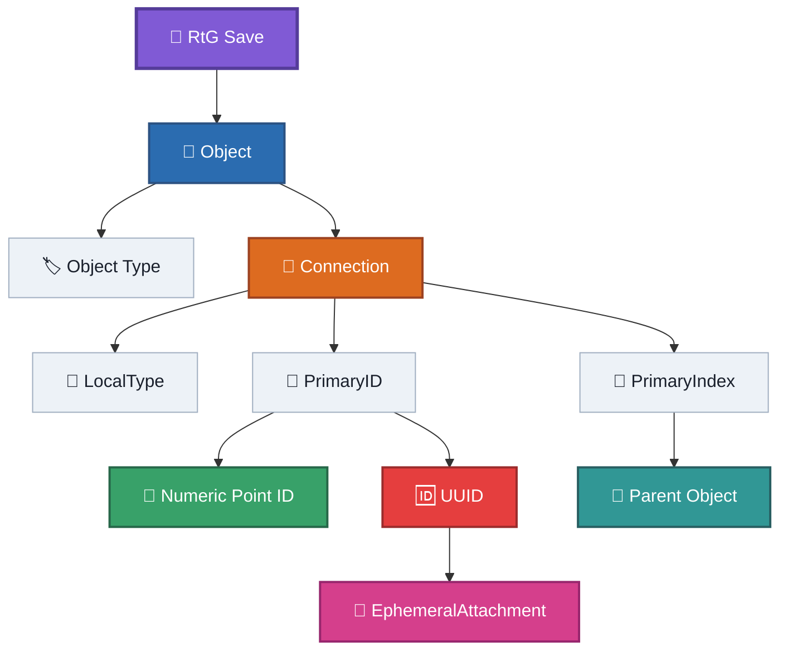
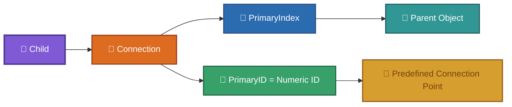
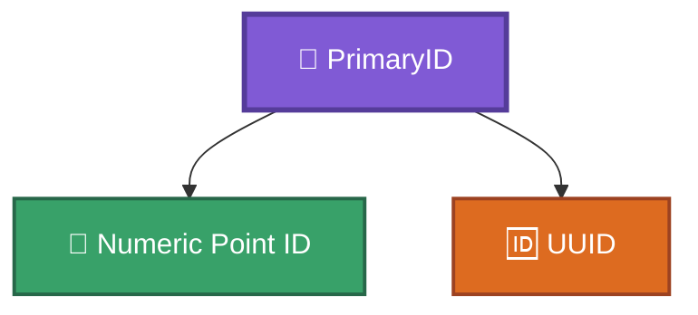
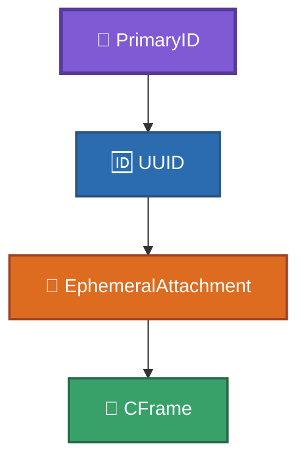
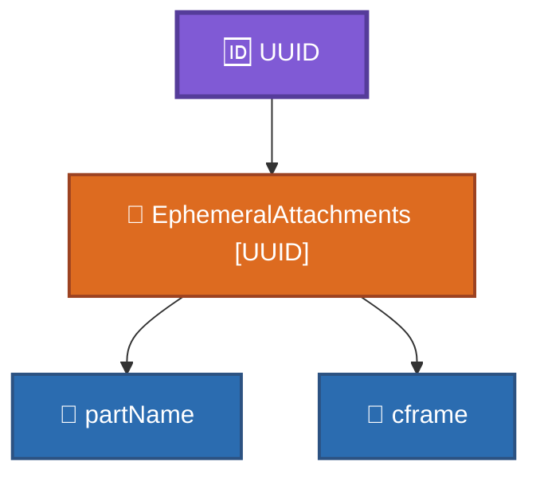
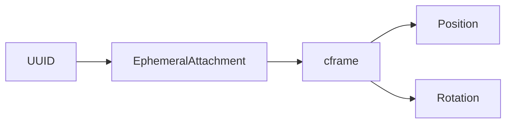
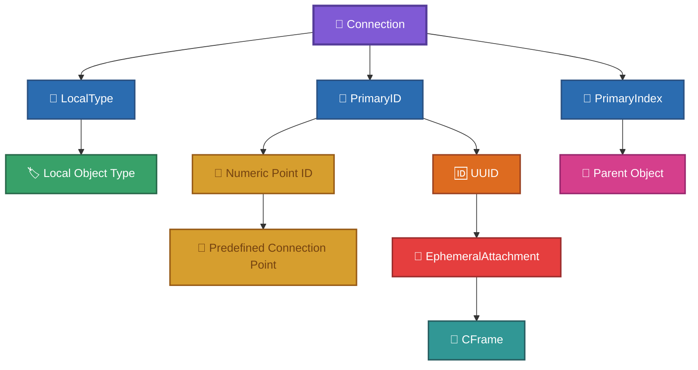
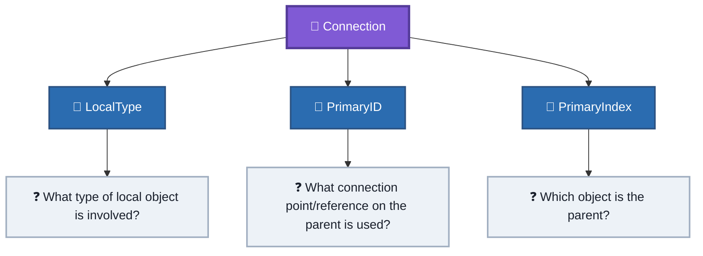

# Identifiers

This document describes the identifier systems observed in the RtG save/build format.
It focuses on what each identifier identifies and how the identifiers relate to each other.
It does not define the complete object catalog or the complete list of connection-point IDs.
Historical identifier research is preserved in [`../old-files/obj_ids-spanish.md`](../old-files/obj_ids-spanish.md).

---

## 1. Identifier Systems

RtG uses several different kinds of identifiers.



These identifiers have different purposes and should not be treated as interchangeable.

---

## 2. Object Type

The first value of an object tuple identifies the type of object.

Example:

```json
[
    "Part",
    [],
    {}
]
```

Here:

```js
Type = "Part"
```

The object type is represented by its name in the serialized object tuple.

Examples include:

```text
Base
Part
Servo
Sprite
Chassis
Wheel
Rope
Wire
Connector
```

The complete object catalog is documented separately.

---

## 3. LocalType

`LocalType` is the first value of a connection tuple.

```json
[
    LocalType,
    PrimaryID,
    PrimaryIndex
]
```

Example:

```json
["1", "5", 15]
```

Here:

```js
LocalType = "1"
```

`LocalType` is a numeric identifier associated with the local object type involved in the connection.
The game uses this value to identify/search for the corresponding object type.
The exact internal lookup mechanism is unknown.

### Important

The numeric value of `LocalType` should not currently be interpreted as a semantic code.
For example, knowing that:

```js
LocalType = "1"
```

does not by itself tell us what internal operation the number represents.
The currently observed mappings should therefore be treated as empirical mappings rather than decoded meanings.

---

## 4. Connection Point IDs

A connection can use a numeric identifier to select a predefined connection point on the parent object.

Example:

```json
["1", "24", 15]
```

Here:

```js
LocalType   = "1"
PrimaryID  = "24"
PrimaryIndex = 15
```

The value:

```js
"24"
```

is a numeric connection-point identifier.

The identifier refers to a predefined point associated with the parent object's model.

Conceptually:



The meaning of individual numeric point IDs is documented in the historical object-ID research.

---

## 5. PrimaryID

`PrimaryID` is the name used by this documentation for the second value of a connection tuple.

It identifies the connection location/reference on the parent.

The field can contain different kinds of identifiers.



Therefore, `PrimaryID` should not be interpreted as being exclusively a numeric connection-point ID.

---

## 6. UUID

A connection can use a UUID instead of a predefined numeric connection-point ID.

Example:

```json
[
    "1",
    "{5a54f1d6-0357-4dae-9a1d-f7600d9c2094}",
    1
]
```

Here:

```js
LocalType   = "1"
PrimaryID  = UUID
PrimaryIndex = 1
```

The UUID acts as a reference to an `EphemeralAttachment`.

It does not itself contain the attachment's spatial information.

Conceptually:



---

## 7. EphemeralAttachment UUIDs

An `EphemeralAttachment` is stored in the `Properties` dictionary of an object.

Example:

```json
{
    "EphemeralAttachments": {
        "{5a54f1d6-0357-4dae-9a1d-f7600d9c2094}": {
            "partName": "Part",
            "cframe": [
                5.0, 5.0, 0.0,
                0.0, 0.0, 0.0,
                0.0, 1.0, 0.0,
                0.0, 0.0, 1.0
            ]
        }
    }
}
```

The UUID is the key of the attachment dictionary.

Therefore:



---

## 8. UUID and CFrame

The UUID itself does not encode the position of the attachment.
The spatial information is stored in its `cframe`.



The observed `cframe` contains 12 numeric values:

```json
[
    X, Y, Z,   // Position
    R1, R2, R3,   // 3x3 rotation matrix
    R4, R5, R6,
    R7, R8, R9
]
```

The first three values represent position.
The remaining nine values form the observed 3×3 rotation matrix.
The spatial position is relative to the coordinate system of the object hosting the attachment.

---

## 9. Synthetic UUIDs

The UUID does not appear to require a UUID generated specifically by Roblox.
Historical experiments demonstrated that externally generated UUIDs can be accepted when they follow the expected GUID format.

Example:

```json
{99999999-9999-4999-8999-999999999999}
```

This demonstrates that the UUID functions primarily as an identifier/reference key rather than as a cryptographic value tied to the original save.

---

## 10. PrimaryIndex

`PrimaryIndex` is the third value of a connection tuple.

```json
[
    LocalType,
    PrimaryID,
    PrimaryIndex
]
```

It identifies the parent object in the root object array.
RtG uses a **1-based logical object index**.

Example:

```json
[
    ["Base", [], {}],
    ["Part", [["1", "5", 1]], {}]
]
```

The connection contains:

```js
PrimaryIndex = 1
```

which refers to the first logical object:

```js
1 = "Base"
```

The detailed indexing rules are documented in [`indexing.md`](indexing.md).

---

## 11. Identifier Relationships

A complete connection can therefore be understood as:



The three connection fields answer different questions:



---

## 12. What Each Identifier Does Not Mean

### LocalType

Does **not** currently have a fully decoded semantic meaning.
It is an observed numeric identifier used by the game to identify/search for the local object type.

### PrimaryID

Is **not always a numeric connection-point ID**.
It can contain a UUID referencing an `EphemeralAttachment`.

### UUID

Does **not** directly encode the spatial position.
The position is stored in the referenced attachment's `cframe`.

### PrimaryIndex

Is **not a UUID or object ID stored independently**.
It is a 1-based logical reference to an object in the root array.

---

## 13. Historical Identifier Research

The historical research contains the most extensive catalog of observed connection-point IDs.

See:

[`../old-files/obj_ids-spanish.md`](../old-files/obj_ids-spanish.md)

That document contains:

* observed object types;
* connection-point IDs;
* descriptive names;
* experimental descriptions;
* methodology used to identify points;
* unresolved and incomplete mappings.

The historical file should be consulted before declaring an identifier mapping unknown or inventing a new mapping.

---

## 14. Evidence Status

The identifier system currently has the following confidence levels:

| Identifier                           | Status             | Meaning                                                                    |
| ------------------------------------ | ------------------ | -------------------------------------------------------------------------- |
| Object Type                          | Confirmed          | Identifies the serialized object type                                      |
| LocalType                            | Confirmed behavior | Used to identify/search for the local object type; internal lookup unknown |
| Numeric connection-point ID          | Confirmed behavior | References a predefined connection point                                   |
| PrimaryID                            | Confirmed          | Second connection field; can contain numeric ID or UUID                    |
| PrimaryIndex                         | Confirmed          | 1-based logical parent-object reference                                    |
| UUID                                 | Confirmed          | References an `EphemeralAttachment`                                        |
| UUID → CFrame                        | Confirmed          | Attachment lookup provides the spatial transform                           |
| Exact internal UUID implementation   | Unknown            | Game implementation not available                                          |
| Semantic meaning of every numeric ID | Incomplete         | Not every mapping has been fully verified                                  |

---

## Related Documentation

* [`../SPECIFICATION.md`](../SPECIFICATION.md) — Complete format specification.
* [`json-structure.md`](json-structure.md) — JSON structure.
* [`indexing.md`](indexing.md) — Object indexing and parent references.
* [`properties.md`](properties.md) — Object properties.
* [`../blocks/`](../blocks/) — Object and Part documentation.
* [`../examples/experiments/`](../examples/experiments/) — Experimental saves and evidence.
* [`../old-files/obj_ids-spanish.md`](../old-files/obj_ids-spanish.md) — Historical identifier research.
