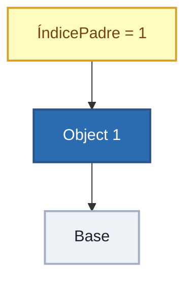
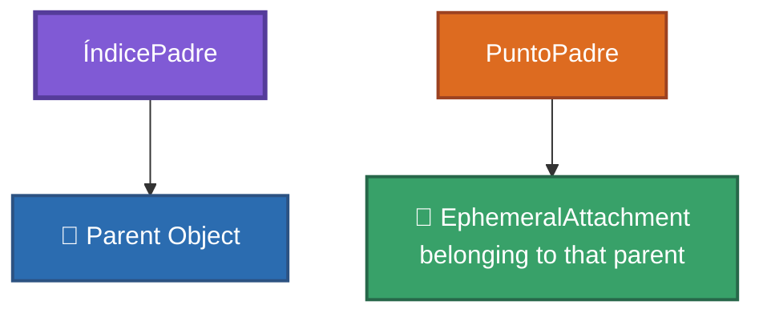
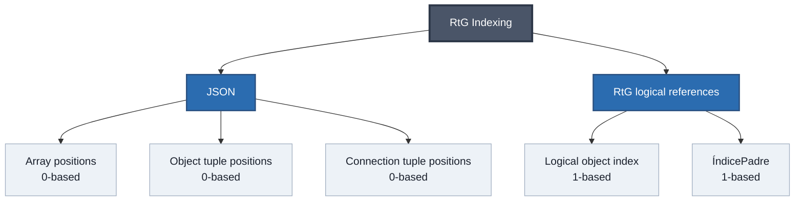

# Indexing

This document describes how RtG indexes objects and how those indices are used by references.

The most important distinction is between:

- JSON array positions.
- RtG logical object indices.
- Tuple field positions.

---

## 1. Two Different Index Systems

RtG uses normal JSON arrays, which programming languages generally access using zero-based positions.

However, object references inside the save format use **1-based logical indices**.

These are not the same thing.
---
| JSON array position | RtG logical object index |
| ------------------- | ------------------------ |
| 0                   | 1                        |
| 1                   | 2                        |
| 2                   | 3                        |
| 3                   | 4                        |
| ...                 | ...                      |
---
For example:

```json
[
    ["Base", [], {}],
    ["Part", [], {}],
    ["Part", [], {}]
]
```

The programming-language positions are:

```js
position 0 = Base
position 1 = first Part
position 2 = second Part
```

The RtG logical indices are:

```js
index 1 = Base
index 2 = first Part
index 3 = second Part
```

---

## 2. Logical Object Index

The logical object index identifies an object within the top-level save array.
The first object has logical index `1`.
The second object has logical index `2`.

And so on.

```text
Root array
│
├── logical index 1 → Object 1
├── logical index 2 → Object 2
├── logical index 3 → Object 3
└── ...
```

This indexing is used by `ÍndicePadre`.

---

## 3. ÍndicePadre

The third value of a connection tuple is `ÍndicePadre`.

```json
[
    TipoLocal,
    PuntoPadre,
    ÍndicePadre
]
```

Example:

```json
["1", "5", 1]
```

Here:

```js
ÍndicePadre = 1
```

means:

> The parent is the object with logical index `1`.

For example:

```json
[
    ["Base", [], {}],
    ["Part", [["1", "5", 1]], {}]
]
```

The connection of the `Part` points to:



---

## 4. Parent References

A connection therefore establishes a relationship between an object and another object in the root array.

```text
Child
 │
 └── Connection
      │
      └── ÍndicePadre
             │
             ▼
        Parent object
```

Example:

```json
[
    ["Base", [], {}],
    ["Part", [["1", "5", 1]], {}],
    ["Part", [["1", "5", 2]], {}]
]
```

Logical relationships:

```text
Object 1 → Base
Object 2 → parent 1 → Base
Object 3 → parent 2 → Object 2
```

Therefore the structure is:

```text
Base
└── Part
    └── Part
```

---

## 5. Object Order Matters

Because references point to logical object indices, changing the order of objects can change what a reference points to.

Original:

```json
[
    ["Base", [], {}],
    ["Part", [["1", "5", 1]], {}]
]
```

Relationship:

```text
Part → Base
```

If the objects are reordered:

```json
[
    ["Part", [["1", "5", 1]], {}],
    ["Base", [], {}]
]
```

the same `ÍndicePadre = 1` now refers to the `Part` itself rather than the `Base`.
The reference has therefore changed meaning.
This is why the order of the root array must be preserved when modifying an existing save.

---

## 6. Object Tuple Positions Are Different

The `0-based` positions used inside an object tuple must not be confused with the `1-based` logical object indices.

An object is:

```json
[
    Type,
    Connections,
    Properties
]
```

Its fields are:

```js
object[0] = Type
object[1] = Connections
object[2] = Properties
```

These positions are zero-based because they are ordinary JSON array positions.

They are unrelated to the logical index used to reference the object.

---

## 7. Connection Tuple Positions

The same distinction applies to connection tuples.

A connection is:

```json
[
    TipoLocal,
    PuntoPadre,
    ÍndicePadre
]
```

Its fields are:

```js
connection[0] = TipoLocal
connection[1] = PuntoPadre
connection[2] = ÍndicePadre
```

Again, these are zero-based JSON positions.
Only the **value of `ÍndicePadre`** represents a 1-based logical object index.

---

## 8. Index Conversion

When parsing an RtG save using a zero-based programming language, the logical index can be converted to an array position by subtracting `1`.

```js
array_position = ÍndicePadre - 1
```

Example:

```js
ÍndicePadre = 1
array position = 0
```

```js
ÍndicePadre = 15
array position = 14
```

When generating a reference from a zero-based array position:

```js
ÍndicePadre = array_position + 1
```

Example:

```js
array position = 0
ÍndicePadre = 1
```

```js
array position = 14
ÍndicePadre = 15
```

---

## 9. Example

Consider:

```json
[
    ["Base", [], {}],
    ["Part", [["1", "5", 1]], {}],
    ["Servo", [["1", "7", 2]], {}],
    ["Part", [["1", "5", 3]], {}]
]
```

Logical indices:

```js
1 = Base
2 = Part
3 = Servo
4 = Part
```

Connections:

```text
Object 2
└── ÍndicePadre = 1
    └── Base

Object 3
└── ÍndicePadre = 2
    └── Part

Object 4
└── ÍndicePadre = 3
    └── Servo
```

The resulting hierarchy is:

```text
Base
└── Part
    └── Servo
        └── Part
```

---

## 10. Indexing and UUIDs

`ÍndicePadre` and UUID references solve different parts of a connection.

A connection such as:

```json
["1", "5", 2]
```

uses:

```js
PuntoPadre  = "5"
ÍndicePadre = 2
```

The `ÍndicePadre` identifies **which object is the parent**.
The `PuntoPadre` identifies **where on that parent the connection is made**.

For a UUID-based connection:

```json
[
    "1",
    "{5a54f1d6-0357-4dae-9a1d-f7600d9c2094}",
    2
]
```

the roles remain separate:



The UUID does not replace `ÍndicePadre`.

---

## 11. Index Validity

A parent index must resolve to an object in the root array.
For a root array containing `N` objects, the normal valid logical range is:

```text
1 ... N
```

A reference outside this range cannot identify an object in the save.
Historical experiments indicate that invalid structural references are not automatically repaired by the loader and can result in a loading failure.

---

## 12. Summary



The most important rule is:

> **`ÍndicePadre` uses a 1-based logical object index, even though the JSON array itself is accessed using zero-based positions by normal programming languages.**

---

## Related Documentation

* [`../SPECIFICATION.md`](../SPECIFICATION.md) — Complete format specification.
* [`json-structure.md`](json-structure.md) — JSON structure.
* [`identifiers.md`](identifiers.md) — Object identifiers and connection references.
* [`../examples/experiments/`](../examples/experiments/) — Experimental saves and evidence.
* [`../old-files/`](../old-files/) — Historical reverse-engineering records.
