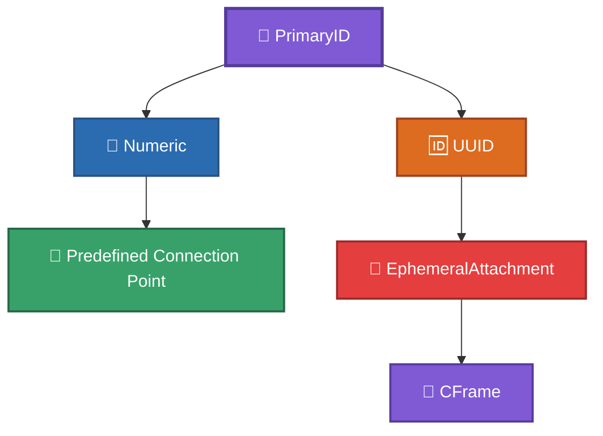
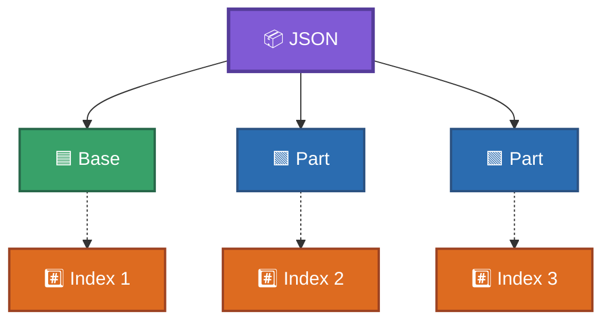
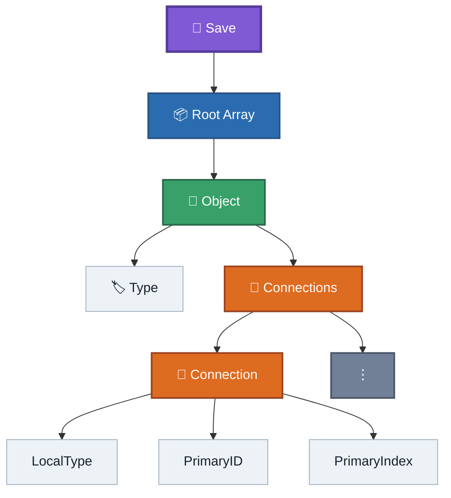

# JSON Structure

This document describes the structural layout of an RtG save file.

It focuses on the JSON representation itself. The meaning and behavior of individual fields are documented separately.

---

## 1. Root Structure

An RtG save is represented by a JSON array.

Each element of the array represents one object in the build.

```json
[
    [Type, Connections, Properties],
    [Type, Connections, Properties],
    [Type, Connections, Properties]
]
```

For example:

```json
[
    ["Base", [], {}],
    ["Part", [], {"RGB": [255, 0, 0]}]
]
```

The top-level array therefore represents the collection of objects that make up the build.

---

## 2. Object Structure

Every object is represented by a tuple containing three elements:

```json
[Type, Connections, Properties]
```

The positions inside this tuple are:

```js
0 = Type
1 = Connections
2 = Properties
```

These positions are **zero-based JSON array positions**.

### Example

```json
[
    "Part",
    [],
    {
        "RGB": [255, 0, 0]
    }
]
```

In this example:

```js
object[0] = "Part"
object[1] = []
object[2] = {"RGB": [255, 0, 0]}
```

---

## 3. Type

The first element identifies the object type.

```json
[
    "Part",
    [],
    {}
]
```

Here:

```js
Type = "Part"
```

The value is normally a string representing an RtG object type.

Examples include:

```text
Base
Part
Servo
Sprite
Rope
Wire
Connector
Chassis
```

The complete object/type research is maintained separately in the object ID documentation.

---

## 4. Connections

The second element is an array containing the connections of the object.

```json
[
    "Part",
    [
        ["1", "5", 1]
    ],
    {}
]
```

An object can have:
```md
0 connections
1 connection
multiple connections
```
Therefore:
```json
[]
```
is a valid empty connection list.
**Example:**
```json
[
    "Part",
    [],
    {}
]
```
---

## 5. Connection Structure

Each connection is represented by three values:

```text
[LocalType, PrimaryID, PrimaryIndex]
```

Example:

```json
[
    "1",
    "5",
    1
]
```

The positions are:

```js
0 = LocalType
1 = PrimaryID
2 = PrimaryIndex
```

These positions are zero-based.

---

## 6. LocalType

`LocalType` is the first value of a connection tuple.

Example:

```json
["1", "5", 1]
```

Here:

```js
LocalType = "1"
```

It identifies the local object type involved in the connection.
The game uses this value when identifying/searching for the corresponding object type.
The exact internal lookup mechanism is unknown.
`LocalType` should therefore not be interpreted as a coordinate, connection-point position, or spatial direction.

---

## 7. PrimaryID

`PrimaryID` is the second value of a connection tuple.

It is the name used by this project for this field because the field identifies the location/reference on the parent involved in the connection.

It can contain different types of values.

### 7.1 Numeric Point ID

A normal connection can use a numeric identifier:

```json
["1", "24", 15]
```

Here:

```js
PrimaryID = "24"
```

The value identifies a predefined connection point on the parent object.

### 7.2 UUID

A connection can instead use a UUID:

```json
[
    "1",
    "{5a54f1d6-0357-4dae-9a1d-f7600d9c2094}",
    1
]
```

In this case, the UUID references an `EphemeralAttachment` belonging to the parent object.
The UUID itself does not contain the spatial position.
The corresponding attachment contains a `cframe` describing its spatial transformation.

Conceptually:

```text
PrimaryID
├── Numeric ID
│   └── Predefined connection point
│
└── UUID
    └── EphemeralAttachment
         └── CFrame
```
Like:

---

## 8. PrimaryIndex

`PrimaryIndex` is the third value of a connection tuple.

It identifies the parent object in the top-level array.

RtG uses **1-based logical object indices**.

Example:

```json
[
    ["Base", [], {}],
    ["Part", [["1", "5", 1]], {}],
    ["Part", [["1", "5", 2]], {}]
]
```

The objects have these logical indices:



Therefore:

```text
first Part
    PrimaryIndex = 1
    → Base

second Part
    PrimaryIndex = 2
    → first Part
```

### Important distinction

The JSON array itself is still accessed using normal zero-based array positions by programming languages.
The **logical object index stored in RtG references is 1-based**.

| JSON position | Logical RtG index |
| ------------- | ----------------- |
| 0             | 1                 |
| 1             | 2                 |
| 2             | 3                 |
| 3             | 4                 |
| ...           | ...               |

This distinction is critical when parsing or generating saves.
---

## 9. Properties

The third element of an object tuple is a JSON object containing the object's properties.

Example:

```json
[
    "Part",
    [],
    {
        "RGB": [255, 0, 0]
    }
]
```

Here:

```js
Properties = {
    "RGB": [255, 0, 0]
}
```

The properties dictionary is open.
Additional keys may exist without necessarily causing a loading error.

For example:

```json
[
    "Part",
    [],
    {
        "RGB": [255, 0, 0],
        "UnknownProperty": 123
    }
]
```
The presence of an unknown property doesn't automatically make the JSON structurally invalid. RtG keeps it when loading the JSON even if the property is unknown.

---

## 10. Empty Values

Objects can have empty connections and/or properties.

```json
[
    "Base",
    [],
    {}
]
```

This is structurally valid.

The three fields still exist:

```js
Type        = "Base"
Connections = []
Properties  = {}
```

---

## 11. Nested Structure

Putting everything together:

```text
Save
│
└── Root Array
    │
    ├── Object
    │   ├── Type
    │   ├── Connections
    │   │   ├── Connection
    │   │   │   ├── LocalType
    │   │   │   ├── PrimaryID
    │   │   │   └── PrimaryIndex
    │   │   └── ...
    │   │
    │   └── Properties
    │       ├── Property
    │       └── ...
    │
    └── ...
```
Like:


Equivalent JSON shape:

```json
[
    [
        Type,
        [
            [
                LocalType,
                PrimaryID,
                PrimaryIndex
            ]
        ],
        {
            PropertyName: PropertyValue
        }
    ]
]
```

---

## 12. Complete Example

The following example combines the structural components:

```json
[
    [
        "Base",
        [],
        {
            "RGB": [120, 120, 120]
        }
    ],
    [
        "Part",
        [
            ["1", "5", 1]
        ],
        {
            "RGB": [255, 0, 0]
        }
    ],
    [
        "Sprite",
        [
            [
                "1",
                "{5a54f1d6-0357-4dae-9a1d-f7600d9c2094}",
                1
            ]
        ],
        {
            "ImageId": 123456789
        }
    ]
]
```

Logical structure:

```text
Object 1
└── Base
    └── no connections

Object 2
└── Part
    └── connection
        ├── LocalType = "1"
        ├── PrimaryID = "5"
        └── PrimaryIndex = 1
            └── parent = Object 1

Object 3
└── Sprite
    └── connection
        ├── LocalType = "1"
        ├── PrimaryID = UUID
        └── PrimaryIndex = 1
            └── parent = Object 1
```

---

## 13. Structural Rules

The following rules describe the observed JSON structure:

1. The root value is an array.
2. Each root element represents one object.
3. Each object contains three fields:
   `[Type, Connections, Properties]`.
4. Object tuple positions are zero-based.
5. `Connections` is an array.
6. Each connection contains three fields:
   `[LocalType, PrimaryID, PrimaryIndex]`.
7. Connection tuple positions are zero-based.
8. `PrimaryIndex` uses a 1-based logical object index.
9. `Properties` is a JSON object/dictionary.
10. `PrimaryID` can contain a numeric connection-point identifier or a UUID referencing an `EphemeralAttachment`.
11. Object ordering affects logical references.
12. Structural references must resolve correctly for the build to load.

---

## 14. What This File Does Not Define

This document intentionally does not fully describe:

* the complete object/type catalog;
* the meaning of every `LocalType`;
* every connection-point ID;
* the complete property catalog;
* `EphemeralAttachment` behavior;
* CFrame mathematics;
* the loader's internal implementation;
* save encoding/compression.

Those topics are documented separately.

---

## Related Documentation

* [`../SPECIFICATION.md`](../SPECIFICATION.md) — Complete format specification.
* [`indexing.md`](indexing.md) — Detailed indexing rules.
* [`identifiers.md`](identifiers.md) — IDs, `LocalType`, `PrimaryID`, and UUIDs.
* [`properties.md`](properties.md) — Property behavior.
* [`../blocks/`](../blocks/) — Object and block documentation.
* [`../examples/experiments/`](../examples/experiments/) — Experimental saves and evidence.
* [`../old-files/`](../old-files/) — Historical reverse-engineering records.
