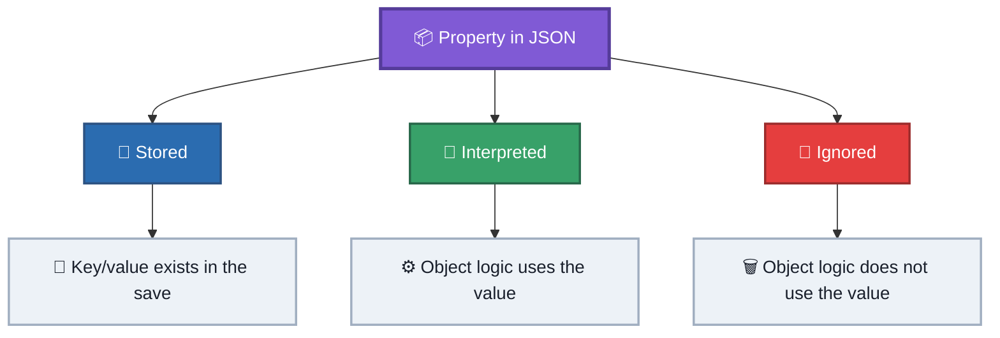
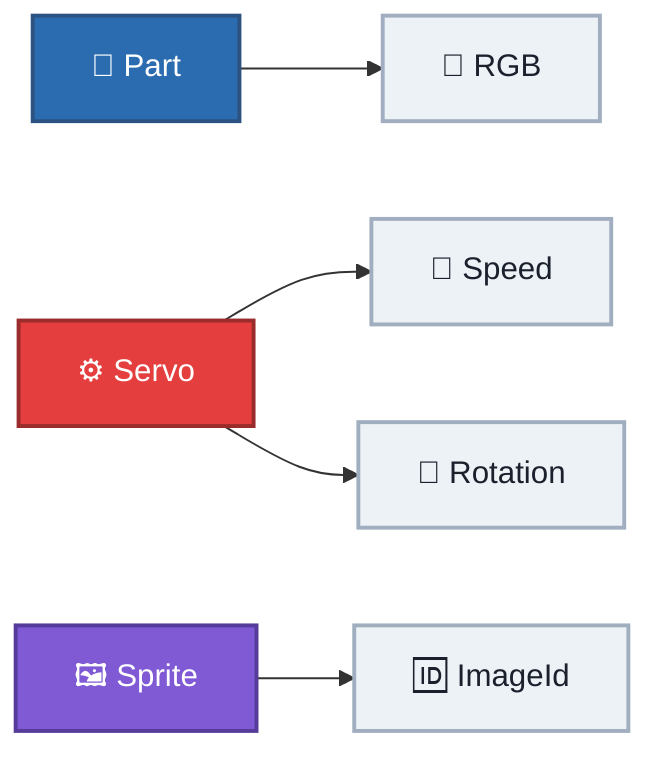
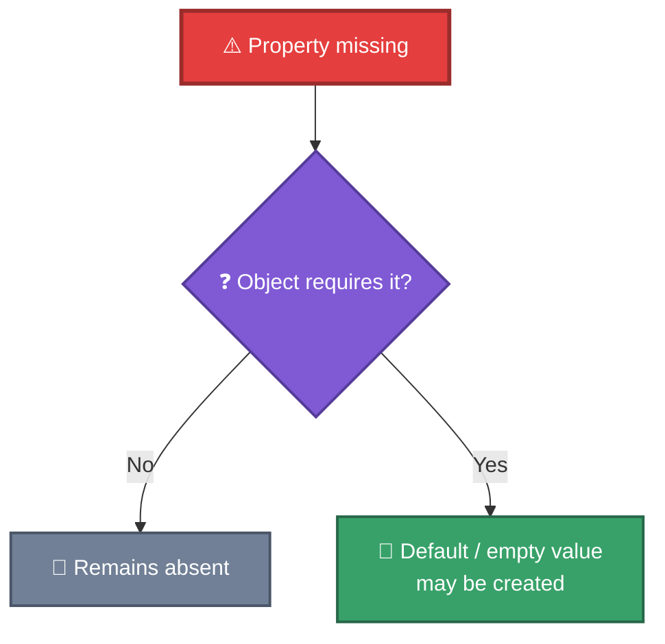
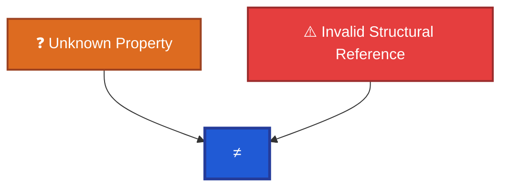

# Properties

This document describes the observed `Properties` dictionary stored in RtG object tuples.

The `Properties` field is an open JSON object. Different object types interpret different properties, while other properties may be stored without being actively used.

Historical evidence for these observations is preserved in:

- [`../old-files/RtG_Save_Format_Specification-spanish.md`](../old-files/RtG_Save_Format_Specification-spanish.md)
- [`../old-files/obj_ids-spanish.md`](../old-files/obj_ids-spanish.md)

---

## 1. Structure

The third field of every object tuple is the `Properties` dictionary:

```json
[
    Type,
    Connections,
    Properties
]
```

Example:

```json
[
    "Part",
    [],
    {
        "RGB": [255, 0, 0]
    }
]
```

The dictionary can contain zero or more key/value pairs.
An empty properties dictionary is valid:

```json
[
    "Base",
    [],
    {}
]
```

---

## 2. Open Dictionary

The `Properties` object is an open dictionary.
Additional keys can be present without necessarily making the JSON structurally invalid.

Example:

```json
{
    "RGB": [255, 0, 0],
    "DatoInventado": 123
}
```

Historical experiments demonstrated that additional properties can be inserted into objects without preventing the save from loading.

This does **not** mean that every property is understood or used by every object.

---

## 3. Property States

A property observed in a save can be classified by how the object handles it.



### Stored

The property exists in the JSON object.
Its presence alone does not prove that the object actively uses it.

### Interpreted

The object's logic reads the property and uses it to affect behavior, appearance, or another part of its state.

Examples observed historically include:



### Ignored

The property exists in the JSON but is not used by the object's logic.

Historical experiments demonstrated that extra keys can be present without causing a syntax or loading error.

---

## 4. Additional Properties

A property dictionary may contain keys that do not correspond to the normal properties expected by an object.

For example:

```json
{
    "RGB": [255, 0, 0],
    "Speed": 100,
    "UnknownProperty": 123
}
```

Historical testing showed that adding extra keys to objects such as `Servo` and `Sprite` did not prevent them from loading.

Therefore:

> An unknown property is not automatically an invalid property.

Whether an unknown property is ignored, preserved, or interpreted is object-dependent and must be determined experimentally.

---

## 5. Missing Properties

Historical testing also showed that some missing properties may be created automatically when the object requires them.

The loader may use an empty or default value.

Conceptually:



The exact default behavior is object-specific and has not been completely catalogued.

---

## 6. Universal / Cross-Object Properties

Some properties have been observed across multiple object types.

### `RGB`

Represents color information as an array of three values:

```json
{
    "RGB": [255, 0, 0]
}
```

Observed form:

```json
[R, G, B]
```

The historical research records `RGB` as an observed property.
It was also present in the first `SprayPaint` save that started the reverse-engineering investigation.

### `EphemeralAttachments`

Stores attachment data indexed by UUID:

```json
{
    "EphemeralAttachments": {
        "{UUID}": {
            "partName": "Part",
            "cframe": [
                5.0, 5.0, 0.0,
                0.0, 0.0, 0.0,
                0.0, 1.0, 0.0,
                0.0, 0.0, 1.0
            ]
        }
    }
}
```

`EphemeralAttachments` can be hosted by objects throughout the format.

Detailed UUID and attachment behavior is documented in [`identifiers.md`](identifiers.md) and `SPECIFICATION.md`.

---

## 7. Observed Property Catalog

The historical specification records the following properties.
This is an **observed catalog**, not a claim that these are the only properties used by RtG.

### General

| Property               | Observed type   | Example         |
| ---------------------- | --------------- | --------------- |
| `RGB`                  | Array `[R,G,B]` | `[255,0,0]`     |
| `EphemeralAttachments` | Object          | `{UUID: {...}}` |
| `Mode`                 | String          | `"..."`         |
| `Visible`              | Boolean         | `true`          |

### Servo / Mechanical

| Property       | Observed type | Example |
| -------------- | ------------- | ------- |
| `Rotation`     | Number        | `0`     |
| `Speed`        | Number        | `72`    |
| `LimitEnabled` | Boolean       | `true`  |
| `LimitAngle`   | Number        | `80.9`  |
| `Rest`         | Boolean       | `true`  |
| `Forwards`     | Boolean       | `false` |
| `Backwards`    | Boolean       | `false` |
| `MinLength`    | Number        | `0`     |
| `MaxLength`    | Number        | `0`     |
| `MaxForce`     | Number        | `0`     |
| `Length`       | Number        | `0`     |

### Sensors

| Property            | Observed type | Example |
| ------------------- | ------------- | ------- |
| `Activated`         | Boolean       | `true`  |
| `ActivationSpeed`   | Number        | `10`    |
| `ActivationHeight`  | Number        | `5`     |
| `MaxDistance`       | Number        | `10`    |
| `CanTargetAttached` | Boolean       | `true`  |
| `IgnoreAttached`    | Boolean       | `true`  |

### Logic / Timing

| Property            | Observed type | Example |
| ------------------- | ------------- | ------- |
| `Delay`             | Number        | `1`     |
| `DelayDeactivation` | Boolean       | `true`  |

### Weapons / Inventory

| Property   | Observed type | Example |
| ---------- | ------------- | ------- |
| `Shooting` | Boolean       | `true`  |
| `Bullets`  | Integer       | `10`    |
| `Quantity` | Integer       | `1`     |

### Text / Media / Radio

| Property      | Observed type | Example     |
| ------------- | ------------- | ----------- |
| `Text`        | String        | `"Hello"`   |
| `ImageId`     | Integer       | `123456789` |
| `Volume`      | Number        | `1`         |
| `Channel`     | Number        | `1`         |
| `CustomTrack` | String        | `"..."`     |
| `On`          | Boolean       | `true`      |
| `Phrase`      | String        | `"..."`     |

---

## 8. Object-Specific Examples

The same property name may have meaning only for certain object types.

### Part

Example observed property:

```json
{
    "RGB": [255, 0, 0]
}
```

### Servo

Historical research observed:

```json
{
    "Rotation": 0,
    "Speed": 72,
    "LimitEnabled": true,
    "LimitAngle": 80.9,
    "Rest": true,
    "Forwards": false,
    "Backwards": false
}
```

### Sensors

Historical research observed properties including:

```json
{
    "ActivationKey": "W",
    "ActivationHeight": 5,
    "ActivationSpeed": 10
}
```

### Sprite

Historical research observed:

```json
{
    "ImageId": 6767676767
}
```

An invalid or nonexistent `ImageId` was observed to produce a `Sprite` that can still exist in the build while remaining invisible.

---

## 9. Property Validation

Properties are treated more permissively than structural references.

Historical testing demonstrated that additional unknown properties can be inserted without necessarily causing `Build inválida`.

This differs from structural fields such as:

* `TipoLocal`
* `ÍndicePadre`
* UUID references

which can cause loading failures when invalid.

Therefore:



---

## 10. Evidence Status

The catalog in this document is based on historical observations.

The following distinctions are important:

### CONFIRMED / OBSERVED

The property and its behavior have been directly observed in a save or experiment.

### PARTIALLY DOCUMENTED

The property has been observed, but its complete behavior or value range is not yet known.

### UNKNOWN

The available evidence does not establish the property's exact behavior.

Do not infer a property's meaning solely from its name.

---

## 11. Related Documentation

* [`../SPECIFICATION.md`](../SPECIFICATION.md) — Complete format specification.
* [`json-structure.md`](json-structure.md) — JSON object structure.
* [`identifiers.md`](identifiers.md) — IDs, UUIDs, and references.
* [`../examples/experiments/`](../examples/experiments/) — Reproducible experiments.
* [`../old-files/RtG_Save_Format_Specification-spanish.md`](../old-files/RtG_Save_Format_Specification-spanish.md) — Historical specification.
* [`../old-files/obj_ids-spanish.md`](../old-files/obj_ids-spanish.md) — Historical object research.
