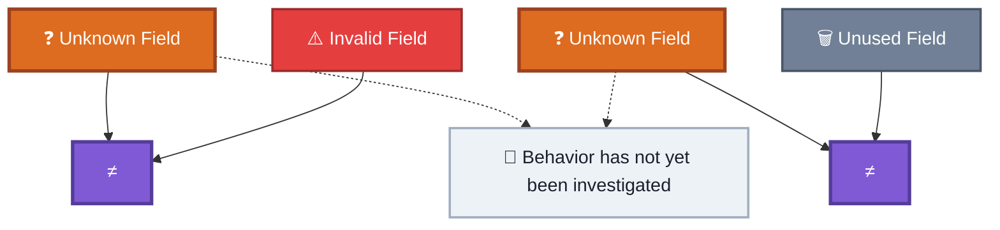
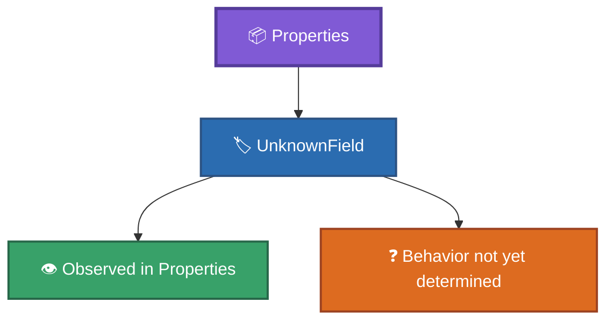
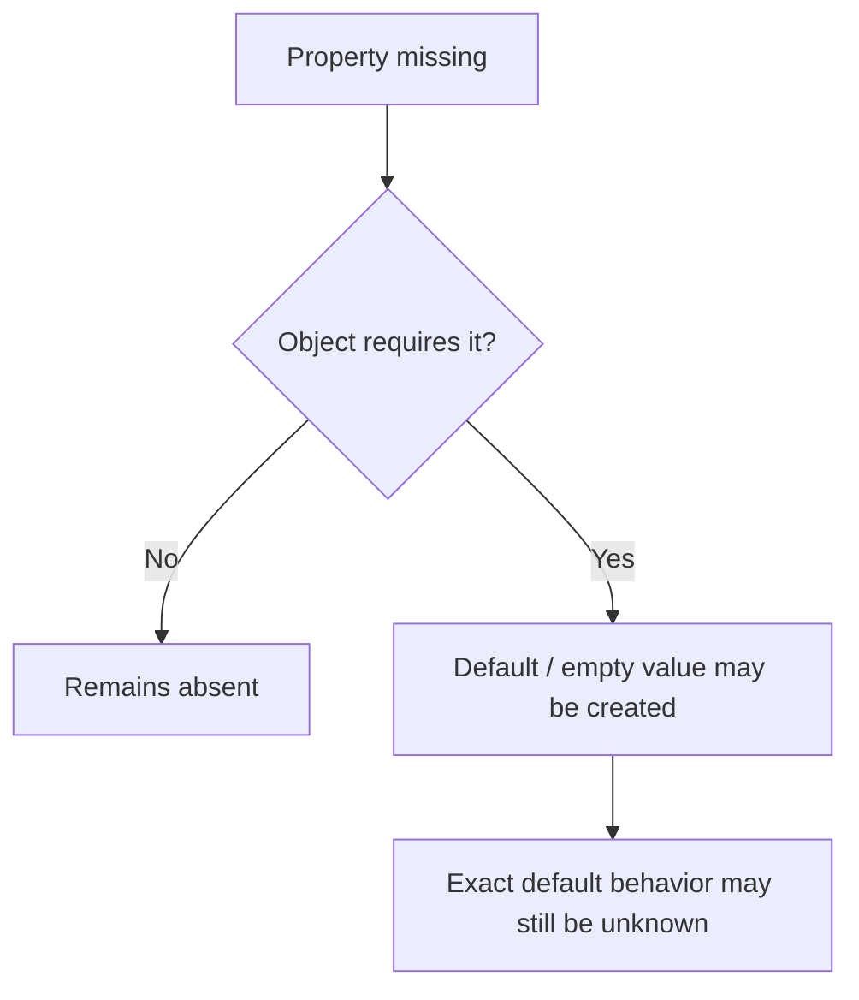
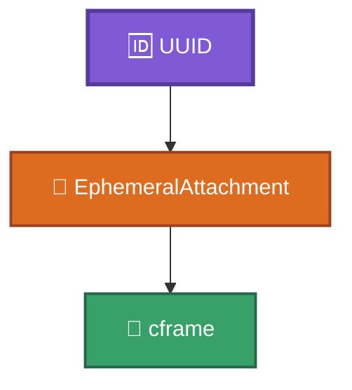
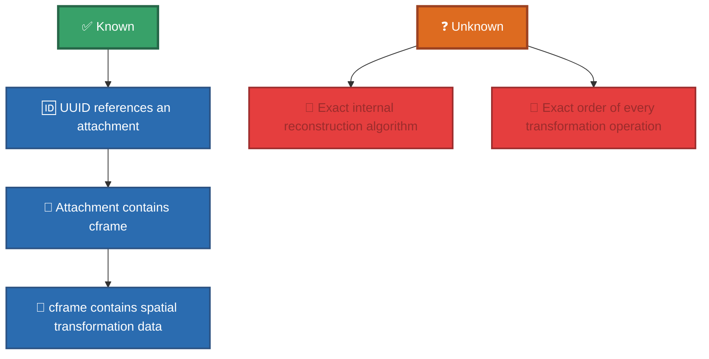

# Unknown / Unconfirmed Fields

This document records fields whose meaning, behavior, or exact purpose has not yet been fully determined.

It is intentionally conservative.

A field should be documented here when it has been observed in a real save or experiment, but the available evidence is not sufficient to describe its meaning with confidence.

---

## 1. What Belongs Here?

A field belongs in this document when:

- it has been observed in a real RtG save;
- its exact meaning is unknown or incomplete;
- its behavior has not been sufficiently tested;
- or multiple interpretations are still possible.

This document should **not** be used for fields whose behavior is already sufficiently understood.

Known properties belong in [`properties.md`](properties.md).
Known identifier systems belong in [`identifiers.md`](identifiers.md).

---

## 2. Evidence Levels

Unknown fields should have an explicit evidence status.

### OBSERVED

The field has been directly observed in one or more real saves.
This confirms that the field exists, but does not establish what it means.

### PARTIALLY UNDERSTOOD

The field's general purpose or behavior is known, but some details remain unknown.

### UNCONFIRMED

The field has been observed, but there is not enough evidence to establish its behavior.

### HYPOTHESIS

A possible interpretation exists, but it has not been experimentally confirmed.
Hypotheses must be clearly marked as such.

---

## 3. Unknown Does Not Mean Invalid

An unknown field is not necessarily an invalid field.
For example:

```json
{
    "KnownProperty": 123,
    "UnknownField": 456
}
```

The presence of `UnknownField` does not automatically mean that the save is structurally invalid.

Historical experiments demonstrated that additional properties can exist without necessarily preventing the build from loading.

Therefore:



A field may be unknown simply because its behavior has not yet been investigated.

---

## 4. Unknown Properties

Properties are stored inside the object's `Properties` dictionary.
Example:

```json
[
    "Part",
    [],
    {
        "RGB": [255, 0, 0],
        "UnknownField": 123
    }
]
```

If the effect of `UnknownField` has not been established, it belongs here rather than being added to the confirmed property catalog.

The correct description is:



It should not be assigned a meaning based solely on its name.

---

## 5. Missing Fields

A missing field can be as important as an unknown field.

Historical experiments showed that when some properties are absent, the loader may create a default or empty value if the object requires that property.

Conceptually:



Therefore, the following questions should be tested separately:

1. Does the object require the field?
2. What happens when the field is absent?
3. Is a value automatically created?
4. What is the created value?
5. Does the behavior differ by object type?

---

## 6. Unknown Values

A known field can also contain an unknown value.

For example:

```json
{
    "Mode": 3
}
```

We may know that `Mode` exists while not knowing what `3` means.

This should be documented as:


rather than treating `Mode` itself as an unknown field.

---

## 7. Unknown Identifier Mappings

Numeric identifiers require additional caution.
For example:

```js
LocalType = 7
```

does not automatically reveal the semantic meaning of `7`.
Likewise, observing:

```js
PuntoPadre = "24"
```

does not by itself establish every property of connection point `24`.
Identifier mappings should therefore only be considered confirmed when supported by evidence.

See:

* [`identifiers.md`](identifiers.md)
* [`../old-files/obj_ids-spanish.md`](../old-files/obj_ids-spanish.md)

---

## 8. UUID-Related Unknowns

UUIDs used by `EphemeralAttachments` are known to act as references.

However, some implementation details remain unknown.

For example:



The observed behavior establishes the relationship, but does not necessarily reveal how the game's internal object system stores or resolves the UUID.

Do not document an assumed internal implementation as fact.

---

## 9. Unknown CFrame Details

The presence of a `cframe` inside an `EphemeralAttachment` is known.

Its observed data contains position and rotation information.

However, implementation details of the game's reconstruction process should not be added here unless experimentally confirmed.

For example:



---

## 10. Field Investigation Template

When a new unknown field is discovered, use the following structure:

````md
### `FieldName`

**Observed in:**

- `path/to/example.json`
- Experiment: `experiment-name`

**Object type:**

`ObjectType`

**Location:**

```text
Properties
└── FieldName
```

**Known behavior:**

Describe only behavior directly supported by evidence.

**Unknown meaning:**

Describe what remains unknown.

**Hypothesis:**

Optional. Clearly label any interpretation that has not been confirmed.

**Tests performed:**

* Test 1
* Test 2
* Test 3

**Result:**

Describe the observed result.

**Confidence:**

`OBSERVED` / `PARTIALLY UNDERSTOOD` / `UNCONFIRMED` / `HYPOTHESIS`

````

---

## 11. Example Entry

The following is an example of the format.

````md
### `SomeField`

**Observed in:**

`examples/experiments/example-name/example.json`

**Object type:**

`Part`

**Location:**

```text
Properties
└── SomeField
````

**Known behavior:**

The field can be present in the `Properties` dictionary without causing a structural loading error.

**Unknown meaning:**

Its effect on the `Part` object has not been determined.

**Hypothesis:**

None.

**Tests performed:**

* Present with original value.
* Removed from the object.
* Replaced with another value.

**Result:**

No confirmed behavioral difference was observed.

**Confidence:**

`UNCONFIRMED`

---

## 12. Do Not Promote Unverified Information

Information should only be moved from this document into the confirmed documentation when there is sufficient evidence.

For example:

```text
Unknown field
     │
     ▼
Experiment
     │
     ├── Insufficient evidence
     │       ↓
     │   Remains here
     │
     └── Sufficient evidence
             ↓
       Move to properties.md
```

Similarly, an identifier mapping should only be promoted to the appropriate identifier documentation after being verified.

---

## 13. Historical Evidence

Historical reverse-engineering documents have priority when reconstructing observations that are no longer represented elsewhere.

Relevant sources include:

* [`../old-files/RtG_Save_Format_Specification-spanish.md`](../old-files/RtG_Save_Format_Specification-spanish.md)
* [`../old-files/obj_ids-spanish.md`](../old-files/obj_ids-spanish.md)
* [`../examples/experiments/`](../examples/experiments/)

Historical observations should be preserved even when their meaning remains unknown.

---

## 14. Important Distinctions

The following distinctions should be maintained:

```mermaid
flowchart TD

    UNKNOWN_FIELD["❓ Unknown Field"] --> NE1["≠"]
    INVALID_FIELD["⚠️ Invalid Field"] --> NE1

    UNKNOWN_FIELD2["❓ Unknown Field"] --> NE2["≠"]
    UNUSED_FIELD["🗑️ Unused Field"] --> NE2

    UNKNOWN_VALUE["❓ Unknown Value"] --> NE3["≠"]
    UNKNOWN_FIELD3["❓ Unknown Field"] --> NE3

    UNKNOWN_IDENTIFIER["❓ Unknown Identifier Meaning"] --> NE4["≠"]
    INVALID_IDENTIFIER["⚠️ Invalid Identifier"] --> NE4

    MISSING_PROPERTY["⚠️ Missing Property"] --> NE5["≠"]
    UNKNOWN_PROPERTY["❓ Unknown Property"] --> NE5

    classDef unknown fill:#dd6b20,color:#fff,stroke:#9c4221,stroke-width:2px;
    classDef invalid fill:#e53e3e,color:#fff,stroke:#9b2c2c,stroke-width:2px;
    classDef unused fill:#718096,color:#fff,stroke:#4a5568,stroke-width:2px;
    classDef missing fill:#d69e2e,color:#744210,stroke:#975a16,stroke-width:2px;
    classDef symbol fill:#805ad5,color:#fff,stroke:#553c9a,stroke-width:3px;

    class UNKNOWN_FIELD,UNKNOWN_FIELD2,UNKNOWN_VALUE,UNKNOWN_FIELD3,UNKNOWN_IDENTIFIER,UNKNOWN_PROPERTY unknown;
    class INVALID_FIELD,INVALID_IDENTIFIER invalid;
    class UNUSED_FIELD unused;
    class MISSING_PROPERTY missing;
    class NE1,NE2,NE3,NE4,NE5 symbol;
```



These distinctions are important because the loader may accept information whose meaning has not yet been reverse-engineered.

---

## Related Documentation

* [`properties.md`](properties.md) — Known and observed properties.
* [`identifiers.md`](identifiers.md) — Identifier systems.
* [`json-structure.md`](json-structure.md) — JSON structure.
* [`indexing.md`](indexing.md) — Object indexing.
* [`../SPECIFICATION.md`](../SPECIFICATION.md) — Complete format specification.
* [`../examples/experiments/`](../examples/experiments/) — Experimental evidence.
* [`../old-files/`](../old-files/) — Historical reverse-engineering records.
