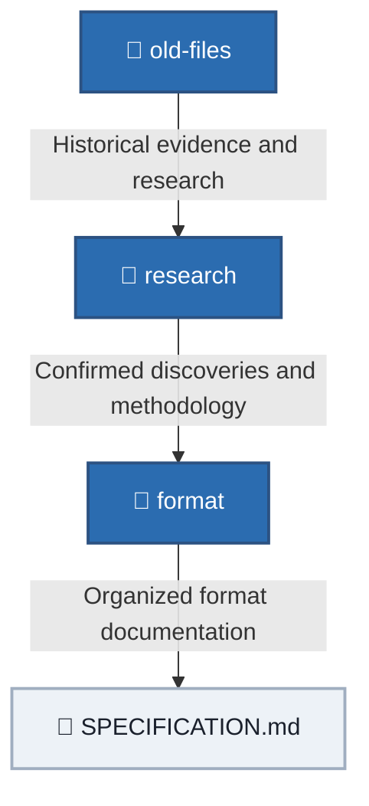

# Old Files

This folder contains historical reverse-engineering documentation and records for the RtG save/build format.
The files in this folder are preserved as part of the project's research history and are considered an important source of evidence for the format.

## Priority

When there is a discrepancy between `old-files/` and the current documentation, the information in `old-files/` takes priority.
Current documentation may reorganize, summarize, clarify, or expand upon information from these files, but it must not silently override historical evidence.
If current documentation disagrees with an `old-files/` document, the discrepancy should be investigated and documented rather than assuming that the current documentation is correct.

## Historical Status

Files in this directory may contain:

- Earlier versions of the format specification.
- Original reverse-engineering observations.
- Object and Part ID research.
- Historical terminology.
- Experiments and discoveries that were later incorporated into the current documentation.
- Information that is no longer fully understood or has not yet been migrated to the current documentation.

Historical wording and terminology should be interpreted in the context of the document in which they appear.
Differences between historical files do not automatically mean that one file is incorrect. They may represent different stages of the reverse-engineering process.

## Relationship With Current Documentation

The current documentation is organized to make the format easier to understand and navigate.
In general:

This does not change the priority of historical evidence.
If a current document conflicts with an `old-files/` document, the historical source must be checked before changing or rejecting the historical information.

## Editing Historical Files

Historical files may be corrected when they contain:

* Obvious writing or formatting errors.
* Broken references.
* Duplicated or corrupted entries.
* Incorrect migrations or accidental edits.
* Information that can be corrected using stronger evidence already available in the repository.

When modifying historical research, avoid silently rewriting the meaning of an observation.
If a correction changes the interpretation of the format, document the reason for the change.

## Object and Part IDs

Historical object and Part ID research is preserved here.
The main historical ID document is:

[`obj_ids-spanish.md`](obj_ids-spanish.md)

If the historical ID list differs from a newer organized reference, investigate the difference before assuming that the newer reference is correct.

## Historical Specification

The Spanish historical specification is preserved in:

[`RtG_Save_Format_Specification-spanish.md`](RtG_Save_Format_Specification-spanish.md)

This document contains detailed historical information about:

* Save structure.
* Object connections.
* Indexing.
* UUIDs.
* `EphemeralAttachments`.
* CFrame data.
* Properties.
* Loader behavior.
* Encoding and related observations.

## Important Rule

Do not treat historical information as obsolete simply because it is stored in `old-files/`.
`old-files/` is part of the evidence base of this project.
When uncertain, preserve the historical information and investigate the discrepancy instead of silently replacing it with a newer interpretation.
