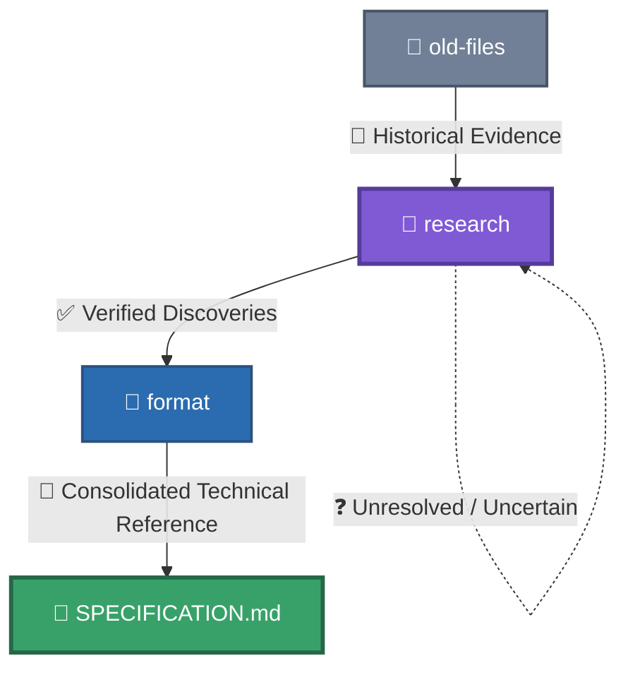

# Old Files

This folder contains historical reverse-engineering documentation and records for the RtG save/build format.
The files in this folder are preserved as part of the project's research history and are considered an important source of evidence for the format.

## Priority

When there is a discrepancy between `old-files/` and the current documentation, the information in `old-files/` takes priority.
Current documentation may reorganize, summarize, clarify, or expand upon information from these files, but it must not silently override historical evidence.
If current documentation disagrees with an `old-files/` document, the discrepancy should be investigated and documented rather than assuming that the current documentation is correct.

## Historical Documentation

[`old-files/`](old-files/) contains historical reverse-engineering material preserved for research provenance.
`SPECIFICATION.md` and `format/` provide the current consolidated presentation of the format.
When a discrepancy exists between current documentation and historical material, the historical material in `old-files/` has priority as evidence and must be investigated before changing the current interpretation.
Historical files may contain earlier terminology, incomplete investigations, or hypotheses that were later refined. Their priority applies to the historical evidence they contain, not to assumptions that are no longer supported by the evidence.

## Relationship With Current Documentation

The current documentation is organized to make the format easier to understand and navigate.
In general:



This does not change the priority of historical evidence.
If a current document conflicts with an `old-files/` document, the historical source must be checked before changing or rejecting the historical information.

## Editing Historical Files

Historical files may be corrected when they contain:

* Obvious writing or formatting errors.
* Broken references.
* Duplicated or corrupted entries.
* Incorrect migrations or accidental edits.
* Information that can be corrected using stronger evidence already available in the repository.

When modifying historical research, avoid silently rewriting the meaning of an observation.
If a correction changes the interpretation of the format, document the reason for the change.

## Object and Part IDs

Historical object and Part ID research is preserved here.
The main historical ID document is:

[`obj_ids-spanish.md`](obj_ids-spanish.md)

If the historical ID list differs from a newer organized reference, investigate the difference before assuming that the newer reference is correct.

## Historical Specification

The Spanish historical specification is preserved in:

[`RtG_Save_Format_Specification-spanish.md`](RtG_Save_Format_Specification-spanish.md)

This document contains detailed historical information about:

* Save structure.
* Object connections.
* Indexing.
* UUIDs.
* `EphemeralAttachments`.
* CFrame data.
* Properties.
* Loader behavior.
* Encoding and related observations.

## Important Rule

Do not treat historical information as obsolete simply because it is stored in `old-files/`.
`old-files/` is part of the evidence base of this project.
When uncertain, preserve the historical information and investigate the discrepancy instead of silently replacing it with a newer interpretation.

## Terminology Note

Historical files may use Spanish names for some format fields, such as:

* `TipoLocal`
* `PuntoPadre`
* `ÍndicePadre`

Current documentation uses generalized English names for these same fields:

```js
"TipoLocal"    = "LocalType"
"PuntoPadre"  = "PrimaryID"
"ÍndicePadre" = "PrimaryIndex"
```

These are **terminology equivalents**, not different fields or different versions of the format.
The Spanish names are preserved in historical files to maintain the original research record.
The English names are used in the current documentation to keep terminology consistent across the repository.

### Terminology Migration

| Historical Name | Current Name   | Description                                                                  | Tag         | Spanish Tag | Migrated by |
| --------------- | -------------- | ---------------------------------------------------------------------------- | ----------- | ----------- | ----------- |
| `TipoLocal`     | `LocalType`    | Local object-type identifier used by a connection                            | Connections | Connexiones | JuanCrakYT  |
| `PuntoPadre`    | `PrimaryID`    | Connection reference on the parent; may contain a numeric point ID or a UUID | Connections | Connexiones | JuanCrakYT  |
| `ÍndicePadre`   | `PrimaryIndex` | 1-based logical index of the parent object                                   | Connections | Connexiones | JuanCrakYT  |

> **Important:** The terminology migration does not change the underlying format or reinterpret historical evidence. It only standardizes the names used by the current documentation.
