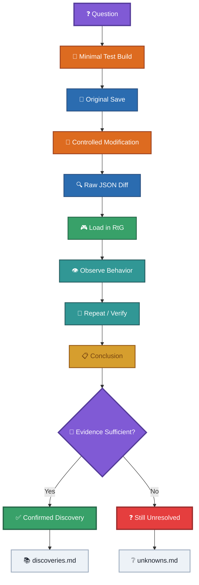
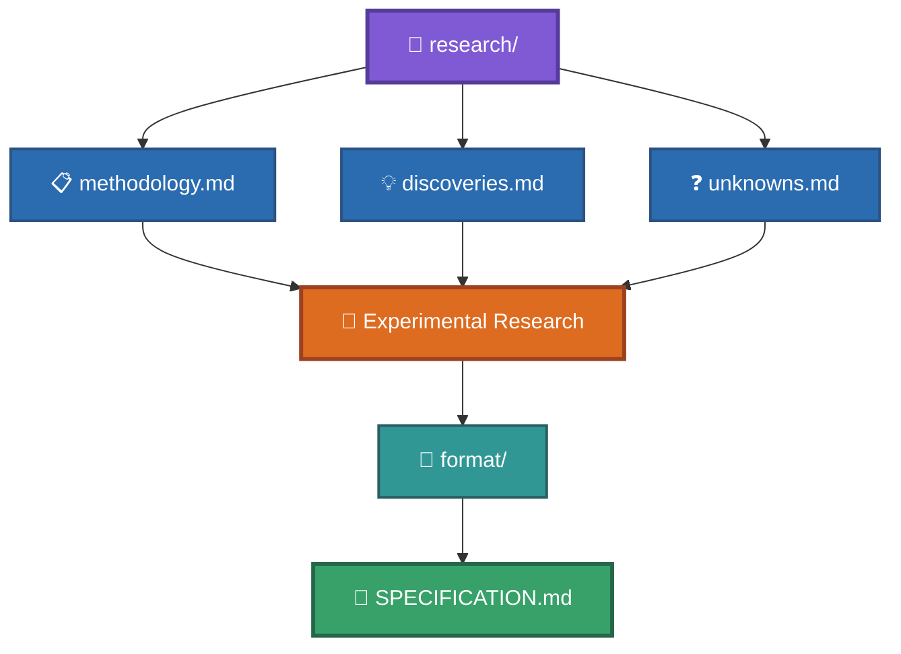

# Research

This folder contains the research documentation produced during the reverse-engineering of the RtG save format.

The documents here focus on **how the format was investigated, what has been discovered, and what is still unknown**.

Research is based primarily on reproducible experiments using real RtG saves.

---

## Documents

### [`discoveries.md`](discoveries.md)

Records the major discoveries made during the reverse-engineering process.
It contains conclusions that are supported by experimental evidence, while avoiding implementation details that have not been confirmed.

Use this file to see **what has been discovered**.

---

### [`unknowns.md`](unknowns.md)

Records questions and behaviors that are still unknown, partially understood, or under investigation.
A subject should remain here until sufficient evidence exists to document it confidently elsewhere.

Use this file to see **what is still unknown**.

---

### [`methodology.md`](methodology.md)

Documents the methodology used to perform the reverse-engineering experiments.
It explains how experiments should be designed, how evidence should be recorded, how variables should be isolated, and how conclusions should be evaluated.

Use this file to see **how discoveries are made and verified**.

---

## Research Workflow

The research process can be summarized as:



The detailed procedure is documented in [`methodology.md`](methodology.md).

---

## Evidence

Research should be based on evidence whenever possible.

Relevant experimental evidence is stored under:

```md
examples/experiments/
```

Historical research is preserved under:

```md
old-files/
```

The historical files are important references, but current documentation should distinguish between:

* historical observations;
* reproducible experimental results;
* confirmed conclusions;
* hypotheses;
* unresolved questions.

---

## Relationship With Other Documentation

The `research/` folder is not intended to replace the technical documentation.

Instead, the project is organized approximately as:



### `research/`

Explains the **investigation and evidence**.

### `format/`

Explains the **current understanding of individual parts of the format**.

### `SPECIFICATION.md`

Provides the **consolidated technical specification**.

### `examples/experiments/`

Contains the **actual experimental saves and their results**.

### `old-files/`

Preserves the **historical reverse-engineering record**.

---

## Important Rule

> **Research documents should describe what the evidence supports, not what the format merely appears to mean.**

When new evidence contradicts an existing conclusion, the documentation should be updated rather than forcing the new evidence to fit the old interpretation.
