# Discoveries

This document records the major discoveries made while reverse-engineering the RtG RtG save/build format.

It is a historical and evidential record, not a complete technical specification.

Detailed explanations should be kept in the appropriate documentation under `format/` and `SPECIFICATION.md`.

Each discovery should include:

- **Discovery** — What was discovered.
- **Evidence** — How it was established.
- **Confidence** — Current confidence level.
- **Notes** — Important limitations or unresolved details.

Historical reverse-engineering material is preserved under [`../old-files/`](../old-files/).

---

## 1. Save Representation

> **Discovery:** RtG builds are serialized as a top-level JSON array.

Each element represents one object:

```json
[
    Type,
    Connections,
    Properties
]
```

> **Evidence:** Repeated observations of exported saves and the historical specification.
> **Confidence:** `CONFIRMED`
> **Notes:** The serialized object tuple contains exactly three fields in the observed format.

See [`../format/json-structure.md`](../format/json-structure.md).

---

## 2. Object Tuple Structure

> **Discovery:** Each object in the root array follows the structure:

```json
[
    Type,
    Connections,
    Properties
]
```

The three fields represent:

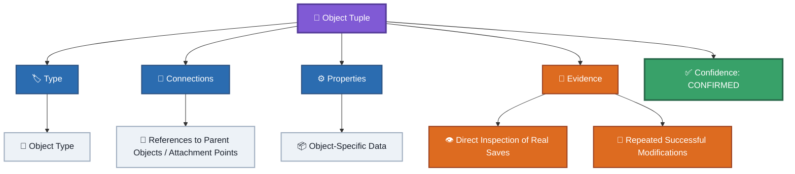

> **Evidence:** Direct inspection of real saves and repeated successful modifications.
> **Confidence:** `CONFIRMED`

---

## 3. Connection Tuple Structure

> **Discovery:** A connection is represented by a three-value tuple:

```json
[
    LocalType,
    PrimaryID,
    PrimaryIndex
]
```

The fields have different roles:

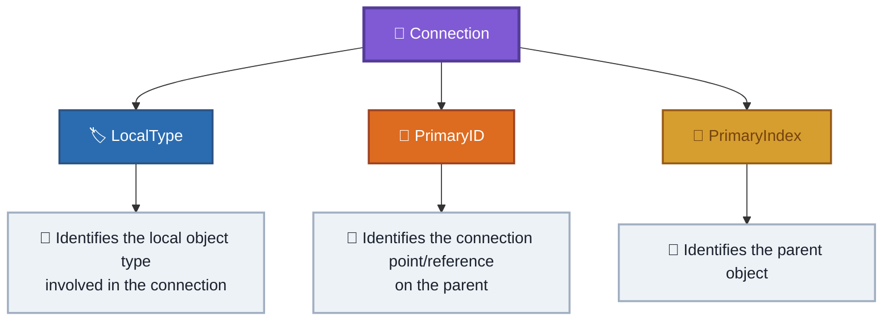

> **Evidence:** Real saves, connection modifications, and historical experiments.
> **Confidence:** `CONFIRMED`

See [`../format/identifiers.md`](../format/identifiers.md).

---

## 4. LocalType Is an Object-Type Identifier

> **Discovery:** `LocalType` is a numeric identifier associated with an object's type.

The game uses the value to identify/search for the corresponding local object type.
The exact internal lookup mechanism has not been determined.

The numeric values should therefore be treated as observed identifiers rather than semantic classifications.

> **Evidence:** Observed mappings across many object types and connection experiments.
> **Confidence:** `CONFIRMED` for the observed behavior; `UNKNOWN` for the internal lookup implementation.
> **Notes:** Knowing a `LocalType` value does not reveal the internal meaning of the number itself.

---

## 5. PrimaryIndex Is a 1-Based Logical Object Index

> **Discovery:** The third value of a connection tuple, `PrimaryIndex`, identifies the parent object using a 1-based logical index.

For example:

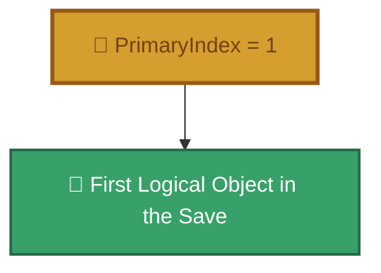

The JSON array itself is still represented using ordinary JSON array positions.

Therefore:

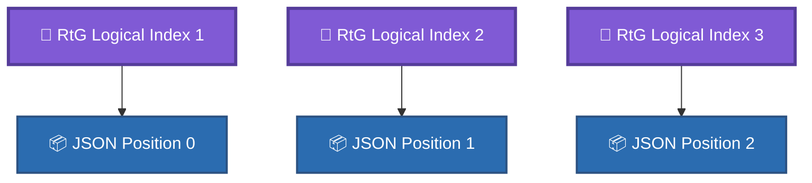

> **Evidence:** Parent-reference experiments and reordering tests.

> **Confidence:** `CONFIRMED`

See [`../format/indexing.md`](../format/indexing.md).

---

## 6. Array Order Is Significant

> **Discovery:** The order of objects in the root array is significant because parent references use logical object indices.

Changing object order without updating references can cause a connection to resolve to a different object.

> **Evidence:** Reordering experiments.
> **Confidence:** `CONFIRMED`
> **Notes:** This is a consequence of the 1-based logical indexing system.

---

## 7. PrimaryID Is a Connection Reference

> **Discovery:** `PrimaryID` identifies where the connection is made on the parent object.

It may contain a numeric connection-point identifier or a UUID.

Therefore, `PrimaryID` should not be interpreted as being exclusively a numeric point ID.

> **Evidence:** Standard connection-point observations and UUID attachment experiments.
> **Confidence:** `CONFIRMED`

---

## 8. Numeric Connection-Point Identifiers

> **Discovery:** Some connections use numeric identifiers to reference predefined connection points associated with the parent object's model.

Example:

```json
[
    "1",
    "5",
    1
]
```

Here `"5"` is the observed connection-point identifier.

> **Evidence:** Connection-point experiments and the historical object-ID research.
> **Confidence:** `CONFIRMED` for the existence and use of numeric point identifiers.
> **Notes:** The meaning of every numeric point identifier is not necessarily known.

See [`../old-files/obj_ids-spanish.md`](../old-files/obj_ids-spanish.md).

---

## 9. EphemeralAttachments

> **Discovery:** Objects can contain an `EphemeralAttachments` dictionary inside `Properties`.

The dictionary maps UUIDs to attachment data.

Conceptually:

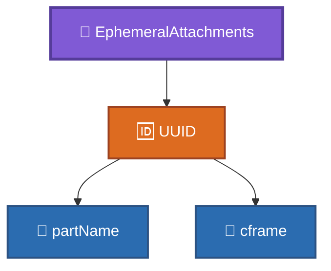

> **Evidence:** Direct inspection of saves and attachment injection experiments.
> **Confidence:** `CONFIRMED`

See [`../format/identifiers.md`](../format/identifiers.md).

---

## 10. UUIDs Can Reference Attachments

> **Discovery:** A connection can use a UUID in `PrimaryID` to reference an `EphemeralAttachment`.

Conceptually:

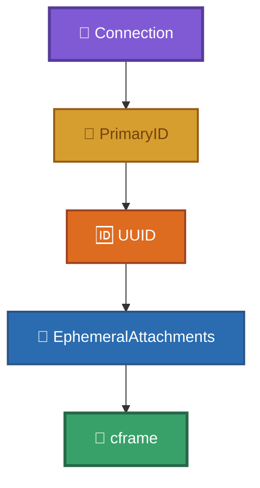

The UUID therefore acts as a reference between the connection and an attachment.

> **Evidence:** UUID injection and attachment experiments.
> **Confidence:** `CONFIRMED`

---

## 11. UUIDs Do Not Encode the Attachment Position

> **Discovery:** The UUID itself does not contain the spatial position of an attachment.

The spatial transform is stored in the referenced attachment's `cframe`.

> **Evidence:** Experiments using arbitrary UUID values with independently defined attachment transforms.
> **Confidence:** `CONFIRMED`
> **Notes:** The exact internal UUID lookup mechanism remains unknown.

---

## 12. Synthetic UUIDs Are Accepted

> **Discovery:** UUIDs generated independently of the original save can be processed when they follow the expected GUID format.

This demonstrates that the UUID functions as an identifier/reference rather than requiring a specific UUID generated by the original save process.

> **Evidence:** Synthetic UUID experiments.
> **Confidence:** `CONFIRMED`
> **Notes:** This does not establish every rule used internally by the game when generating UUIDs.

---

## 13. CFrame Stores Attachment Transform

> **Discovery:** The `cframe` associated with an `EphemeralAttachment` contains spatial transformation information.

The observed representation contains:

```json
[
    X, Y, Z  // Position
    R1, R2, R3   // 3x3 rotation matrix
    R4, R5, R6
    R7, R8, R9
]

```

The first three values represent position, while the remaining nine represent the observed 3×3 rotation matrix.

> **Evidence:** Attachment inspection and spatial experiments.
> **Confidence:** `CONFIRMED` for the observed representation.
> **Notes:** The exact internal reconstruction algorithm is not fully documented.

---

## 14. Attachment Position Is Relative to Its Host

> **Discovery:** The `cframe` of an `EphemeralAttachment` describes the attachment relative to the coordinate system of its host object rather than storing an independent global world position.

This allows a connection to identify an arbitrary location on an object without requiring a predefined numeric connection point.

> **Evidence:** Attachment placement experiments and reconstruction behavior.
> **Confidence:** `CONFIRMED`

---

## 15. Properties Are an Open Dictionary

> **Discovery:** The `Properties` field accepts additional keys without automatically making the save structurally invalid.

For example:

```json
{
    "KnownProperty": 123,
    "UnknownField": 456
}
```

The presence of an unknown field does not by itself imply an invalid save.

> **Evidence:** Unknown-property injection experiments.
> **Confidence:** `CONFIRMED`

See [`../format/properties.md`](../format/properties.md) and [`../format/unknown-fields.md`](../format/unknown-fields.md).

---

## 16. Unknown Does Not Mean Invalid

> **Discovery:** A field can be unknown to the reverse-engineering documentation while still being accepted by the game's loader.

This distinction is important:

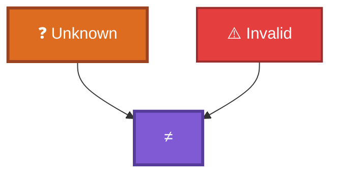

Likewise:

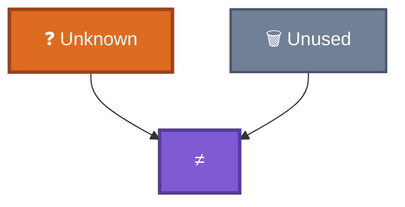

> **Evidence:** Unknown-field experiments.
> **Confidence:** `CONFIRMED`

---

## 17. Missing Properties Can Behave Differently

> **Discovery:** Removing a property does not always produce the same result as inserting an unknown property.

Depending on the object and property, the loader may:

* leave the property absent;
* create a default value;
* create an empty value;
* or fail to load.

> **Evidence:** Missing-property experiments.
> **Confidence:** `PARTIALLY CONFIRMED`
> **Notes:** Default behavior is object-specific and has not been completely catalogued.

---

## 18. Invalid References Are Different From Unknown Properties

> **Discovery:** Structural references are handled more strictly than arbitrary properties.

Invalid references involving object indices or UUID attachments can cause loading failures, while additional unknown properties can be accepted.

Conceptually:

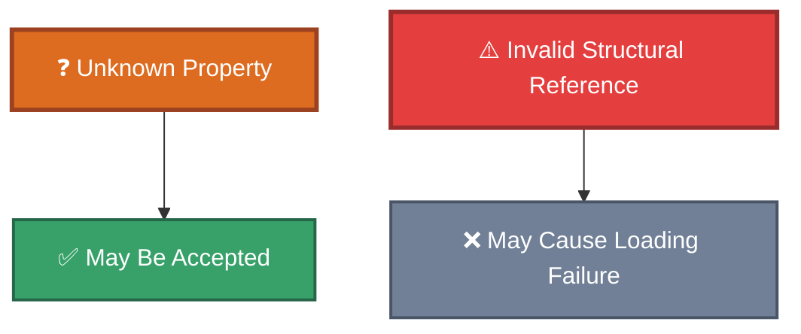

> **Evidence:** Reference injection and unknown-property experiments.
> **Confidence:** `CONFIRMED`

---

## 19. Invalid Sprite Image IDs

> **Discovery:** A `Sprite` can remain present in the object hierarchy when supplied with an invalid or nonexistent `ImageId`, while becoming invisible.

> **Evidence:** Sprite `ImageId` experiments.
> **Confidence:** `CONFIRMED`
> **Notes:** This demonstrates that an invalid media resource does not necessarily invalidate the entire object or build.

---

## 20. EphemeralAttachments Are Not Limited to One Object Type

> **Discovery:** `EphemeralAttachments` are not exclusive to a single object type.
Objects throughout the format can act as attachment hosts.

> **Evidence:** Historical examples and attachment experiments.
> **Confidence:** `CONFIRMED`
> **Notes:** The exact set of object types capable of hosting attachments should be maintained as experimental evidence rather than assumed to be universal solely from the format structure.

---

## 21. The Format Reconstructs Spatial Relationships

> **Discovery:** The save does not need to store a conventional absolute `X, Y, Z` world position for every object.

Instead, spatial relationships can be reconstructed from:

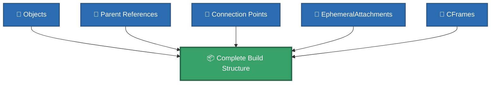

> **Evidence:** Save structure analysis and attachment reconstruction experiments.
> **Confidence:** `CONFIRMED`

---

## 22. The Save Represents a Reconstructible Dependency Structure

> **Discovery:** The root array and its references form a reconstructible hierarchy/dependency structure rather than a simple list of independent objects.

Conceptually:

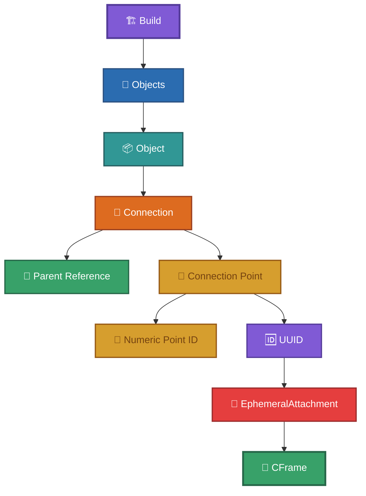

> **Evidence:** Root-array structure, parent-index experiments, and attachment experiments.
> **Confidence:** `CONFIRMED`

---

# Discovery Status

The following categories should be used when adding future discoveries.

| Confidence            | Meaning                                                                  |
| --------------------- | ------------------------------------------------------------------------ |
| `CONFIRMED`           | Directly supported by reproducible evidence.                             |
| `PARTIALLY CONFIRMED` | Core behavior is supported, but important details remain unresolved.     |
| `OBSERVED`            | The behavior/value has been observed but its meaning is not established. |
| `HYPOTHESIS`          | A possible explanation that has not been experimentally confirmed.       |
| `UNKNOWN`             | No reliable interpretation is currently established.                     |

---

# Adding New Discoveries

New discoveries should contain reproducible evidence whenever possible.
Use this template:

```md
## N. Short Discovery Name

> **Discovery:** What was discovered.
> **Evidence:** Exact save, experiment, modification, or observation supporting it.
> **Confidence:** `CONFIRMED` / `PARTIALLY CONFIRMED` / `OBSERVED` / `HYPOTHESIS` / `UNKNOWN`
> **Notes:** Limitations, unresolved questions, or related observations.
```

Do not promote a hypothesis to `CONFIRMED` without new evidence.

---

## Related Documentation

* [`../SPECIFICATION.md`](../SPECIFICATION.md) — Complete technical specification.
* [`../format/json-structure.md`](../format/json-structure.md) — JSON structure.
* [`../format/indexing.md`](../format/indexing.md) — Object indexing.
* [`../format/identifiers.md`](../format/identifiers.md) — Identifier systems.
* [`../format/properties.md`](../format/properties.md) — Properties.
* [`../format/unknown-fields.md`](../format/unknown-fields.md) — Unknown and unconfirmed fields.
* [`../examples/experiments/`](../examples/experiments/) — Experimental saves and evidence.
* [`../old-files/`](../old-files/) — Historical reverse-engineering records.
