# Methodology

This document describes the methodology used to reverse-engineer the RtG RtG save/build format.

The goal is not only to discover how the format works, but to produce observations that can be reproduced, compared, and distinguished from assumptions.

---

## 1. Core Principle

The format is reverse-engineered through controlled experimentation.
The basic rule is:

> Change one thing, observe one thing, and do not assign a meaning that the evidence does not support.

A field name, numeric value, or apparent pattern is not enough to establish its meaning.

---

## 2. Start With a Minimal Build

Whenever possible, begin with the smallest possible build containing the object or feature being investigated.

For example:

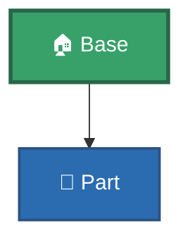
or:
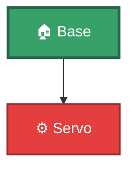


A minimal build reduces unrelated data and makes differences easier to identify.
Avoid beginning an investigation with a large complex build unless the feature cannot be reproduced in a smaller one.

---

## 3. Obtain the Original Save

Export or otherwise capture the save produced by the game.
Preserve the original data before making any modification.
The original save is the control sample.

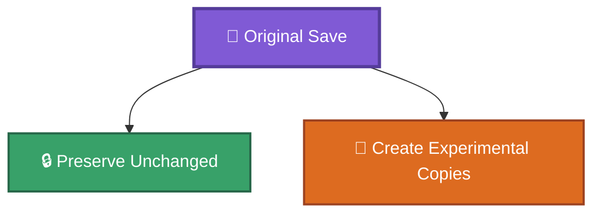

Never modify the only copy of the original experiment.

---

## 4. Isolate One Variable

The preferred experiment changes only one value or structural element at a time.

Example:

Original:
```json
{
    "Speed": 10,
    "Rotation": 0
}
```

Experiment:
```json
{
    "Speed": 20,
    "Rotation": 0
}
```

Here only `Speed` changed.

This makes it possible to associate an observed result with the modified field.
Avoid experiments where several unrelated values are changed simultaneously.

---

## 5. Compare the Raw Data

Whenever possible, compare the original and modified saves directly.
A useful experiment should preserve the smallest meaningful diff.

Conceptually:

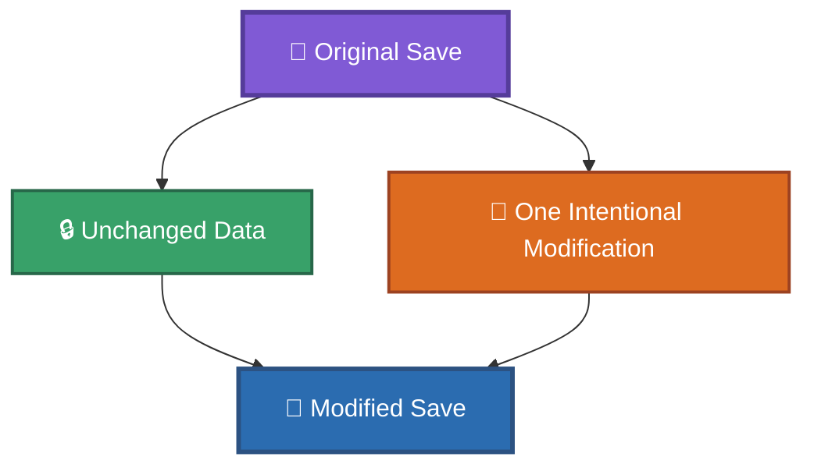

The raw diff is evidence.
A conclusion without a corresponding data change is weaker and should be treated cautiously.

---

## 6. Test Loading Behavior

After modifying the save, load it in RtG and record what happens.
At minimum, distinguish between:

```md
LOAD SUCCESS
LOAD FAILURE
```

For successful loads, also record relevant behavioral changes.
For example:

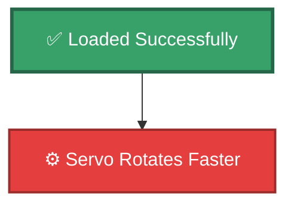

or:

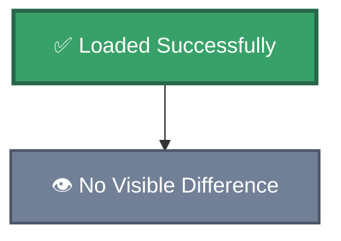

A successful load does not prove that a field is meaningful.
Likewise, a loading failure does not automatically identify which value caused the failure unless the experiment isolated that variable.

---

## 7. Separate Structural and Behavioral Evidence

Two different questions should be asked:

### Structural question

> Does the game accept this data?

Example:

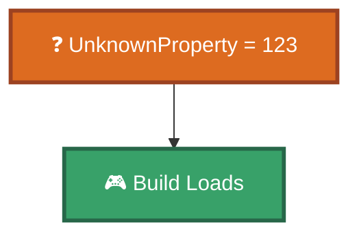

This establishes that the field is accepted.
It does **not** establish what the field does.

### Behavioral question

> Does changing this data affect the resulting object?

Example:

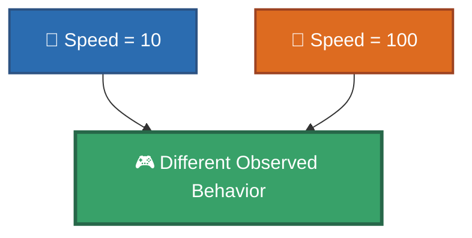

This provides evidence that `Speed` is interpreted.
These two kinds of evidence must not be conflated.

---

## 8. Use Controls

When possible, create a control experiment.

Example:

```md
A: Original save
B: Change target field
C: Change unrelated field
```

If A and C behave identically while B behaves differently, the evidence for the target field becomes stronger.

A control is especially useful when the game has nondeterministic behavior.

---

## 9. Repeat Important Experiments

A single successful experiment is useful, but repetition increases confidence.
For important discoveries:

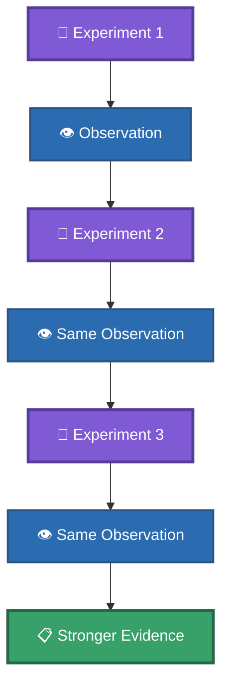

Repeated results are stronger evidence than a single observation.

---

## 10. Change Direction, Not Only Magnitude

When investigating a numeric value, do not test only:

```md
10 → 20
```

Also test values such as:

```text
0
1
-1
10
20
large value
```

When appropriate, test both positive and negative values.
This can reveal whether a value represents:

* a magnitude;
* a direction;
* a boolean-like state;
* an index;
* an enum;
* an angle;
* or another type of parameter.

---

## 11. Test Missing Values

Removing a field is a different experiment from adding an unknown field.
For a property:


Original:
```json
{
    "Speed": 10
}
```

Test:

```json
{
}
```

and compare the result with:

```json
{
    "Speed": 10,
    "UnknownField": 123
}
```

Possible outcomes include:

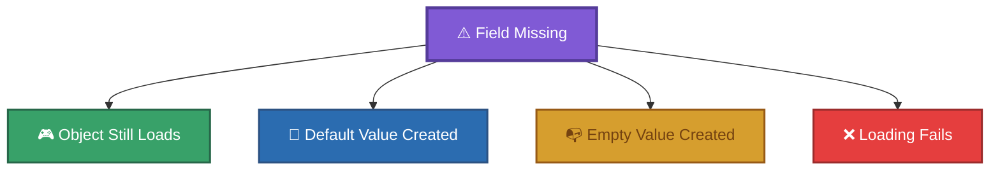

Document the actual result rather than assuming the behavior.

---

## 12. Test Unknown Fields Separately

An unknown field should first be tested for structural acceptance.

For example:

```json
{
    "KnownProperty": 123,
    "UnknownField": 456
}
```

If the build loads, this establishes:

```md
UnknownField is accepted
```

It does not establish:

```md
UnknownField is used
```

These are separate claims.

---

## 13. Test References Independently

References should be tested separately from properties.
For example, when investigating `PrimaryIndex`:

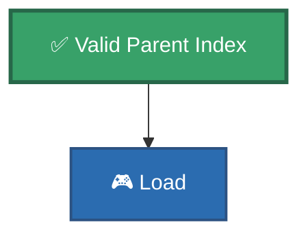

then:

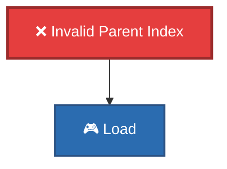

Likewise, UUID references should be tested independently from the attachment's `cframe`.
This helps distinguish:


---

## 14. Test Numeric Connection Points

When investigating a numeric `PrimaryID`, use a controlled object whose geometry is understood.

Connection-point experiments can use visual markers to identify where each point is located.
The historical object-ID research uses this type of approach.

The important distinction is:

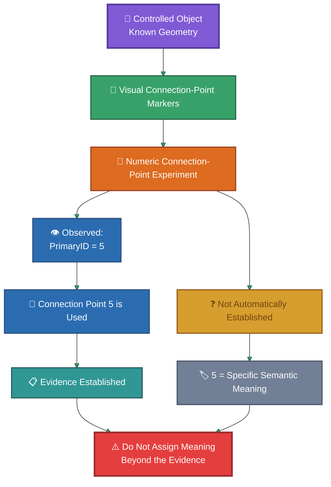

The numeric value should not be assigned a meaning beyond the evidence.

---

## 15. Test UUID Attachments

When investigating a UUID-based connection:

1. Create the host object.
2. Create an `EphemeralAttachment`.
3. Assign a UUID.
4. Reference that UUID from the connection.
5. Change only the attachment `cframe`.
6. Reload the build.
7. Observe the resulting attachment position.

Conceptually:

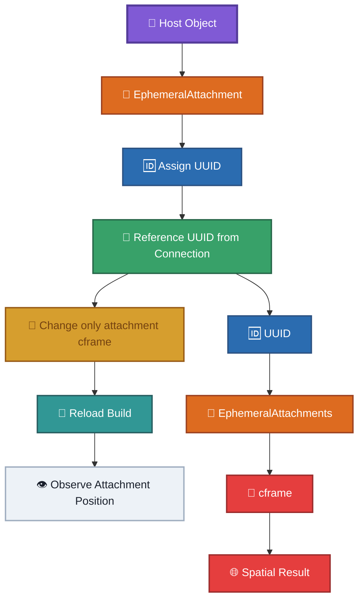

This allows the reference mechanism and spatial transform to be investigated separately.

---

## 16. Synthetic Identifiers

When testing UUIDs or other identifiers, synthetic values can be useful.

For example:

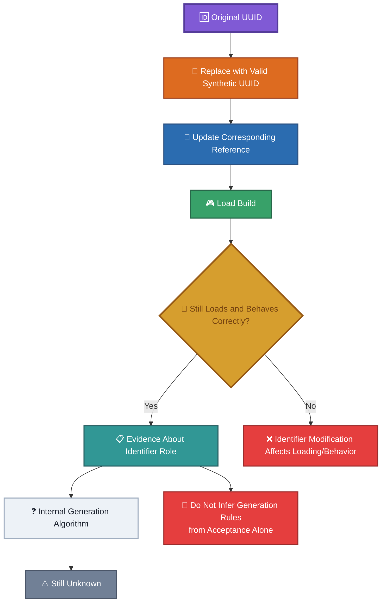

If the build still loads and behaves correctly, this provides evidence about the role of the identifier.

However, this does not reveal the internal generation algorithm.
Do not infer generation rules from acceptance alone.

---

## 17. Test Invalid Data Carefully

Invalid-data experiments should be performed only after establishing a valid control.

Use:

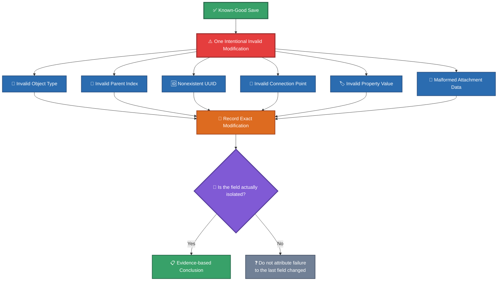

Possible categories include:

* invalid object type;
* invalid parent index;
* nonexistent UUID;
* invalid connection point;
* invalid property value;
* malformed attachment data.

Record the exact modification.

Do not classify every loading failure as `"Build inválida"` caused by the last field changed unless the experiment actually isolates that field.

---

## 18. Record Exact Results

Every experiment should record at least:

```text
Input
Procedure
Observation
Result
Confidence
```

A stronger record should also contain:

```text
Original save
Modified save
Raw diff
Object type
Field changed
Original value
New value
Load result
Visible behavior
```

---

## 19. Recommended Experiment Format

Experiments should use a structure similar to:

```md
# Experiment Name

## Objective

What is being investigated?

## Input

Which save and object were used?

## Procedure

What was changed?

## Diff

What changed in the raw JSON?

## Observation

What happened when the save was loaded?

## Result

What can be concluded?

## Confidence

How strong is the evidence?

## Remaining Questions

What is still unknown?
```

The actual experimental save should be stored under:

```text
examples/experiments/
```

when it is suitable for preservation.

---

## 20. Confidence Levels

Use explicit confidence levels.

### CONFIRMED

The behavior has been reproduced and the evidence directly supports the claim.

### PARTIALLY CONFIRMED

The general behavior is supported, but important implementation details remain unknown.

### OBSERVED

The behavior or value has been seen, but its meaning has not been established.

### HYPOTHESIS

A possible explanation exists but has not been sufficiently tested.

### UNKNOWN

There is currently insufficient evidence to determine the answer.

---

## 21. Observation vs Interpretation

Always separate what was observed from what was inferred.

Example:

### Observation

```text
Changing Speed from 10 to 100 causes the Servo to rotate faster.
```

### Interpretation

```text
Speed probably controls rotational speed.
```

### Confirmed conclusion

```text
Speed controls the Servo's rotational speed.
```

The interpretation should only become a confirmed conclusion after sufficient testing.

---

## 22. Avoid Semantic Assumptions

Do not infer meaning from names alone.
For example:

```js
"LimitAngle"
```

looks like an angle limit.
That may be a useful hypothesis, but the name itself is not evidence of its behavior.

Likewise:

```js
LocalType = 7
```

does not mean that `7` has a semantic meaning of its own.
Names and numbers are clues, not proof.

---

## 23. Avoid Searching for Confirmation

When testing a hypothesis, do not design the experiment only to produce the expected result.
Instead, attempt to disprove the hypothesis.

For example:

```md
Hypothesis:
Speed controls Servo speed.
```

Do not only test:

```md
10 → 20
```

Also test:

```md
0
negative values
very large values
missing field
unexpected type
```

A hypothesis that survives attempts to disprove it becomes stronger.

---

## 24. Preserve Failed Experiments

A failed experiment is still useful evidence.

If a modified save does not load:

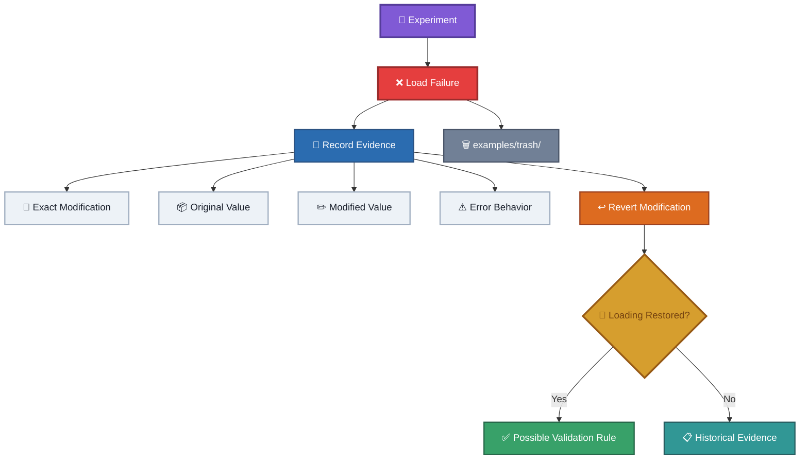

record:

* the exact modification;
* the original value;
* the modified value;
* the error behavior;
* whether reverting the modification restores loading.

Failed experiments can help establish validation rules.

Suitable failed experiments should be preserved under:

```md
examples/trash/
```

when they are no longer useful as active examples but should remain historically available.

---

## 25. One Experiment Should Answer One Main Question

Prefer:
```md
Does Speed affect Servo rotation speed?
```
over:
```md
What do Speed, Rotation, LimitEnabled, and Rest do?
```

The first question can be answered with a controlled experiment.
The second introduces several variables and makes the result ambiguous.
Complex investigations should therefore be divided into smaller experiments.

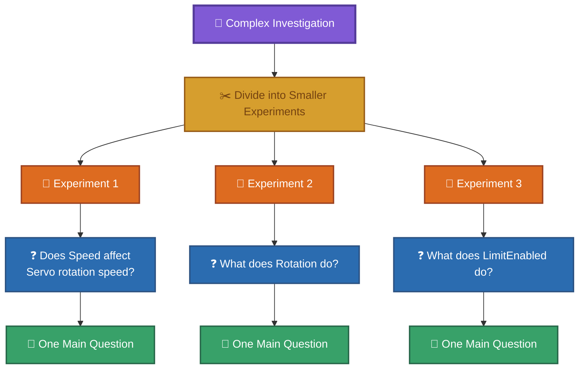


---

## 26. From Experiment to Documentation

A discovery should move through the following process:
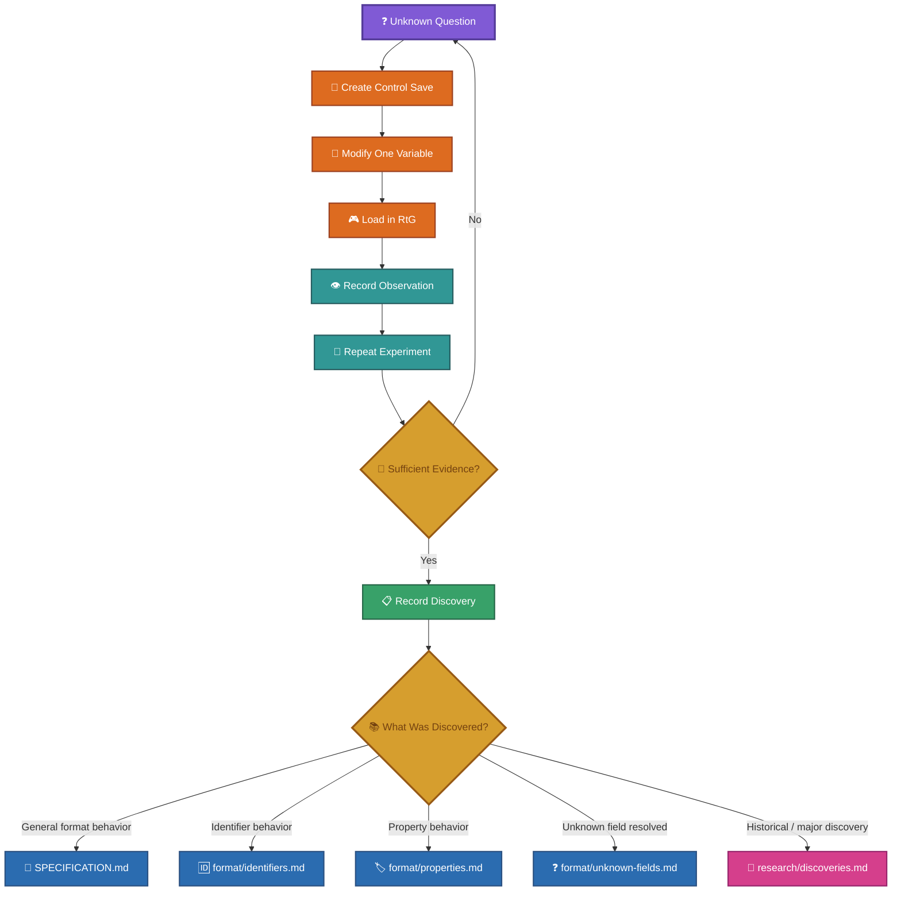

The experiment itself remains the evidence.
The documentation is the conclusion drawn from that evidence.

---

## 27. Raw Evidence Has Priority

When possible, preserve:

* original JSON;
* modified JSON;
* exact diff;
* screenshots or video of relevant behavior;
* experiment README;
* notes about the game version;
* any relevant circumstances.

The raw evidence should make it possible for another researcher to understand how the conclusion was obtained.

---

## 28. Historical Evidence

Historical reverse-engineering material is preserved under:

```text
old-files/
```

The historical documents are important evidence, but they should not automatically override later reproducible experimental results.

When a historical statement conflicts with a newer confirmed result:

1. preserve the historical statement;
2. document the newer evidence;
3. update the current documentation;
4. note the historical discrepancy when useful.

This prevents the historical record from being silently rewritten.

---

## 29. Experimental Priority

When deciding what to investigate next, prefer questions that:

1. affect the interpretation of multiple parts of the format;
2. can be isolated with a minimal save;
3. can be tested repeatedly;
4. have observable results;
5. resolve contradictions between existing documentation.

Avoid spending experiments on questions that cannot currently be observed or measured.

---

## 30. Final Rule

The most important rule of the methodology is:

> **Document what the evidence proves, not what the format appears to mean.**

A good reverse-engineering result should allow another person to follow the same reasoning:

```mermaid
flowchart TD

    SAVE["💾 Save"] --> MODIFICATION["🧪 Controlled Modification"]
    MODIFICATION --> DIFFERENCE["🔍 Raw Difference"]
    DIFFERENCE --> BEHAVIOR["🎮 Game Behavior"]
    BEHAVIOR --> OBSERVATION["👁️ Repeated Observation"]
    OBSERVATION --> CONCLUSION["📋 Conclusion"]

    CONCLUSION --> UNCERTAINTY["⚠️ Appropriate Level of Uncertainty"]

    classDef save fill:#805ad5,color:#fff,stroke:#553c9a,stroke-width:3px;
    classDef experiment fill:#dd6b20,color:#fff,stroke:#9c4221,stroke-width:2px;
    classDef evidence fill:#2b6cb0,color:#fff,stroke:#2c5282,stroke-width:2px;
    classDef behavior fill:#38a169,color:#fff,stroke:#276749,stroke-width:2px;
    classDef observation fill:#319795,color:#fff,stroke:#285e61,stroke-width:2px;
    classDef conclusion fill:#d69e2e,color:#744210,stroke:#975a16,stroke-width:2px;
    classDef uncertainty fill:#e53e3e,color:#fff,stroke:#9b2c2c,stroke-width:3px;

    class SAVE save;
    class MODIFICATION experiment;
    class DIFFERENCE evidence;
    class BEHAVIOR behavior;
    class OBSERVATION observation;
    class CONCLUSION conclusion;
    class UNCERTAINTY uncertainty;
```

If one of these steps is missing, the conclusion should be treated with an appropriate level of uncertainty.
