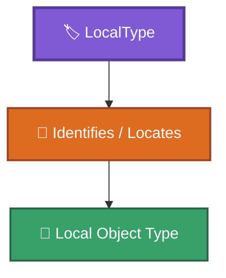
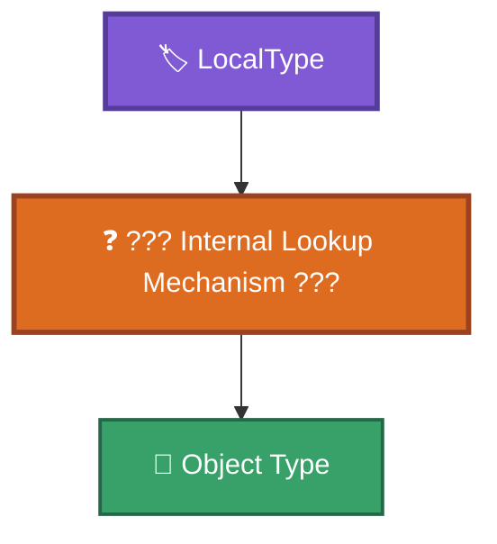
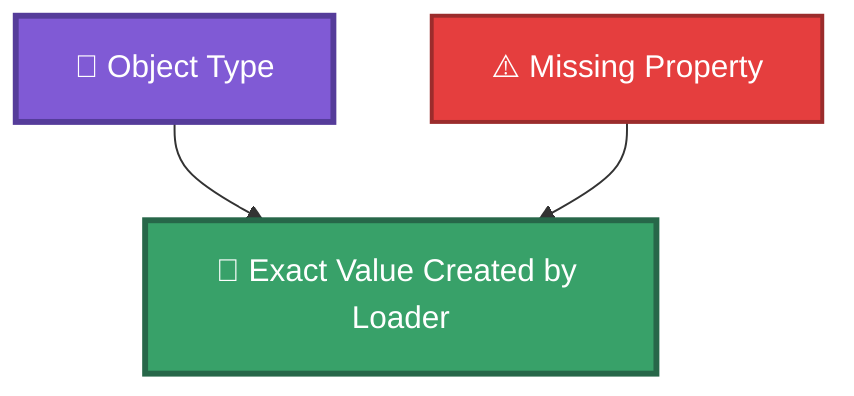
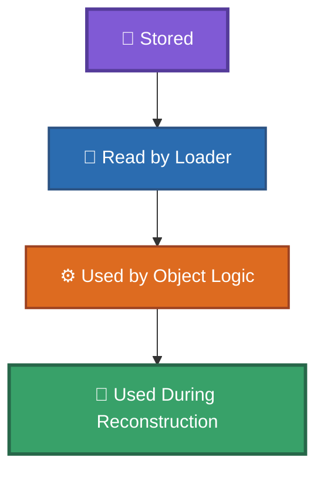
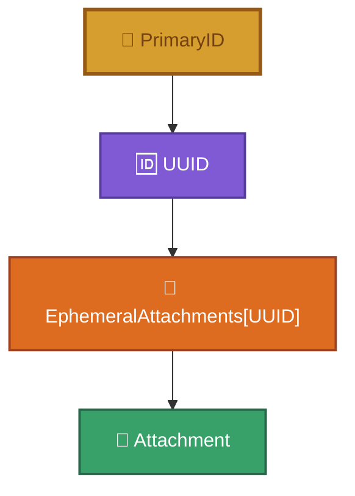
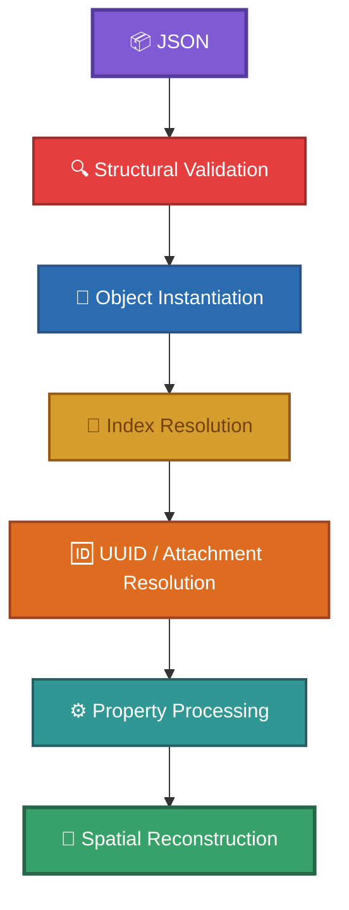
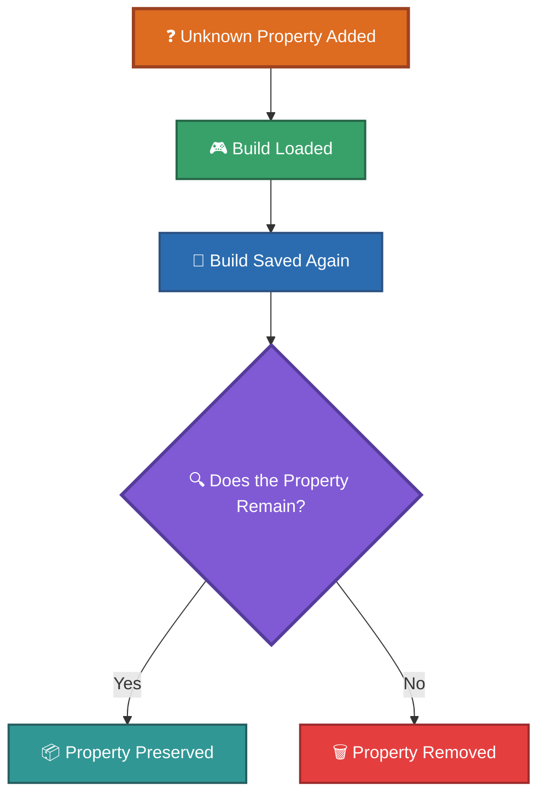
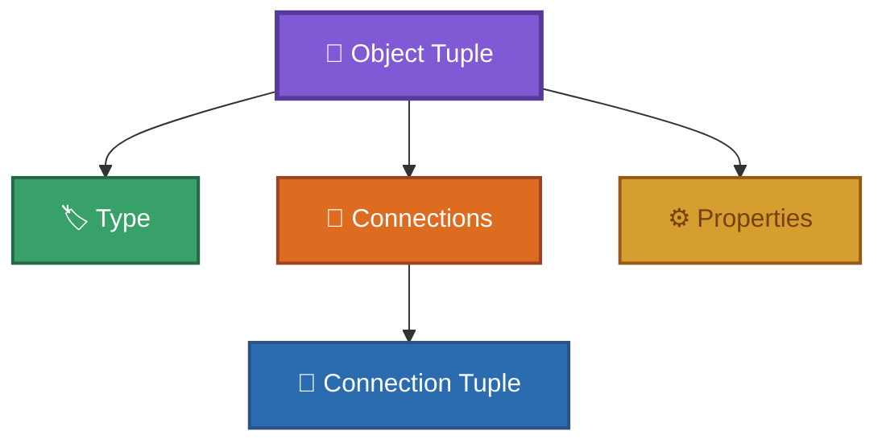
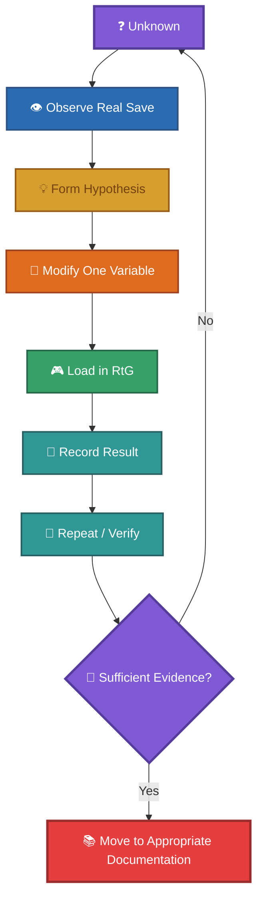

# Unknowns

This document records questions about the RtG RtG save/build format that remain unresolved or only partially understood.

Unlike [`discoveries.md`](discoveries.md), this document does not record confirmed discoveries.

An item should remain here until sufficient evidence exists to move it to the appropriate documentation.

---

## 1. Exact Internal Lookup Mechanism of `LocalType`

**Status:** `UNKNOWN`

We know that `LocalType` is a numeric identifier associated with the local object type involved in a connection.

The game uses this value to identify/search for the corresponding object type.
However, the exact internal lookup mechanism is unknown.

Unknown details include:

- where the mapping is stored internally;
- whether the number directly indexes an internal table;
- whether the lookup uses another intermediate mapping;
- whether different systems use the value differently.

What is known:



What is unknown:



See [`../format/identifiers.md`](../format/identifiers.md).

---

## 2. Semantic Meaning of Individual `LocalType` Values

**Status:** `UNKNOWN / PARTIALLY UNDERSTOOD`

The observed numeric values can be mapped to object types in experiments.
However, the numbers themselves do not currently have a known semantic interpretation.

For example:

```js
LocalType = 1
```
does not tell us what the number `1` means internally.

The current documentation therefore treats the values as observed identifiers rather than semantic classifications.

---

## 3. Complete Numeric Connection-Point Mapping

**Status:** `WORK IN PROGRESS`

Many numeric connection-point identifiers have been observed and documented in the historical research.
However, the complete mapping for every object and every possible connection point has not necessarily been verified.

The unresolved questions include:

* whether every point ID has been discovered;
* whether the same numeric ID always represents the same type of point;
* whether point IDs are globally defined or object-specific;
* whether some IDs are generated dynamically;
* whether undocumented IDs exist.

See [`../old-files/obj_ids-spanish.md`](../old-files/obj_ids-spanish.md).

---

## 4. Exact Meaning of Every Numeric `PrimaryID` ID

**Status:** `PARTIALLY UNDERSTOOD`

We know that a numeric `PrimaryID` can identify a predefined connection point on the parent object.
What remains unknown is the exact semantic meaning of every numeric value.

For example:

```js
PrimaryID = "5"
```

is known to be a connection-point reference in the appropriate context.

However, this alone does not establish:

* its exact geometric location;
* its orientation;
* whether it is available for every object;
* whether its meaning changes between object types.

---

## 5. Complete Per-Object Property Semantics

**Status:** `WORK IN PROGRESS`

A large number of properties have been observed.

However, the complete behavior of every property for every object type has not been established.

Unknown details include:

* accepted value ranges;
* default values;
* interactions between properties;
* properties shared by multiple object types;
* properties that are stored but ignored;
* properties that are created automatically;
* properties whose behavior changes depending on object state.

See [`../format/properties.md`](../format/properties.md).

---

## 6. Exact Default Values for Missing Properties

**Status:** `PARTIALLY UNDERSTOOD`

Some experiments indicate that missing properties may be replaced by empty or default values when the object requires them.

However, the exact behavior is object-specific.
We do not yet have a complete table such as:



Future experiments should test missing properties individually.

---

## 7. Which Properties Are Actually Used by the Loader?

**Status:** `PARTIALLY UNDERSTOOD`

A property existing in the JSON does not prove that the game actively uses it.
Likewise, an unknown property can sometimes be present without causing a loading failure.

The remaining question is which properties are:



and which are simply preserved or ignored.

---

## 8. Exact UUID Resolution Mechanism

**Status:** `UNKNOWN`

The UUID relationship is known:



However, the internal mechanism used by the game to resolve this UUID is unknown.

Unknown details include:

* how the UUID is searched;
* whether UUIDs are stored in a global registry;
* whether the lookup is local to the parent object;
* when the UUID lookup occurs during loading;
* how duplicate UUIDs are handled.

---

## 9. Duplicate UUID Behavior

**Status:** `UNKNOWN`

It has been established that UUIDs act as attachment identifiers.

However, the behavior when the same UUID appears multiple times has not been completely characterized.

Unknown cases include:

```md
Two attachments with the same UUID
```

```md
Two connections referencing the same UUID
```
and:
```md
UUID exists on multiple objects
```

Experiments are required to determine whether the loader:

* rejects duplicates;
* uses the first occurrence;
* uses the last occurrence;
* resolves them relative to the parent;
* or handles them in another way.

---

## 10. UUID Generation Rules

**Status:** `UNKNOWN`

Synthetic UUIDs can be accepted when they follow the expected GUID format.
However, this does not explain how RtG generates UUIDs itself.

Unknown details include:

* whether UUIDs are random;
* whether they are deterministic;
* whether they contain any encoded information;
* when they are generated;
* whether regenerated saves preserve UUIDs.

---

## 11. Complete `CFrame` Reconstruction Algorithm

**Status:** `PARTIALLY UNDERSTOOD`

The observed `cframe` representation contains position and rotation information.
The attachment position is understood as being relative to its host object's coordinate system.

However, the complete reconstruction process used by the game is not documented.

Unknown details include:

* exact transformation order;
* parent-to-child transformation order;
* rotation multiplication order;
* how nested attachments are resolved;
* how physics transformations interact with saved transforms.

---

## 12. Exact Coordinate-System Conventions

**Status:** `PARTIALLY UNDERSTOOD`

The spatial role of `cframe` is known.
However, some lower-level coordinate-system details remain to be fully verified.

Potential questions include:

* exact axis conventions;
* handedness;
* rotation matrix interpretation;
* multiplication order;
* conversion between saved and engine coordinates.

These should be confirmed through controlled attachment experiments.

---

## 13. Complete Attachment Host Rules

**Status:** `PARTIALLY UNDERSTOOD`

`EphemeralAttachments` have been observed on many different object types.
The format therefore cannot be treated as having a single attachment-host object.

However, the complete set of object types that can host attachments has not been exhaustively verified.

Unknown:

```md
Which object types can host EphemeralAttachments?
```

and:

```md
Are there object-specific restrictions on attachment data?
```

---

## 14. Attachment `partName` Semantics

**Status:** `UNKNOWN / PARTIALLY UNDERSTOOD`

`EphemeralAttachments` can contain a `partName` field.

The field appears to identify a part associated with the attachment.
However, its exact role during reconstruction has not been completely established.

Unknown details include:

* whether the value must correspond to an existing internal part;
* whether arbitrary names are accepted;
* whether it affects attachment lookup;
* whether it affects only reconstruction.

---

## 15. Unknown Loader Validation Rules

**Status:** `WORK IN PROGRESS`

Several validation rules have been discovered experimentally.
However, the complete validation pipeline is unknown.

The remaining question is:

```md
What exactly does the loader validate,
and in what order?
```

Potential stages include:



This represents the currently understood conceptual pipeline.
It should not be interpreted as a confirmed implementation-level call sequence.

---

## 16. Exact Error Conditions

**Status:** `WORK IN PROGRESS`

Some invalid data is known to produce loading failures.

However, the complete set of conditions producing:

```js
"Build inválida"
```

has not been catalogued.

Future experiments should distinguish between:

* malformed JSON;
* invalid object structure;
* invalid `LocalType`;
* invalid parent index;
* missing parent;
* invalid UUID reference;
* invalid property values;
* invalid attachment data;
* invalid connection points.

---

## 17. Unknown Properties and Loader Preservation

**Status:** `UNKNOWN`

Experiments show that additional properties can be accepted.
What remains unclear is what happens to those properties after loading and saving again.

Questions:



Possible outcomes include:

* preserved unchanged;
* removed;
* normalized;
* transformed;
* ignored during serialization.

This requires a load → save → compare experiment.

---

## 18. Unknown Property Value Coercion

**Status:** `UNKNOWN`

It is not yet completely known whether the loader coerces property values into another type.

For example:

```json
{
    "Speed": "10"
}
```

versus:

```json
{
    "Speed": 10
}
```

The exact behavior may differ by property and object type.
Controlled experiments are required before documenting coercion rules.

---

## 19. Complete Compression / Serialization Pipeline

**Status:** `PARTIALLY UNDERSTOOD`

The underlying build data can be represented as JSON.

However, the complete process used by the game to serialize, compress, encode, and decode saves is not yet fully documented.
The remaining questions include:

* exact compression algorithm and configuration;
* ordering of compression and encoding stages;
* whether additional serialization transformations occur;
* whether metadata exists outside the JSON payload.

See [`../compression/`](../compression/).

---

## 20. Unknown Fields Outside `Properties`

**Status:** `UNKNOWN`

Most currently documented unknown-field behavior concerns keys inside the `Properties` dictionary.

It remains important to distinguish these from fields at other structural levels.
For any newly discovered field, determine whether it belongs to:



before classifying it as an unknown property.
See [`../format/unknown-fields.md`](../format/unknown-fields.md).

---

# How to Resolve an Unknown

Every new investigation should attempt to produce reproducible evidence.
Use the following process:



When possible:

1. Start from a known working save.
2. Change only one variable.
3. Load the save in RtG.
4. Record whether loading succeeds.
5. Record visible or behavioral changes.
6. Repeat the experiment.
7. Preserve the original and modified saves.
8. Document the evidence in `examples/experiments/`.
9. Promote the result only when sufficiently verified.

---

# Status Definitions

| Status                 | Meaning                                                                 |
| ---------------------- | ----------------------------------------------------------------------- |
| `UNKNOWN`              | No reliable interpretation has been established.                        |
| `PARTIALLY UNDERSTOOD` | The general behavior is known, but important details remain unresolved. |
| `WORK IN PROGRESS`     | Active investigation is still being performed.                          |
| `HYPOTHESIS`           | A possible interpretation exists but has not been confirmed.            |

---

## Related Documentation

* [`discoveries.md`](discoveries.md) — Confirmed and significant discoveries.
* [`../format/unknown-fields.md`](../format/unknown-fields.md) — Unknown fields in the serialized structure.
* [`../format/identifiers.md`](../format/identifiers.md) — Identifier systems.
* [`../format/properties.md`](../format/properties.md) — Properties.
* [`../format/indexing.md`](../format/indexing.md) — Indexing.
* [`../compression/`](../compression/) — Compression and serialization research.
* [`../examples/experiments/`](../examples/experiments/) — Experimental evidence.
* [`../old-files/`](../old-files/) — Historical reverse-engineering records.
