# Structure

## Text/Tree format:
```tree
rtg-save-format/
│
├── README.md
├── SPECIFICATION.md
├── CHANGELOG.md
├── CONTRIBUTING.md
├── LICENSE
├── structure.md
│
├── blocks/
│   ├── README.md
│   └── parts/
│        ├── building/
│        │    ├── parts-id.md
│        │    └── README.md
│        ├── miscellaneous/
│        │    ├── parts-id.md
│        │    └── README.md
│        ├── other/
│        │    ├── parts-id.md
│        │    └── README.md
│        ├── physics/
│        │    ├── parts-id.md
│        │    └── README.md
│        ├── tools/
│        │    ├── parts-id.md
│        │    └── README.md
│        ├── uncategorized/
│        │    ├── parts-id.md
│        │    └── README.md
│        ├── unused/
│        │    ├── parts-id.md
│        │    └── README.md
│        └── wiring/
│             ├── parts-id.md
│             └── README.md
│
├── format/
│   ├── json-structure.md
│   ├── indexing.md
│   ├── properties.md
│   ├── identifiers.md
│   └── unknown-fields.md
│
├── compression/
│   ├── README.md
│   ├── overview.md
│   ├── encoding.md
│   └── examples-template.md
│
├── examples/
│   ├── README.md
│   ├── experiments/
│   │    ├── README.md
│   │    └── ...
│   ├── json-examples/
│   │    ├── README.md
│   │    └── ...
│   └── trash/
│        └── README.md
│
├── tools/
│   ├── README.md
│   └── agent/
│        ├── parts_diff.py
│        └── regenerate_parts.py
│
├── research/
│   ├── README.md
│   ├── methodology.md
│   ├── discoveries.md
│   └── unknowns.md
│
├── old-files/
│   ├── README.md
│   ├── obj_ids-spanish.md
│   └── RtG_Save_Format_Specification-spanish.md
│
└── docs/
    ├── README.md
    ├── getting-started.md
    ├── save-anatomy.md
    ├── building-system.md
    └── faq.md
```

## Mermaid format

```mermaid
flowchart TD
    ROOT["📁 rtg-save-format"]

    ROOT --> ROOT_DOCS["📄 README.md"]
    ROOT --> SPEC["📄 SPECIFICATION.md"]
    ROOT --> CHANGELOG["📄 CHANGELOG.md"]
    ROOT --> CONTRIBUTING["📄 CONTRIBUTING.md"]
    ROOT --> LICENSE["📄 LICENSE"]
    ROOT --> STRUCTURE["📄 structure"]

    ROOT --> BLOCKS["📁 blocks"]
    BLOCKS --> BLOCKS_README["📄 README.md"]
    BLOCKS --> PARTS["📁 parts"]

    PARTS --> BUILDING["📁 building"]
    PARTS --> MISC["📁 miscellaneous"]
    PARTS --> OTHER["📁 other"]
    PARTS --> PHYSICS["📁 physics"]
    PARTS --> TOOLS_PARTS["📁 tools"]
    PARTS --> UNCATEGORIZED["📁 uncategorized"]
    PARTS --> UNUSED["📁 unused"]
    PARTS --> WIRING["📁 wiring"]

    BUILDING --> BUILDING_ID["📄 parts-id.md"]
    BUILDING --> BUILDING_README["📄 README.md"]

    MISC --> MISC_ID["📄 parts-id.md"]
    MISC --> MISC_README["📄 README.md"]

    OTHER --> OTHER_ID["📄 parts-id.md"]
    OTHER --> OTHER_README["📄 README.md"]

    PHYSICS --> PHYSICS_ID["📄 parts-id.md"]
    PHYSICS --> PHYSICS_README["📄 README.md"]

    TOOLS_PARTS --> TOOLS_PARTS_ID["📄 parts-id.md"]
    TOOLS_PARTS --> TOOLS_PARTS_README["📄 README.md"]

    UNCATEGORIZED --> UNCATEGORIZED_ID["📄 parts-id.md"]
    UNCATEGORIZED --> UNCATEGORIZED_README["📄 README.md"]

    UNUSED --> UNUSED_ID["📄 parts-id.md"]
    UNUSED --> UNUSED_README["📄 README.md"]

    WIRING --> WIRING_ID["📄 parts-id.md"]
    WIRING --> WIRING_README["📄 README.md"]

    ROOT --> FORMAT["📁 format"]
    FORMAT --> JSON["📄 json-structure.md"]
    FORMAT --> INDEXING["📄 indexing.md"]
    FORMAT --> PROPERTIES["📄 properties.md"]
    FORMAT --> IDENTIFIERS["📄 identifiers.md"]
    FORMAT --> UNKNOWN["📄 unknown-fields.md"]

    ROOT --> COMPRESSION["📁 compression"]
    COMPRESSION --> COMP_README["📄 README.md"]
    COMPRESSION --> OVERVIEW["📄 overview.md"]
    COMPRESSION --> ENCODING["📄 encoding.md"]
    COMPRESSION --> EXAMPLES_TEMPLATE["📄 examples-template.md"]

    ROOT --> EXAMPLES["📁 examples"]
    EXAMPLES --> EXAMPLES_README["📄 README.md"]
    EXAMPLES --> EXPERIMENTS["📁 experiments"]
    EXAMPLES --> JSON_EXAMPLES["📁 json-examples"]
    EXAMPLES --> TRASH["📁 trash"]

    EXPERIMENTS --> EXP_README["📄 README.md"]
    EXPERIMENTS --> EXP_OTHER["📄 ..."]

    JSON_EXAMPLES --> JSON_EXP_README["📄 README.md"]
    JSON_EXAMPLES --> JSON_EXP_OTHER["📄 ..."]

    TRASH --> TRASH_README["📄 README.md"]

    ROOT --> TOOLS["📁 tools"]
    TOOLS --> TOOLS_README["📄 README.md"]
    TOOLS --> AGENT["📁 agent"]
    AGENT --> PARTS_DIFF["🐍 parts_diff.py"]
    AGENT --> REGENERATE["🐍 regenerate_parts.py"]

    ROOT --> RESEARCH["📁 research"]
    RESEARCH --> METHODOLOGY_README["📄 README.md"]
    RESEARCH --> METHODOLOGY["📄 methodology.md"]
    RESEARCH --> DISCOVERIES["📄 discoveries.md"]
    RESEARCH --> UNKNOWNS["📄 unknowns.md"]

    ROOT --> OLD["📁 old-files"]
    OLD --> OLD_STRUCTURE["📄 structure.md"]
    OLD --> SPANISH_IDS["📄 obj_ids-spanish.md"]
    OLD --> SPANISH_SPEC["📄 RtG_Save_Format_Specification-spanish.md"]

    ROOT --> DOCS["📁 docs"]
    DOCS --> DOCS_README["📄 README.md"]
    DOCS --> GETTING_STARTED["📄 getting-started.md"]
    DOCS --> SAVE_ANATOMY["📄 save-anatomy.md"]
    DOCS --> BUILDING_SYSTEM["📄 building-system.md"]
    DOCS --> FAQ["📄 faq.md"]

    classDef root fill:#4a5568,color:#ffffff,stroke:#2d3748,stroke-width:3px;
    classDef folder fill:#2b6cb0,color:#ffffff,stroke:#2c5282,stroke-width:2px;
    classDef file fill:#edf2f7,color:#1a202c,stroke:#a0aec0;
    classDef python fill:#fefcbf,color:#744210,stroke:#d69e2e;

    class ROOT root;

    class BLOCKS,PARTS,BUILDING,MISC,OTHER,PHYSICS,TOOLS_PARTS folder;
    class UNCATEGORIZED,UNUSED,WIRING,FORMAT,COMPRESSION folder;
    class EXAMPLES,EXPERIMENTS,JSON_EXAMPLES,TRASH folder;
    class TOOLS,AGENT,RESEARCH,OLD,DOCS folder;

    class ROOT_DOCS,SPEC,CHANGELOG,CONTRIBUTING,LICENSE,STRUCTURE file;
    class BLOCKS_README,BUILDING_ID,BUILDING_README file;
    class MISC_ID,MISC_README,OTHER_ID,OTHER_README file;
    class PHYSICS_ID,PHYSICS_README,TOOLS_PARTS_ID,TOOLS_PARTS_README file;
    class UNCATEGORIZED_ID,UNCATEGORIZED_README file;
    class UNUSED_ID,UNUSED_README,WIRING_ID,WIRING_README file;
    class JSON,INDEXING,PROPERTIES,IDENTIFIERS,UNKNOWN file;
    class COMP_README,OVERVIEW,ENCODING,EXAMPLES_TEMPLATE file;
    class EXAMPLES_README,EXP_README,EXP_OTHER file;
    class JSON_EXP_README,JSON_EXP_OTHER,TRASH_README file;
    class TOOLS_README,METHODOLOGY,DISCOVERIES,UNKNOWNS,METHODOLOGY_README file;
    class OLD_STRUCTURE,SPANISH_IDS,SPANISH_SPEC file;
    class DOCS_README,GETTING_STARTED,SAVE_ANATOMY,BUILDING_SYSTEM,FAQ file;

    class PARTS_DIFF,REGENERATE python;
```



# READ STRUCTURE

```mermaid
flowchart LR

    %% =========================================================
    %% README
    %% =========================================================

    R_OV["Overview"] -->|"README.md"| R_FILE["📄 README.md"]
    R_DOC["Documentation"] -->|"README.md"| R_FILE
    R_START["Start here"] -->|"README.md"| R_FILE
    R_FORMAT["Format"] -->|"README.md"| R_FILE
    R_BLOCKS["Blocks and Parts"] -->|"README.md"| R_FILE
    R_COMP["Compression and encoding"] -->|"README.md"| R_FILE
    R_EXAMPLES["Examples"] -->|"README.md"| R_FILE
    R_RESEARCH["Research"] -->|"README.md"| R_FILE
    R_TOOLS["Tools"] -->|"README.md"| R_FILE
    R_STATUS["Status"] -->|"README.md"| R_FILE
    R_RS["Research status"] -->|"README.md"| R_FILE
    R_HISTORY["Historical Documentation"] -->|"README.md"| R_FILE
    R_ATTR["Attribution"] -->|"README.md"| R_FILE
    R_CREDITS["Credits"] -->|"README.md"| R_FILE
    R_LINK["Link Reference"] -->|"README.md"| R_FILE

    %% =========================================================
    %% SPECIFICATION
    %% =========================================================

    S1["1. Overview"] -->|"SPECIFICATION.md"| SPEC["📘 SPECIFICATION.md"]
    S2["2. Root Structure"] -->|"SPECIFICATION.md"| SPEC
    S3["3. Object Type"] -->|"SPECIFICATION.md"| SPEC
    S4["4. Connections"] -->|"SPECIFICATION.md"| SPEC
    S41["4.1 LocalType"] -->|"SPECIFICATION.md"| SPEC
    S42["4.2 PrimaryID"] -->|"SPECIFICATION.md"| SPEC
    S421["Numeric connection point"] -->|"SPECIFICATION.md"| SPEC
    S422["UUID attachment reference"] -->|"SPECIFICATION.md"| SPEC
    S43["4.3 PrimaryIndex"] -->|"SPECIFICATION.md"| SPEC
    S5["5. Object Ordering"] -->|"SPECIFICATION.md"| SPEC
    S6["6. Spatial Reconstruction"] -->|"SPECIFICATION.md"| SPEC
    S7["7. EphemeralAttachments"] -->|"SPECIFICATION.md"| SPEC
    S8["8. UUID Linking"] -->|"SPECIFICATION.md"| SPEC
    S9["9. Synthetic UUIDs"] -->|"SPECIFICATION.md"| SPEC
    S10["10. CFrame"] -->|"SPECIFICATION.md"| SPEC
    S11["11. Properties"] -->|"SPECIFICATION.md"| SPEC
    S111["11.1 Property Categories"] -->|"SPECIFICATION.md"| SPEC
    S1111["Stored"] -->|"SPECIFICATION.md"| SPEC
    S1112["Interpreted"] -->|"SPECIFICATION.md"| SPEC
    S1113["Ignored"] -->|"SPECIFICATION.md"| SPEC
    S12["12. Missing Properties"] -->|"SPECIFICATION.md"| SPEC
    S13["13. Observed Properties"] -->|"SPECIFICATION.md"| SPEC
    S14["14. Loader Behavior"] -->|"SPECIFICATION.md"| SPEC
    S15["15. Validation and Failure Behavior"] -->|"SPECIFICATION.md"| SPEC
    S16["16. Coordinate and Attachment Behavior"] -->|"SPECIFICATION.md"| SPEC
    S17["17. Confirmed Discoveries"] -->|"SPECIFICATION.md"| SPEC
    S18["18. Hypotheses and Reconstructed Behavior"] -->|"SPECIFICATION.md"| SPEC
    S181["18.1 Loader Pipeline"] -->|"SPECIFICATION.md"| SPEC
    S182["18.2 Sprite CFrame Behavior"] -->|"SPECIFICATION.md"| SPEC
    S19["19. Historical First Save (Skippeable)"] -->|"SPECIFICATION.md"| SPEC
    S20["20. Evidence and Confidence"] -->|"SPECIFICATION.md"| SPEC
    S201["CONFIRMED"] -->|"SPECIFICATION.md"| SPEC
    S202["OBSERVED"] -->|"SPECIFICATION.md"| SPEC
    S203["PROBABLE"] -->|"SPECIFICATION.md"| SPEC
    S204["HYPOTHESIS"] -->|"SPECIFICATION.md"| SPEC
    S205["UNKNOWN"] -->|"SPECIFICATION.md"| SPEC
    S21["21. Related Documentation"] -->|"SPECIFICATION.md"| SPEC

    %% =========================================================
    %% FORMAT / INDEXING
    %% =========================================================

    I1["1. Two Different Index Systems"] -->|"format/indexing.md"| IDX["📐 format/indexing.md"]
    I2["2. Logical Object Index"] -->|"format/indexing.md"| IDX
    I3["3. PrimaryIndex"] -->|"format/indexing.md"| IDX
    I4["4. Parent References"] -->|"format/indexing.md"| IDX
    I5["5. Object Order Matters"] -->|"format/indexing.md"| IDX
    I6["6. Object Tuple Positions Are Different"] -->|"format/indexing.md"| IDX
    I7["7. Connection Tuple Positions"] -->|"format/indexing.md"| IDX
    I8["8. Index Conversion"] -->|"format/indexing.md"| IDX
    I9["9. Example"] -->|"format/indexing.md"| IDX
    I10["10. Indexing and UUIDs"] -->|"format/indexing.md"| IDX
    I11["11. Index Validity"] -->|"format/indexing.md"| IDX
    I12["12. Summary"] -->|"format/indexing.md"| IDX
    I13["Related Documentation"] -->|"format/indexing.md"| IDX

    %% =========================================================
    %% FORMAT / JSON
    %% =========================================================

    J1["1. Root Structure"] -->|"format/json-structure.md"| JSON["📄 format/json-structure.md"]
    J2["2. Object Structure"] -->|"format/json-structure.md"| JSON
    J21["Example"] -->|"format/json-structure.md"| JSON
    J3["3. Type"] -->|"format/json-structure.md"| JSON
    J4["4. Connections"] -->|"format/json-structure.md"| JSON
    J5["5. Connection Structure"] -->|"format/json-structure.md"| JSON
    J6["6. LocalType"] -->|"format/json-structure.md"| JSON
    J7["7. PrimaryID"] -->|"format/json-structure.md"| JSON
    J71["7.1 Numeric Point ID"] -->|"format/json-structure.md"| JSON
    J72["7.2 UUID"] -->|"format/json-structure.md"| JSON
    J8["8. PrimaryIndex"] -->|"format/json-structure.md"| JSON
    J9["9. Properties"] -->|"format/json-structure.md"| JSON
    J10["10. Empty Values"] -->|"format/json-structure.md"| JSON
    J11["11. Nested Structure"] -->|"format/json-structure.md"| JSON
    J12["12. Complete Example"] -->|"format/json-structure.md"| JSON
    J13["13. Structural Rules"] -->|"format/json-structure.md"| JSON
    J14["14. What This File Does Not Define"] -->|"format/json-structure.md"| JSON
    J15["Related Documentation"] -->|"format/json-structure.md"| JSON

    %% =========================================================
    %% FORMAT / PROPERTIES
    %% =========================================================

    P1["1. Structure"] -->|"format/properties.md"| PROP["⚙️ format/properties.md"]
    P2["2. Open Dictionary"] -->|"format/properties.md"| PROP
    P3["3. Property States"] -->|"format/properties.md"| PROP
    P31["Stored"] -->|"format/properties.md"| PROP
    P32["Interpreted"] -->|"format/properties.md"| PROP
    P33["Ignored"] -->|"format/properties.md"| PROP
    P4["4. Additional Properties"] -->|"format/properties.md"| PROP
    P5["5. Missing Properties"] -->|"format/properties.md"| PROP
    P6["6. Universal / Cross-Object Properties"] -->|"format/properties.md"| PROP
    P61["RGB"] -->|"format/properties.md"| PROP
    P62["EphemeralAttachments"] -->|"format/properties.md"| PROP
    P7["7. Observed Property Catalog"] -->|"format/properties.md"| PROP
    P71["General"] -->|"format/properties.md"| PROP
    P72["Servo / Mechanical"] -->|"format/properties.md"| PROP
    P73["Sensors"] -->|"format/properties.md"| PROP
    P74["Logic / Timing"] -->|"format/properties.md"| PROP
    P75["Weapons / Inventory"] -->|"format/properties.md"| PROP
    P76["Text / Media / Radio"] -->|"format/properties.md"| PROP
    P8["8. Object-Specific Examples"] -->|"format/properties.md"| PROP
    P81["Part"] -->|"format/properties.md"| PROP
    P82["Servo"] -->|"format/properties.md"| PROP
    P83["Sensors"] -->|"format/properties.md"| PROP
    P84["Sprite"] -->|"format/properties.md"| PROP
    P9["9. Property Validation"] -->|"format/properties.md"| PROP
    P10["10. Evidence Status"] -->|"format/properties.md"| PROP
    P101["CONFIRMED / OBSERVED"] -->|"format/properties.md"| PROP
    P102["PARTIALLY DOCUMENTED"] -->|"format/properties.md"| PROP
    P103["UNKNOWN"] -->|"format/properties.md"| PROP
    P11["11. Related Documentation"] -->|"format/properties.md"| PROP

    %% =========================================================
    %% FORMAT / IDENTIFIERS
    %% =========================================================

    ID1["1. Identifier Systems"] -->|"format/identifiers.md"| IDENT["🆔 format/identifiers.md"]
    ID2["2. Object Type"] -->|"format/identifiers.md"| IDENT
    ID3["3. LocalType"] -->|"format/identifiers.md"| IDENT
    ID31["Important"] -->|"format/identifiers.md"| IDENT
    ID4["4. Connection Point IDs"] -->|"format/identifiers.md"| IDENT
    ID5["5. PrimaryID"] -->|"format/identifiers.md"| IDENT
    ID6["6. UUID"] -->|"format/identifiers.md"| IDENT
    ID7["7. EphemeralAttachment UUIDs"] -->|"format/identifiers.md"| IDENT
    ID8["8. UUID and CFrame"] -->|"format/identifiers.md"| IDENT
    ID9["9. Synthetic UUIDs"] -->|"format/identifiers.md"| IDENT
    ID10["10. PrimaryIndex"] -->|"format/identifiers.md"| IDENT
    ID11["11. Identifier Relationships"] -->|"format/identifiers.md"| IDENT
    ID12["12. What Each Identifier Does Not Mean"] -->|"format/identifiers.md"| IDENT
    ID121["LocalType"] -->|"format/identifiers.md"| IDENT
    ID122["PrimaryID"] -->|"format/identifiers.md"| IDENT
    ID123["UUID"] -->|"format/identifiers.md"| IDENT
    ID124["PrimaryIndex"] -->|"format/identifiers.md"| IDENT
    ID13["13. Historical Identifier Research"] -->|"format/identifiers.md"| IDENT
    ID14["14. Evidence Status"] -->|"format/identifiers.md"| IDENT
    ID15["Related Documentation"] -->|"format/identifiers.md"| IDENT

    %% =========================================================
    %% FORMAT / UNKNOWN FIELDS
    %% =========================================================

    U1["1. What Belongs Here?"] -->|"format/unknown-fields.md"| UF["❓ format/unknown-fields.md"]
    U2["2. Evidence Levels"] -->|"format/unknown-fields.md"| UF
    U21["OBSERVED"] -->|"format/unknown-fields.md"| UF
    U22["PARTIALLY UNDERSTOOD"] -->|"format/unknown-fields.md"| UF
    U23["UNCONFIRMED"] -->|"format/unknown-fields.md"| UF
    U24["HYPOTHESIS"] -->|"format/unknown-fields.md"| UF
    U3["3. Unknown Does Not Mean Invalid"] -->|"format/unknown-fields.md"| UF
    U4["4. Unknown Properties"] -->|"format/unknown-fields.md"| UF
    U5["5. Missing Fields"] -->|"format/unknown-fields.md"| UF
    U6["6. Unknown Values"] -->|"format/unknown-fields.md"| UF
    U7["7. Unknown Identifier Mappings"] -->|"format/unknown-fields.md"| UF
    U8["8. UUID-Related Unknowns"] -->|"format/unknown-fields.md"| UF
    U9["9. Unknown CFrame Details"] -->|"format/unknown-fields.md"| UF
    U10["10. Field Investigation Template"] -->|"format/unknown-fields.md"| UF
    U11["11. Example Entry"] -->|"format/unknown-fields.md"| UF
    U12["12. Do Not Promote Unverified Information"] -->|"format/unknown-fields.md"| UF
    U13["13. Historical Evidence"] -->|"format/unknown-fields.md"| UF
    U14["14. Important Distinctions"] -->|"format/unknown-fields.md"| UF
    U15["Related Documentation"] -->|"format/unknown-fields.md"| UF

    %% =========================================================
    %% RESEARCH / METHODOLOGY
    %% =========================================================

    M1["1. Core Principle"] -->|"research/methodology.md"| METH["🔬 research/methodology.md"]
    M2["2. Start With a Minimal Build"] -->|"research/methodology.md"| METH
    M3["3. Obtain the Original Save"] -->|"research/methodology.md"| METH
    M4["4. Isolate One Variable"] -->|"research/methodology.md"| METH
    M5["5. Compare the Raw Data"] -->|"research/methodology.md"| METH
    M6["6. Test Loading Behavior"] -->|"research/methodology.md"| METH
    M7["7. Separate Structural and Behavioral Evidence"] -->|"research/methodology.md"| METH
    M71["Structural question"] -->|"research/methodology.md"| METH
    M72["Behavioral question"] -->|"research/methodology.md"| METH
    M8["8. Use Controls"] -->|"research/methodology.md"| METH
    M9["9. Repeat Important Experiments"] -->|"research/methodology.md"| METH
    M10["10. Change Direction, Not Only Magnitude"] -->|"research/methodology.md"| METH
    M11["11. Test Missing Values"] -->|"research/methodology.md"| METH
    M12["12. Test Unknown Fields Separately"] -->|"research/methodology.md"| METH
    M13["13. Test References Independently"] -->|"research/methodology.md"| METH
    M14["14. Test Numeric Connection Points"] -->|"research/methodology.md"| METH
    M15["15. Test UUID Attachments"] -->|"research/methodology.md"| METH
    M16["16. Synthetic Identifiers"] -->|"research/methodology.md"| METH
    M17["17. Test Invalid Data Carefully"] -->|"research/methodology.md"| METH
    M18["18. Record Exact Results"] -->|"research/methodology.md"| METH
    M19["19. Recommended Experiment Format"] -->|"research/methodology.md"| METH
    M20["20. Confidence Levels"] -->|"research/methodology.md"| METH
    M201["CONFIRMED"] -->|"research/methodology.md"| METH
    M202["PARTIALLY CONFIRMED"] -->|"research/methodology.md"| METH
    M203["OBSERVED"] -->|"research/methodology.md"| METH
    M204["HYPOTHESIS"] -->|"research/methodology.md"| METH
    M205["UNKNOWN"] -->|"research/methodology.md"| METH
    M21["21. Observation vs Interpretation"] -->|"research/methodology.md"| METH
    M211["Observation"] -->|"research/methodology.md"| METH
    M212["Interpretation"] -->|"research/methodology.md"| METH
    M213["Confirmed conclusion"] -->|"research/methodology.md"| METH
    M22["22. Avoid Semantic Assumptions"] -->|"research/methodology.md"| METH
    M23["23. Avoid Searching for Confirmation"] -->|"research/methodology.md"| METH
    M24["24. Preserve Failed Experiments"] -->|"research/methodology.md"| METH
    M25["25. One Experiment Should Answer One Main Question"] -->|"research/methodology.md"| METH
    M26["26. From Experiment to Documentation"] -->|"research/methodology.md"| METH
    M27["27. Raw Evidence Has Priority"] -->|"research/methodology.md"| METH
    M28["28. Historical Evidence"] -->|"research/methodology.md"| METH
    M29["29. Experimental Priority"] -->|"research/methodology.md"| METH
    M30["30. Final Rule"] -->|"research/methodology.md"| METH

    %% =========================================================
    %% RESEARCH / DISCOVERIES
    %% =========================================================

    D1["1. Save Representation"] -->|"research/discoveries.md"| DISC["🔎 research/discoveries.md"]
    D2["2. Object Tuple Structure"] -->|"research/discoveries.md"| DISC
    D3["3. Connection Tuple Structure"] -->|"research/discoveries.md"| DISC
    D4["4. LocalType Is an Object-Type Identifier"] -->|"research/discoveries.md"| DISC
    D5["5. PrimaryIndex Is a 1-Based Logical Object Index"] -->|"research/discoveries.md"| DISC
    D6["6. Array Order Is Significant"] -->|"research/discoveries.md"| DISC
    D7["7. PrimaryID Is a Connection Reference"] -->|"research/discoveries.md"| DISC
    D8["8. Numeric Connection-Point Identifiers"] -->|"research/discoveries.md"| DISC
    D9["9. EphemeralAttachments"] -->|"research/discoveries.md"| DISC
    D10["10. UUIDs Can Reference Attachments"] -->|"research/discoveries.md"| DISC
    D11["11. UUIDs Do Not Encode the Attachment Position"] -->|"research/discoveries.md"| DISC
    D12["12. Synthetic UUIDs Are Accepted"] -->|"research/discoveries.md"| DISC
    D13["13. CFrame Stores Attachment Transform"] -->|"research/discoveries.md"| DISC
    D14["14. Attachment Position Is Relative to Its Host"] -->|"research/discoveries.md"| DISC
    D15["15. Properties Are an Open Dictionary"] -->|"research/discoveries.md"| DISC
    D16["16. Unknown Does Not Mean Invalid"] -->|"research/discoveries.md"| DISC
    D17["17. Missing Properties Can Behave Differently"] -->|"research/discoveries.md"| DISC
    D18["18. Invalid References Are Different From Unknown Properties"] -->|"research/discoveries.md"| DISC
    D19["19. Invalid Sprite Image IDs"] -->|"research/discoveries.md"| DISC
    D20["20. EphemeralAttachments Are Not Limited to One Object Type"] -->|"research/discoveries.md"| DISC
    D21["21. The Format Reconstructs Spatial Relationships"] -->|"research/discoveries.md"| DISC
    D22["22. The Save Represents a Reconstructible Dependency Structure"] -->|"research/discoveries.md"| DISC
    DS["Discovery Status"] -->|"research/discoveries.md"| DISC
    DNA["Adding New Discoveries"] -->|"research/discoveries.md"| DISC
    DR["Related Documentation"] -->|"research/discoveries.md"| DISC

    %% =========================================================
    %% RESEARCH / UNKNOWNS
    %% =========================================================

    N1["1. Exact Internal Lookup Mechanism of LocalType"] -->|"research/unknowns.md"| UNK["❔ research/unknowns.md"]
    N2["2. Semantic Meaning of Individual LocalType Values"] -->|"research/unknowns.md"| UNK
    N3["3. Complete Numeric Connection-Point Mapping"] -->|"research/unknowns.md"| UNK
    N4["4. Exact Meaning of Every Numeric PrimaryID ID"] -->|"research/unknowns.md"| UNK
    N5["5. Complete Per-Object Property Semantics"] -->|"research/unknowns.md"| UNK
    N6["6. Exact Default Values for Missing Properties"] -->|"research/unknowns.md"| UNK
    N7["7. Which Properties Are Actually Used by the Loader?"] -->|"research/unknowns.md"| UNK
    N8["8. Exact UUID Resolution Mechanism"] -->|"research/unknowns.md"| UNK
    N9["9. Duplicate UUID Behavior"] -->|"research/unknowns.md"| UNK
    N10["10. UUID Generation Rules"] -->|"research/unknowns.md"| UNK
    N11["11. Complete CFrame Reconstruction Algorithm"] -->|"research/unknowns.md"| UNK
    N12["12. Exact Coordinate-System Conventions"] -->|"research/unknowns.md"| UNK
    N13["13. Complete Attachment Host Rules"] -->|"research/unknowns.md"| UNK
    N14["14. Attachment partName Semantics"] -->|"research/unknowns.md"| UNK
    N15["15. Unknown Loader Validation Rules"] -->|"research/unknowns.md"| UNK
    N16["16. Exact Error Conditions"] -->|"research/unknowns.md"| UNK
    N17["17. Unknown Properties and Loader Preservation"] -->|"research/unknowns.md"| UNK
    N18["18. Unknown Property Value Coercion"] -->|"research/unknowns.md"| UNK
    N19["19. Complete Compression / Serialization Pipeline"] -->|"research/unknowns.md"| UNK
    N20["20. Unknown Fields Outside Properties"] -->|"research/unknowns.md"| UNK
    NRES["How to Resolve an Unknown"] -->|"research/unknowns.md"| UNK
    NSTAT["Status Definitions"] -->|"research/unknowns.md"| UNK
    NRELATED["Related Documentation"] -->|"research/unknowns.md"| UNK

    %% =========================================================
    %% COMPRESSION / README
    %% =========================================================

    CR_DOC["Documentation"] -->|"compression/README.md"| CREAD["🗜️ compression/README.md"]
    CR_RESEARCH["Research and Evidence"] -->|"compression/README.md"| CREAD
    CR_DIST["Important Distinction"] -->|"compression/README.md"| CREAD
    CR_REL["Related Documentation"] -->|"compression/README.md"| CREAD

    %% =========================================================
    %% COMPRESSION / OVERVIEW
    %% =========================================================

    CO_SCOPE["Scope"] -->|"compression/overview.md"| COV["🗜️ compression/overview.md"]
    CO_WHAT["What This Folder Documents"] -->|"compression/overview.md"| COV
    CO_KNOW["Current Knowledge"] -->|"compression/overview.md"| COV
    CO_CONF["Confidence and Evidence"] -->|"compression/overview.md"| COV
    CO_EXP["Experiments"] -->|"compression/overview.md"| COV
    CO_REL["Related Documentation"] -->|"compression/overview.md"| COV
    CO_DIST["Important Distinction"] -->|"compression/overview.md"| COV

    %% =========================================================
    %% COMPRESSION / ENCODING
    %% =========================================================

    CE_STATUS["Status"] -->|"compression/encoding.md"| CENC["🧬 compression/encoding.md"]
    CE1["1. Overview"] -->|"compression/encoding.md"| CENC
    CE2["2. Base64"] -->|"compression/encoding.md"| CENC
    CE21["2.1 What was observed"] -->|"compression/encoding.md"| CENC
    CE3["3. Decoding the First Known Save"] -->|"compression/encoding.md"| CENC
    CE4["4. Base64 Is Not the Object Format"] -->|"compression/encoding.md"| CENC
    CE5["5. JSON Structure After Decoding"] -->|"compression/encoding.md"| CENC
    CE6["6. Relationship Between Encoding and Serialization"] -->|"compression/encoding.md"| CENC
    CE61["Serialization"] -->|"compression/encoding.md"| CENC
    CE62["Encoding"] -->|"compression/encoding.md"| CENC
    CE7["7. Compression"] -->|"compression/encoding.md"| CENC
    CE8["8. Why Base64 Is Useful in the RtG Save Pipeline"] -->|"compression/encoding.md"| CENC
    CE9["9. Encoding Does Not Change RtG References"] -->|"compression/encoding.md"| CENC
    CE10["10. Final Save Output"] -->|"compression/encoding.md"| CENC
    CE11["11. Historical First Example"] -->|"compression/encoding.md"| CENC
    CE12["12. Interaction With EphemeralAttachments"] -->|"compression/encoding.md"| CENC
    CE13["13. Practical Decoder Model"] -->|"compression/encoding.md"| CENC
    CE14["14. Validation"] -->|"compression/encoding.md"| CENC
    CE15["15. Decoding vs. Decompressing"] -->|"compression/encoding.md"| CENC
    CE151["Decoding"] -->|"compression/encoding.md"| CENC
    CE152["Decompression"] -->|"compression/encoding.md"| CENC
    CE153["JSON Parsing"] -->|"compression/encoding.md"| CENC
    CE16["16. Evidence Classification"] -->|"compression/encoding.md"| CENC
    CE161["Confirmed"] -->|"compression/encoding.md"| CENC
    CE162["Not established by this document"] -->|"compression/encoding.md"| CENC
    CE17["17. Summary"] -->|"compression/encoding.md"| CENC
    CE_H["Historical Source"] -->|"compression/encoding.md"| CENC

    %% =========================================================
    %% EXAMPLES
    %% =========================================================

    EX_RULE["General Rules"] -->|"examples/README.md"| EX["🧪 examples/README.md"]
    EXAMPLES["Examples"] -->|"examples/README.md"| EX
    EX_ESTRUCT["Example structure"] -->|"examples/README.md"| EX
    EX_EXP["Experiments"] -->|"examples/README.md"| EX
    EX_EXPSTRUCT["Experiment structure"] -->|"examples/README.md"| EX

    %% =========================================================
    %% DOCS
    %% =========================================================

    G_REC["Recommended Reading Order"] -->|"docs/getting-started.md"| GSTART["📚 docs/getting-started.md"]
    G_AFTER["After the Basics"] -->|"docs/getting-started.md"| GSTART
    G_CONTRIB["Contributing"] -->|"docs/getting-started.md"| GSTART
    G_DIST["Important Distinction"] -->|"docs/getting-started.md"| GSTART

    A_BASIC["Basic Structure"] -->|"docs/save-anatomy.md"| ANAT["📦 docs/save-anatomy.md"]
    A_REL["Object Relationships"] -->|"docs/save-anatomy.md"| ANAT
    A_ATTACH["Attachments and UUIDs"] -->|"docs/save-anatomy.md"| ANAT
    A_ENC["Encoding"] -->|"docs/save-anatomy.md"| ANAT
    A_CONT["Where to Continue"] -->|"docs/save-anatomy.md"| ANAT
    A_TYPE["Type"] -->|"docs/save-anatomy.md"| ANAT
    A_CONN["Connections"] -->|"docs/save-anatomy.md"| ANAT
    A_PROP["Properties"] -->|"docs/save-anatomy.md"| ANAT

    B_MAIN["Main Concepts"] -->|"docs/building-system.md"| BSYS["🏗️ docs/building-system.md"]
    B_PARTS["Parts and Object IDs"] -->|"docs/building-system.md"| BSYS
    B_FORMAT["Format Representation"] -->|"docs/building-system.md"| BSYS
    B_ATTACH["Attachments and Spatial Data"] -->|"docs/building-system.md"| BSYS
    B_DIST["Important Distinction"] -->|"docs/building-system.md"| BSYS

    F1["What is this repository?"] -->|"docs/faq.md"| FAQ["❓ docs/faq.md"]
    F2["What is the current source of truth?"] -->|"docs/faq.md"| FAQ
    F3["Why are there historical files?"] -->|"docs/faq.md"| FAQ
    F4["Where are the Part IDs?"] -->|"docs/faq.md"| FAQ
    F5["Where are the experiments?"] -->|"docs/faq.md"| FAQ
    F6["Can I add an example JSON file?"] -->|"docs/faq.md"| FAQ
    F7["Can experiments be deleted?"] -->|"docs/faq.md"| FAQ
    F8["Where is encoding and compression documented?"] -->|"docs/faq.md"| FAQ
    F9["Where are the tools?"] -->|"docs/faq.md"| FAQ
    F10["Is the project affiliated with Road To Gramby's?"] -->|"docs/faq.md"| FAQ

    %% =========================================================
    %% BLOCKS
    %% =========================================================

    BTAX["Current categories"] -->|"blocks/README.md"| BLOCKS["🧩 blocks/README.md"]
    BCLASS["Classification"] -->|"blocks/README.md"| BLOCKS
    BLANG["Language"] -->|"blocks/README.md"| BLOCKS

    BBUILD["What this contains"] -->|"blocks/parts/building/README.md"| BB["📄 blocks/parts/building/README.md"]
    BSOURCE["Sources and provenance"] -->|"blocks/parts/building/README.md"| BB
    BINDEX["Indexing note"] -->|"blocks/parts/building/README.md"| BB

    %% =========================================================
    %% OLD FILES
    %% =========================================================

    OFP["Priority"] -->|"old-files/README.md"| OLD["📜 old-files/README.md"]
    OFH["Historical Documentation"] -->|"old-files/README.md"| OLD
    OFR["Relationship With Current Documentation"] -->|"old-files/README.md"| OLD
    OFE["Editing Historical Files"] -->|"old-files/README.md"| OLD
    OFID["Object and Part IDs"] -->|"old-files/README.md"| OLD
    OFS["Historical Specification"] -->|"old-files/README.md"| OLD
    OFIR["Important Rule"] -->|"old-files/README.md"| OLD
    OFTERM["Terminology Note"] -->|"old-files/README.md"| OLD
    OFTM["Terminology Migration"] -->|"old-files/README.md"| OLD

    %% =========================================================
    %% FILE NODE STYLING
    %% =========================================================

    classDef fileRoot fill:#4a5568,color:#fff,stroke:#2d3748,stroke-width:3px;
    classDef specFile fill:#38a169,color:#fff,stroke:#276749,stroke-width:3px;
    classDef formatFile fill:#2b6cb0,color:#fff,stroke:#2c5282,stroke-width:3px;
    classDef researchFile fill:#805ad5,color:#fff,stroke:#553c9a,stroke-width:3px;
    classDef compressionFile fill:#dd6b20,color:#fff,stroke:#9c4221,stroke-width:3px;
    classDef docsFile fill:#319795,color:#fff,stroke:#285e61,stroke-width:3px;
    classDef otherFile fill:#718096,color:#fff,stroke:#4a5568,stroke-width:3px;

    class R_FILE fileRoot;
    class SPEC specFile;
    class IDX,JSON,PROP,IDENT,UF formatFile;
    class METH,DISC,UNK researchFile;
    class CREAD,COV,CENC compressionFile;
    class GSTART,ANAT,BSYS,FAQ docsFile;
    class EX,BLOCKS,BB,OLD otherFile;
```
