# Structure

# Text/Tree format:
```tree
rtg-save-format/
│
├── README.md
├── SPECIFICATION.md
├── CHANGELOG.md
├── CONTRIBUTING.md
├── LICENSE
│
├── blocks/
│   ├── README.md
│   └── parts/
│        ├── building/
│        │    ├── parts-id.md
│        │    └── README.md
│        ├── miscellaneous/
│        │    ├── parts-id.md
│        │    └── README.md
│        ├── other/
│        │    ├── parts-id.md
│        │    └── README.md
│        ├── physics/
│        │    ├── parts-id.md
│        │    └── README.md
│        ├── tools/
│        │    ├── parts-id.md
│        │    └── README.md
│        ├── uncategorized/
│        │    ├── parts-id.md
│        │    └── README.md
│        ├── unused/
│        │    ├── parts-id.md
│        │    └── README.md
│        └── wiring/
│             ├── parts-id.md
│             └── README.md
│
├── format/
│   ├── json-structure.md
│   ├── indexing.md
│   ├── properties.md
│   ├── identifiers.md
│   └── unknown-fields.md
│
├── compression/
│   ├── README.md
│   ├── overview.md
│   ├── encoding.md
│   └── examples-template.md
│
├── examples/
│   ├── README.md
│   ├── experiments/
│   │    ├── README.md
│   │    └── ...
│   ├── json-examples/
│   │    ├── README.md
│   │    └── ...
│   └── trash/
│
├── tools/
│   ├── README.md
│   └── agent/
│       ├── parts_diff.py
│       └── regenerate_parts.py
│
├── research/
│   ├── methodology.md
│   ├── discoveries.md
│   └── unknowns.md
│
├── old-files/
│   ├── structure.md
│   ├── obj_ids-spanish.md
│   └── RtG_Save_Format_Specification-spanish.md
│
└── docs/
    ├── getting-started.md
    ├── save-anatomy.md
    ├── building-system.md
    └── faq.md
```

## Mermaid format

```mermaid
flowchart TD
    ROOT["rtg-save-format/"]

    ROOT --> README["README.md"]
    ROOT --> SPEC["SPECIFICATION.md"]
    ROOT --> CHANGELOG["CHANGELOG.md"]
    ROOT --> CONTRIBUTING["CONTRIBUTING.md"]
    ROOT --> LICENSE["LICENSE"]

    ROOT --> BLOCKS["blocks/"]
    BLOCKS --> BLOCKS_README["README.md"]
    BLOCKS --> PARTS["parts/"]

    PARTS --> BUILDING["building/"]
    BUILDING --> BUILDING_ID["parts-id.md"]
    BUILDING --> BUILDING_README["README.md"]

    PARTS --> MISC["miscellaneous/"]
    MISC --> MISC_ID["parts-id.md"]
    MISC --> MISC_README["README.md"]

    PARTS --> OTHER["other/"]
    OTHER --> OTHER_ID["parts-id.md"]
    OTHER --> OTHER_README["README.md"]

    PARTS --> PHYSICS["physics/"]
    PHYSICS --> PHYSICS_ID["parts-id.md"]
    PHYSICS --> PHYSICS_README["README.md"]

    PARTS --> TOOLS_PARTS["tools/"]
    TOOLS_PARTS --> TOOLS_PARTS_ID["parts-id.md"]
    TOOLS_PARTS --> TOOLS_PARTS_README["README.md"]

    PARTS --> UNCATEGORIZED["uncategorized/"]
    UNCATEGORIZED --> UNCATEGORIZED_ID["parts-id.md"]
    UNCATEGORIZED --> UNCATEGORIZED_README["README.md"]

    PARTS --> UNUSED["unused/"]
    UNUSED --> UNUSED_ID["parts-id.md"]
    UNUSED --> UNUSED_README["README.md"]

    PARTS --> WIRING["wiring/"]
    WIRING --> WIRING_ID["parts-id.md"]
    WIRING --> WIRING_README["README.md"]

    ROOT --> FORMAT["format/"]
    FORMAT --> JSON["json-structure.md"]
    FORMAT --> INDEXING["indexing.md"]
    FORMAT --> PROPERTIES["properties.md"]
    FORMAT --> IDENTIFIERS["identifiers.md"]
    FORMAT --> UNKNOWN_FIELDS["unknown-fields.md"]

    ROOT --> COMPRESSION["compression/"]
    COMPRESSION --> COMPRESSION_README["README.md"]
    COMPRESSION --> OVERVIEW["overview.md"]
    COMPRESSION --> ENCODING["encoding.md"]
    COMPRESSION --> TEMPLATE["examples-template.md"]

    ROOT --> EXAMPLES["examples/"]
    EXAMPLES --> EXAMPLES_README["README.md"]
    EXAMPLES --> EXPERIMENTS["experiments/"]
    EXPERIMENTS --> EXPERIMENTS_README["README.md"]
    EXPERIMENTS --> EXPERIMENTS_OTHER["..."]
    EXAMPLES --> JSON_EXAMPLES["json-examples/"]
    JSON_EXAMPLES --> JSON_EXAMPLES_README["README.md"]
    JSON_EXAMPLES --> JSON_EXAMPLES_OTHER["..."]
    EXAMPLES --> TRASH["trash/"]

    ROOT --> TOOLS["tools/"]
    TOOLS --> TOOLS_README["README.md"]
    TOOLS --> AGENT["agent/"]
    AGENT --> PARTS_DIFF["parts_diff.py"]
    AGENT --> REGENERATE["regenerate_parts.py"]

    ROOT --> RESEARCH["research/"]
    RESEARCH --> METHODOLOGY["methodology.md"]
    RESEARCH --> DISCOVERIES["discoveries.md"]
    RESEARCH --> UNKNOWNS["unknowns.md"]

    ROOT --> OLD_FILES["old-files/"]
    OLD_FILES --> OLD_STRUCTURE["structure.md"]
    OLD_FILES --> OBJ_IDS["obj_ids-spanish.md"]
    OLD_FILES --> OLD_SPEC["RtG_Save_Format_Specification-spanish.md"]

    ROOT --> DOCS["docs/"]
    DOCS --> GETTING_STARTED["getting-started.md"]
    DOCS --> SAVE_ANATOMY["save-anatomy.md"]
    DOCS --> BUILDING_SYSTEM["building-system.md"]
    DOCS --> FAQ["faq.md"]
```

